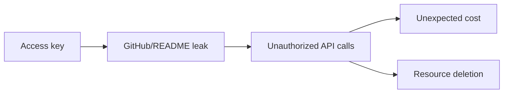

# 2교시: AWS 계정 안전장치


## 수업 목표
- root user와 IAM identity의 차이를 설명한다.
- MFA, Budget, access key, billing permission을 실습 전 안전장치로 확인한다.
- 비용과 보안 사고를 막기 위한 최소 checklist를 만든다.

## 오늘 반드시 가져갈 것
| 필수 개념 | 왜 필수인가 | 놓치면 생기는 문제 | 확인 지점 |
|---|---|---|---|
| root user 최소 사용 | root user는 계정 전체에 강한 권한을 가진다 | 실습 중 실수와 credential 노출의 영향 범위가 커진다 | IAM root user best practices |
| MFA | password 하나로 계정이 뚫리지 않게 한다 | 계정 탈취 시 비용/삭제/권한 사고가 커진다 | root/IAM user MFA 상태 |
| Budget 먼저 | AWS는 resource를 만들면 비용이 날 수 있다 | 실습 후 잔여 resource 비용을 늦게 발견한다 | AWS Budgets, Billing dashboard |
| access key 제한 | 장기 access key는 유출되면 자동화된 악용 대상이 된다 | GitHub, README, screenshot에 key가 남는다 | IAM access keys, CloudTrail |

## root user를 어떻게 볼 것인가
AWS 공식 문서는 root user를 일상 작업에 사용하지 말 것을 권장한다. root user는 계정 생성 시 생기는 최상위 identity이고, billing, account closure, 일부 account-level 작업처럼 root가 필요한 경우가 있다. 수업 실습에서 EC2, S3, VPC를 만드는 일상 작업은 root로 하지 않는 것을 원칙으로 둔다.

| identity | 수업에서의 기준 |
|---|---|
| root user | MFA 설정, 계정 복구 정보 확인, 꼭 필요한 account-level 작업에만 사용 |
| IAM user | 개인 실습 계정에서 Console 로그인용으로 사용할 수 있음 |
| IAM role | 실제 운영과 cloud service 간 권한 위임에 주로 사용 |
| access key | 오늘은 만들지 않는 것을 기본값으로 둠 |

## MFA 확인
MFA는 root user와 IAM user 모두에 설정할 수 있다. root user MFA는 특히 중요하다. MFA device를 하나만 등록하고 복구 수단이 없으면 분실 시 접근 문제가 생길 수 있으므로, 계정 정책에 맞게 복구 절차를 남긴다.

```text
Console -> IAM -> Security credentials -> Multi-factor authentication
```

## Budget과 Billing 확인
AWS Budgets는 비용 또는 사용량 기준으로 알림을 설정하는 도구다. Cost Explorer는 비용과 사용량을 분석하는 도구다. Cost Explorer는 처음 열 때 활성화가 필요할 수 있고, 데이터가 바로 충분히 보이지 않을 수 있다.

| 항목 | 오늘 확인할 것 |
|---|---|
| Billing dashboard | 월 누적 비용, forecast |
| Budget | 예산 금액, 알림 이메일 |
| Cost Explorer | service별 비용 확인 가능 여부 |
| Tag | 비용 추적을 위한 `Course`, `Owner`, `Purpose` |

## Access key 위험
AWS access key는 CLI나 SDK에서 AWS API를 호출할 때 쓰인다. 오늘 수업은 Console 중심이므로 새 access key를 만들 필요가 없다. key가 필요해지는 날에도 `.env`, README, screenshot, GitHub issue, 메신저에 남기지 않는다.



## 계정 안전 Checklist
| 확인 | 상태 |
|---|---|
| root user MFA가 설정되어 있다 |  |
| 실습 중 root user를 사용하지 않는다 |  |
| 오늘 사용할 Region을 정했다 |  |
| Budget 또는 비용 알림을 확인했다 |  |
| access key를 새로 만들지 않는다 |  |
| 모든 resource에 tag를 붙인다 |  |
| 실습 종료 전 cleanup 시간을 남긴다 |  |


## 50분 수업 운영 흐름
| 시간 | 활동 | 확인할 evidence |
|---|---|---|
| 0~10분 | root user와 IAM identity 구분 | root 사용 금지 기준 |
| 10~20분 | MFA 상태 확인 | MFA enabled 여부 |
| 20~30분 | Budget/Cost Explorer 위치 확인 | 예산/알림 설정 가능 여부 |
| 30~40분 | access key 위험 시나리오 | key 생성 없이 진행 원칙 |
| 40~50분 | 계정 안전 checklist 작성 | checklist 완성 |

## 실습 전 안전 점검 절차
1. Console 상단에서 현재 로그인 identity와 account를 확인한다.
2. root user로 들어와 있다면 일상 실습용 IAM identity로 전환한다.
3. IAM 또는 Security credentials 화면에서 MFA 상태를 확인한다.
4. Billing and Cost Management에서 Budget 또는 비용 알림 접근 가능 여부를 확인한다.
5. 오늘 새 access key를 만들지 않는다는 원칙을 배움일기에 적는다.

## 비용 사고 예시
| 상황 | 왜 위험한가 | 예방 |
|---|---|---|
| ALB를 삭제하지 않음 | traffic이 없어도 시간 비용이 발생할 수 있음 | Day2 종료 전 ALB cleanup |
| RDS 삭제 보호를 켜고 방치 | DB instance/storage 비용 지속 | Day4 실습 전 삭제 계획 |
| NAT Gateway를 무심코 생성 | 초보 실습에서 큰 비용이 날 수 있음 | W5에서는 기본 생성 금지 |
| access key 유출 | 자동 API 호출로 비용/삭제 사고 가능 | key 미생성, CloudTrail 확인 |

## 운영 판단 기준
실습에서 권한이 막히면 무조건 관리자 권한을 요구하지 않는다. 어떤 action이 막혔는지, 어떤 service 권한이 필요한지, 그 권한이 수업 목표에 꼭 필요한지 먼저 분리한다. 이 습관이 IAM 최소 권한 설계의 출발점이다.

## 캡처 가이드
MFA 화면과 Billing 화면은 민감정보가 많다. 공개 자료에는 전체 화면 캡처를 넣지 말고, MFA enabled 상태 또는 Budget 이름/상태만 잘라서 남긴다. account email과 결제 수단 정보는 가린다.

## 강사 보강 노트
이 교시는 `계정 안전장치`을 학생이 말로 설명할 수 있게 만드는 데 초점을 둔다. Console 화면을 따라 누르는 시간으로만 흘러가면 학생은 성공 화면은 보지만, 다음 날 같은 resource를 혼자 다시 만들거나 장애를 설명하지 못한다. 각 단계마다 "지금 무엇을 결정했는가", "그 결정은 비용/보안/관찰 중 어디에 영향을 주는가"를 짧게 되묻는다.

## 학생이 자주 흔들리는 지점
| 흔들리는 지점 | 강사 개입 문장 |
|---|---|
| root user로 계속 실습하려고 함 | "지금 화면에서 그 판단을 증명하는 값이 어디에 있나요?" |
| Budget은 비용을 막아주는 장치라고 오해함 | "이 값이 바뀌면 접속, 비용, 권한 중 무엇이 먼저 달라질까요?" |
| access key를 캡처나 노트에 그대로 남김 | "성공 화면 말고 실패했을 때 다시 볼 evidence를 남겼나요?" |

## 실습 중 멈춤 포인트
- 첫 번째 멈춤: 학생이 resource를 생성하기 전에 이름, Region, tag, 예상 비용 발생 지점을 말하게 한다.
- 두 번째 멈춤: 성공 화면이 나온 직후 resource ID와 상태값을 evidence note에 적게 한다.
- 세 번째 멈춤: 실패나 지연이 생기면 새로 클릭하기 전에 이전 단계의 화면과 명령을 다시 보게 한다.
- 네 번째 멈춤: 정리 단계에서 "삭제했다"가 아니라 "검색해도 남아 있지 않다"를 확인하게 한다.

## 확인 질문
1. 오늘 만든 resource가 어느 Region과 어느 계정 경계에 있는가?
2. 이 resource가 비용을 만들기 시작하는 시점은 언제인가?
3. 접속이 실패하면 app, network, permission 중 무엇을 먼저 확인할 것인가?
4. 수업이 끝난 뒤 남겨도 되는 resource와 지워야 하는 resource는 무엇인가?

## 제출 evidence 기준
| evidence | 좋은 예 | 부족한 예 |
|---|---|---|
| 화면 캡처 | MFA 활성화 상태 | 성공 toast만 보이는 캡처 |
| 설정 기록 | Budget 이름과 threshold | "기본값 사용"이라고만 적음 |
| 운영 판단 | 실습에 사용할 user/role 이름 | "잘 됨", "안 됨"으로만 적음 |

## Evidence Note
```markdown
# W5D1S2 account safety
- root MFA 확인 여부:
- 실습 identity:
- Budget 이름/금액 또는 확인 상태:
- 오늘 사용할 공통 tag:
- access key 생성 여부: no
- 가장 먼저 조심할 resource:
```

## 혼자 다시 따라오기
- 최소 재현 경로: IAM dashboard에서 MFA 상태를 확인하고, Billing and Cost Management에서 Budget/Cost Explorer 접근 가능성을 확인한다.
- 공식 문서 키워드: `root user best practices`, `MFA for root user`, `AWS Budgets`, `Cost Explorer`.
- 스스로 확인할 화면: IAM security credentials, Billing dashboard, Budgets list.
- 흔한 실패 3개: root로 계속 실습함, Budget 없이 유료 resource를 만듦, access key를 만들어 로컬에 방치함.
- 다음 준비 상태: "내가 지금 어떤 identity로 어떤 account와 Region에서 작업 중인지" 설명할 수 있어야 한다.

## 한 줄 요약
```text
AWS 실습은 root/MFA/Budget/access key를 먼저 잠그고 시작해야 한다.
```
