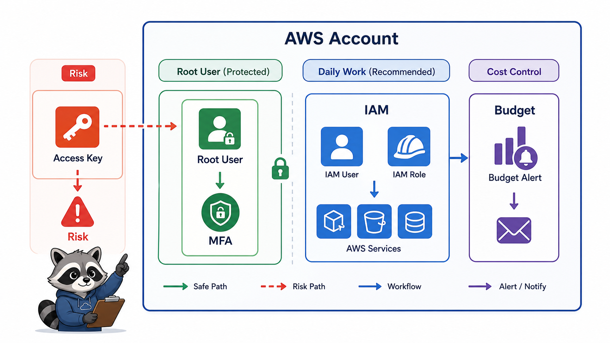
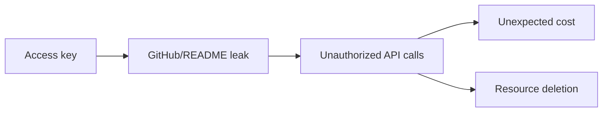

# 2교시: AWS 계정 안전장치



## 수업 목표
- root user와 IAM identity의 차이를 설명한다.
- MFA, Budget, access key, billing permission을 실습 전 안전장치로 확인한다.
- 비용과 보안 사고를 막기 위한 최소 checklist를 만든다.

## 오늘 반드시 가져갈 것
| 필수 개념 | 왜 필수인가 | 놓치면 생기는 문제 | 확인 지점 |
|---|---|---|---|
| root user 최소 사용 | root user는 계정 전체에 강한 권한을 가진다 | 실습 중 실수와 credential 노출의 영향 범위가 커진다 | IAM root user best practices |
| MFA | password 하나로 계정이 뚫리지 않게 한다 | 계정 탈취 시 비용/삭제/권한 사고가 커진다 | root/IAM user MFA 상태 |
| Budget 먼저 | AWS는 resource를 만들면 비용이 날 수 있다 | 실습 후 잔여 resource 비용을 늦게 발견한다 | AWS Budgets, Billing dashboard |
| access key 제한 | 장기 access key는 유출되면 자동화된 악용 대상이 된다 | GitHub, README, screenshot에 key가 남는다 | IAM access keys, CloudTrail |

## root user를 어떻게 볼 것인가
AWS 공식 문서는 root user를 일상 작업에 사용하지 말 것을 권장한다. root user는 계정 생성 시 생기는 최상위 identity이고, billing, account closure, 일부 account-level 작업처럼 root가 필요한 경우가 있다. 수업 실습에서 EC2, S3, VPC를 만드는 일상 작업은 root로 하지 않는 것을 원칙으로 둔다.

| identity | 수업에서의 기준 |
|---|---|
| root user | MFA 설정, 계정 복구 정보 확인, 꼭 필요한 account-level 작업에만 사용 |
| IAM user | 개인 실습 계정에서 Console 로그인용으로 사용할 수 있음 |
| IAM role | 실제 운영과 cloud service 간 권한 위임에 주로 사용 |
| access key | 오늘은 만들지 않는 것을 기본값으로 둠 |

## MFA 확인
MFA는 root user와 IAM user 모두에 설정할 수 있다. root user MFA는 특히 중요하다. MFA device를 하나만 등록하고 복구 수단이 없으면 분실 시 접근 문제가 생길 수 있으므로, 계정 정책에 맞게 복구 절차를 남긴다.

```text
Console -> IAM -> Security credentials -> Multi-factor authentication
```

## Budget과 Billing 확인
AWS Budgets는 비용 또는 사용량 기준으로 알림을 설정하는 도구다. Cost Explorer는 비용과 사용량을 분석하는 도구다. Cost Explorer는 처음 열 때 활성화가 필요할 수 있고, 데이터가 바로 충분히 보이지 않을 수 있다.

| 항목 | 오늘 확인할 것 |
|---|---|
| Billing dashboard | 월 누적 비용, forecast |
| Budget | 예산 금액, 알림 이메일 |
| Cost Explorer | service별 비용 확인 가능 여부 |
| Tag | 비용 추적을 위한 `Course`, `Owner`, `Purpose` |

## Access key 위험
AWS access key는 CLI나 SDK에서 AWS API를 호출할 때 쓰인다. 오늘 수업은 Console 중심이므로 새 access key를 만들 필요가 없다. key가 필요해지는 날에도 `.env`, README, screenshot, GitHub issue, 메신저에 남기지 않는다.



## 계정 안전 Checklist
| 확인 | 상태 |
|---|---|
| root user MFA가 설정되어 있다 |  |
| 실습 중 root user를 사용하지 않는다 |  |
| 오늘 사용할 Region을 정했다 |  |
| Budget 또는 비용 알림을 확인했다 |  |
| access key를 새로 만들지 않는다 |  |
| 모든 resource에 tag를 붙인다 |  |
| 실습 종료 전 cleanup 시간을 남긴다 |  |

## Evidence Note
```markdown
# W5D1S2 account safety
- root MFA 확인 여부:
- 실습 identity:
- Budget 이름/금액 또는 확인 상태:
- 오늘 사용할 공통 tag:
- access key 생성 여부: no
- 가장 먼저 조심할 resource:
```

## 혼자 다시 따라오기
- 최소 재현 경로: IAM dashboard에서 MFA 상태를 확인하고, Billing and Cost Management에서 Budget/Cost Explorer 접근 가능성을 확인한다.
- 공식 문서 키워드: `root user best practices`, `MFA for root user`, `AWS Budgets`, `Cost Explorer`.
- 스스로 확인할 화면: IAM security credentials, Billing dashboard, Budgets list.
- 흔한 실패 3개: root로 계속 실습함, Budget 없이 유료 resource를 만듦, access key를 만들어 로컬에 방치함.
- 다음 준비 상태: "내가 지금 어떤 identity로 어떤 account와 Region에서 작업 중인지" 설명할 수 있어야 한다.

## 한 줄 요약
```text
AWS 실습은 root/MFA/Budget/access key를 먼저 잠그고 시작해야 한다.
```
