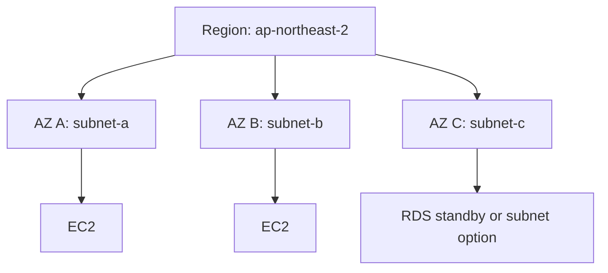

# 3교시: Region/AZ와 장애 경계


## 수업 목표
- Region과 Availability Zone을 위치, 장애 경계, latency 관점으로 구분한다.
- 서울 리전 `ap-northeast-2`를 실습 기본값으로 고정한다.
- resource를 못 찾는 문제의 첫 확인 지점이 Region임을 이해한다.

## 오늘 반드시 가져갈 것
| 필수 개념 | 왜 필수인가 | 놓치면 생기는 문제 | 확인 지점 |
|---|---|---|---|
| Region | AWS resource가 생성되는 지리적/운영 경계다 | 다른 Region에서 resource를 찾으며 시간을 낭비한다 | Console Region selector |
| Availability Zone | Region 안의 격리된 location이다 | 단일 AZ 장애와 multi-AZ 구성을 구분하지 못한다 | subnet AZ, EC2 placement |
| Service availability | 모든 service와 feature가 모든 Region에서 같지 않을 수 있다 | 문서와 Console 화면이 달라 보인다 | service Region support |
| Cost and latency | 가까운 Region이 latency에 유리할 수 있지만 비용과 지원 기능도 봐야 한다 | 무조건 한 Region만 고집한다 | pricing, latency, compliance |

## Region
AWS Region은 독립된 지리적 영역이다. Console 오른쪽 위 Region selector에서 현재 작업 Region을 확인한다. EC2, VPC, ALB, RDS 같은 많은 resource는 Region 단위로 생성된다.

```text
ap-northeast-2 = Asia Pacific (Seoul)
```

오늘 수업에서는 혼선을 줄이기 위해 기본 Region을 `ap-northeast-2`로 둔다. 다른 Region을 써야 하는 경우 evidence note에 반드시 남긴다.

## Availability Zone
Availability Zone은 Region 안의 격리된 location이다. AWS 공식 문서 기준으로 AZ는 Region 내부의 isolated location이다. 고가용성 설계에서는 여러 AZ에 resource를 분산한다.



## Kubernetes와 연결
Kubernetes에서 Pod가 어느 node에 배치되는지가 중요했듯, AWS에서는 instance와 subnet이 어느 AZ에 있는지가 중요하다.

| Kubernetes | AWS |
|---|---|
| node | EC2 instance 또는 managed node |
| node zone label | Availability Zone |
| Service endpoint | ALB target 또는 service endpoint |
| PV/PVC zonal disk | EBS volume과 AZ 제약 |
| multi-replica | multi-AZ 배치 |

## Region을 잘못 보면 생기는 증상
| 증상 | 첫 확인 |
|---|---|
| 방금 만든 EC2가 안 보인다 | Console Region selector |
| S3 bucket 이름이 중복된다고 나온다 | S3 bucket name은 전역 unique |
| VPC가 다르게 보인다 | Region별 VPC list |
| ALB target이 등록되지 않는다 | target과 ALB의 VPC/Region |
| 비용은 있는데 resource를 못 찾는다 | Cost Explorer service/Region filter |


## Region 선택 의사결정
| 기준 | 질문 | 예시 판단 |
|---|---|---|
| latency | 사용자가 어디에 있는가 | 국내 교육/서비스면 서울 Region 우선 |
| service availability | 필요한 service가 지원되는가 | 새 기능은 일부 Region만 지원 가능 |
| cost | 같은 resource라도 가격이 다른가 | 장기 운영 전 pricing 확인 |
| compliance | 데이터 위치 요구가 있는가 | 고객/기관 요구 확인 |
| failure design | 어느 범위 장애를 견딜 것인가 | multi-AZ 또는 multi-Region 판단 |

## 콘솔 실험
EC2 화면에서 서울 Region을 보고, 다른 Region으로 바꾼 뒤 instance list가 달라지는지 확인한다. 이때 resource가 삭제된 것이 아니라 조회 범위가 바뀐 것이다. 이 작은 실험은 AWS 초반에 매우 중요하다. 많은 학생이 "방금 만든 게 사라졌다"고 느끼지만 실제 원인은 Region mismatch다.

## 장애 분석 연결
| 장애 증상 | Region/AZ 관점 질문 |
|---|---|
| ALB target 등록 실패 | ALB와 target이 같은 VPC/Region인가 |
| RDS 연결 실패 | app subnet과 DB subnet/security group이 맞는가 |
| EBS volume attach 실패 | instance와 volume AZ가 같은가 |
| resource가 안 보임 | Console Region이 맞는가 |

## 캡처 가이드
Region selector, subnet list의 AZ column, VPC ID가 함께 보이도록 캡처한다. account email은 제외하고, resource ID 일부와 tag는 남겨도 된다.

## 운영 판단 연습
| 판단 질문 | 확인 기준 |
|---|---|
| 이 항목에서 가장 먼저 결정할 것은 무엇인가 | Region은 resource가 존재하는 큰 지리적 경계다. |
| 실패했을 때 어느 경계부터 볼 것인가 | AZ는 한 Region 안의 장애 격리 단위다. |
| 수업 뒤 혼자 재현할 때 필요한 최소 정보는 무엇인가 | global service와 regional service를 구분해야 한다. |

## 흔한 실패와 첫 확인 위치
| 흔한 실패 | 첫 확인 위치 |
|---|---|
| 서울에서 만들고 다른 Region을 본다 | Region selector와 resource ARN/URL의 region 값을 확인한다 |

## Evidence 점검
- 화면에는 민감 정보 대신 resource 이름, Region, 상태값, rule, tag처럼 재현 가능한 값이 보여야 한다.
- 기록에는 "성공했다"보다 어떤 값이 어떤 상태였는지가 남아야 한다.
- 실패를 기록할 때는 증상, 확인한 화면, 수정한 값, 재확인 결과를 한 세트로 남긴다.
- 현재 Region, resource 생성 Region, AZ가 필요한 이유 중 최소 두 가지는 배움일기에 남긴다.

## Evidence Note
```markdown
# W5D1S3 region az
- 오늘 실습 Region:
- 선택 이유:
- 확인한 AZ 이름:
- Region을 바꾸면 사라져 보일 resource:
- 비용 확인 시 Region filter가 필요한 이유:
```

## 혼자 다시 따라오기
- 최소 재현 경로: Console 오른쪽 위 Region을 확인하고, EC2/VPC/S3 화면에서 resource 범위가 어떻게 보이는지 비교한다.
- 공식 문서 키워드: `AWS Regions`, `Availability Zones`, `isolated locations`.
- 스스로 확인할 화면: Region selector, VPC subnet list, EC2 launch placement.
- 흔한 실패 3개: Region이 달라 resource를 못 찾음, AZ와 Region을 같은 말로 씀, S3 bucket의 global name 특성을 Region resource처럼 오해함.
- 다음 준비 상태: "서울 Region의 여러 AZ에 subnet이 나뉜다"는 문장을 설명할 수 있어야 한다.

## 한 줄 요약
```text
AWS에서 resource를 못 찾으면 먼저 이름보다 Region을 확인한다.
```
