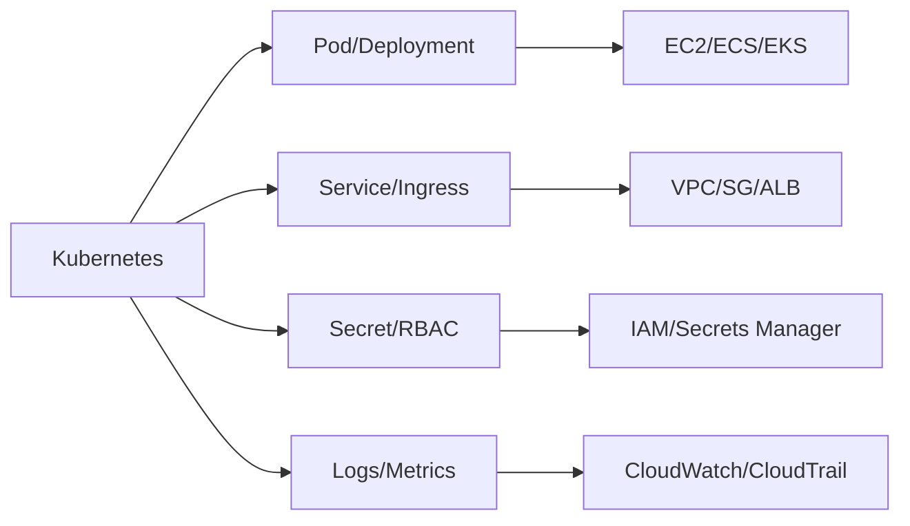

# 4교시: AWS 서비스 운영 지도

## 수업 목표
- AWS 주요 service를 computing spine에 매핑한다.
- Docker/Kubernetes에서 배운 운영 질문이 AWS에서 어떤 service로 확장되는지 설명한다.
- CloudWatch와 CloudTrail의 역할 차이를 구분한다.

## 오늘 반드시 가져갈 것
| 필수 개념 | 왜 필수인가 | 놓치면 생기는 문제 | 확인 지점 |
|---|---|---|---|
| Service map | 많은 AWS service를 운영 문제별로 정리한다 | 이름만 외우고 장애 분석에 연결하지 못한다 | computing spine table |
| Managed service 책임 분리 | AWS가 맡는 부분과 사용자가 맡는 부분이 다르다 | 백업/보안/비용 책임을 착각한다 | service docs, shared responsibility |
| CloudWatch vs CloudTrail | metric/log와 API audit은 다른 증거다 | 장애와 변경 추적을 같은 곳에서 찾으려 한다 | log group, metric, event history |

## AWS를 도구 목록이 아니라 운영 지도로 보기
AWS service는 너무 많다. 처음에는 다음 질문으로 분류한다.

| 운영 질문 | AWS service 후보 |
|---|---|
| 어디서 실행되는가 | EC2, ECS, Lambda, EKS |
| 어디로 접속되는가 | VPC, subnet, Security Group, ALB, Route 53 |
| 파일/객체는 어디에 두는가 | S3 |
| block storage는 어디에 두는가 | EBS |
| 공유 파일시스템은 어디에 두는가 | EFS |
| database는 누가 운영하는가 | RDS |
| image는 어디에 저장하는가 | ECR |
| 로그와 지표는 어디서 보는가 | CloudWatch |
| 누가 무엇을 호출했는가 | CloudTrail |
| 비용은 어디서 보는가 | Billing, Budget, Cost Explorer |

## Kubernetes에서 AWS로


## CloudWatch와 CloudTrail
CloudWatch와 CloudTrail은 이름이 비슷하지만 보는 증거가 다르다.

| 구분 | CloudWatch | CloudTrail |
|---|---|---|
| 주 관심 | app/resource 상태 | AWS API 활동 |
| 예시 | CPU metric, log group, alarm | `RunInstances`, `CreateBucket`, `AuthorizeSecurityGroupIngress` |
| 장애 질문 | "서비스가 느린가, 죽었는가" | "누가 설정을 바꿨는가" |
| Day1 수준 | 위치와 역할 preview | event history preview |

## Managed service의 책임
Managed service는 "운영 책임이 0"이라는 뜻이 아니다. AWS가 하드웨어와 service control plane 일부를 맡지만, 사용자는 설정, 접근 제어, 비용, 데이터, backup option, 삭제 보호를 결정한다.

| service | AWS가 줄여주는 부담 | 사용자가 여전히 결정할 것 |
|---|---|---|
| EC2 | 물리 서버 구매/설치 | OS patch, SG, instance type, EBS |
| S3 | storage server 운영 | public access, lifecycle, versioning |
| RDS | DB 설치/backup 기능 제공 | engine, size, backup window, SG |
| ECS/App Runner | container 실행 제어 일부 | image, env, secret, scaling, logs |

## Evidence Note
```markdown
# W5D1S4 service map
- compute 후보:
- network 후보:
- storage/database 후보:
- observability 후보:
- audit 후보:
- cost 후보:
- Kubernetes 개념과 가장 헷갈리는 AWS service:
```

## 혼자 다시 따라오기
- 최소 재현 경로: Week 1 computing spine 표에 AWS service를 직접 채워 넣는다.
- 공식 문서 키워드: `CloudWatch logs metrics alarms`, `CloudTrail event history`, `Amazon EC2`, `Amazon S3`.
- 스스로 확인할 화면: AWS Console service search, CloudWatch dashboard, CloudTrail event history.
- 흔한 실패 3개: CloudTrail에서 app log를 찾음, CloudWatch에서 API 변경자를 찾음, managed service라 비용/권한 책임이 없다고 생각함.
- 다음 준비 상태: EC2, VPC, S3, IAM, CloudWatch, CloudTrail을 각각 한 문장으로 설명할 수 있어야 한다.

## 한 줄 요약
```text
AWS service는 이름이 아니라 compute, network, storage, identity, observability, cost 질문에 붙여서 읽는다.
```
