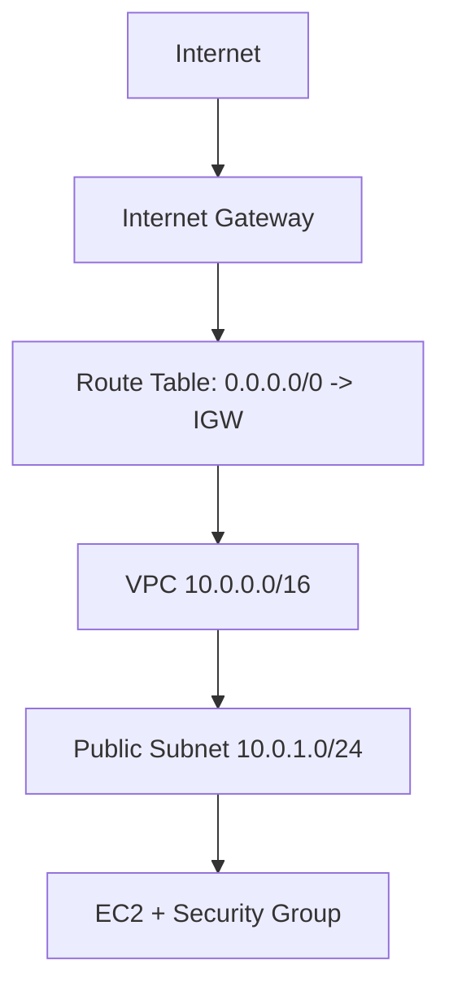

# 5교시: VPC와 Security Group 기본

## 수업 목표
- VPC, subnet, route table, internet gateway, security group의 역할을 구분한다.
- Security Group을 EC2 접근 장애의 첫 번째 확인 지점으로 읽는다.
- Kubernetes Service/Ingress와 AWS network resource를 비교한다.

## 오늘 반드시 가져갈 것
| 필수 개념 | 왜 필수인가 | 놓치면 생기는 문제 | 확인 지점 |
|---|---|---|---|
| VPC | AWS resource가 놓이는 virtual network 경계다 | EC2/ALB/RDS 연결 문제를 한 덩어리로 오해한다 | VPC ID, CIDR |
| Subnet/Route Table | traffic이 public/private 경로를 갖는 기준이다 | public IP가 있어도 접속이 안 되는 이유를 못 찾는다 | subnet route, IGW |
| Security Group | resource 단위 stateful firewall이다 | port가 닫혀 있는데 app 문제로 착각한다 | inbound/outbound rules |
| Kubernetes 비교 | Service/Ingress와 SG/ALB는 계층이 다르다 | cluster 내부 routing과 cloud network access를 혼동한다 | Service, Ingress, ALB, SG |

## VPC 구성요소


| 구성요소 | 짧은 설명 | 첫 확인 지점 |
|---|---|---|
| VPC | AWS 안의 격리된 network | VPC ID, CIDR |
| Subnet | VPC CIDR 일부를 AZ에 배치 | subnet ID, AZ, route table |
| Route Table | traffic의 다음 hop 결정 | `0.0.0.0/0` target |
| Internet Gateway | VPC와 internet 연결 | attached VPC |
| Security Group | resource 단위 inbound/outbound 허용 | protocol, port, source |

## Security Group은 stateful
AWS VPC Security Group은 stateful이다. 허용된 inbound 요청에 대한 응답은 별도 outbound rule을 세밀하게 열지 않아도 돌아갈 수 있다. 이 특성 때문에 Network ACL과 헷갈리지 않도록 한다.

| 질문 | Security Group에서 볼 것 |
|---|---|
| SSH가 안 된다 | inbound TCP 22 source |
| HTTP가 안 된다 | inbound TCP 80 source |
| app port가 다르다 | container/app listen port와 SG port |
| 모든 사람에게 열려 있다 | source `0.0.0.0/0` 또는 `::/0` |
| DB가 public으로 열려 있다 | inbound 3306/5432 source |

## Kubernetes와 비교
| Kubernetes | AWS |
|---|---|
| Pod IP | EC2 private IP 또는 task ENI |
| Service | target group 또는 service discovery와 일부 비교 가능 |
| Ingress/Gateway | ALB listener/rule과 연결 가능 |
| NetworkPolicy | Security Group/NACL과 목적은 비슷하지만 계층과 적용 대상이 다름 |
| `kubectl describe svc` | Console에서 ALB, target group, SG, subnet 확인 |

Service와 Security Group을 같은 것으로 보면 안 된다. Service는 cluster 안에서 endpoint를 추상화하고, Security Group은 AWS resource에 도달 가능한 traffic을 허용하거나 막는다.

## Day2를 위한 사전 관찰
오늘은 VPC를 새로 설계하지 않아도 된다. 다만 Day2에서 EC2/ALB를 만들기 전에 다음을 읽을 수 있어야 한다.

| 항목 | 확인 값 |
|---|---|
| VPC ID |  |
| public subnet ID |  |
| subnet AZ |  |
| route table에 IGW route 존재 |  |
| security group inbound 22/80 source |  |

## Evidence Note
```markdown
# W5D1S5 vpc sg
- VPC ID:
- CIDR:
- public subnet:
- route table internet route:
- security group에서 가장 위험한 rule:
- Kubernetes Service/Ingress와 다른 점:
```

## 혼자 다시 따라오기
- 최소 재현 경로: VPC console에서 default VPC, subnet, route table, security group을 순서대로 연다.
- 공식 문서 키워드: `VPC security groups`, `inbound rules`, `outbound rules`, `stateful`.
- 스스로 확인할 화면: VPC list, Subnets, Route tables, Security groups.
- 흔한 실패 3개: SG port를 열지 않고 app 문제로 봄, Region이 달라 VPC가 다르게 보임, subnet route table을 확인하지 않음.
- 다음 준비 상태: "EC2에 접속이 안 되면 SG, subnet, route table, public IP를 본다"는 순서를 말할 수 있어야 한다.

## 한 줄 요약
```text
VPC는 AWS resource가 놓이는 network 경계이고, Security Group은 그 resource에 도달 가능한 traffic을 정한다.
```
