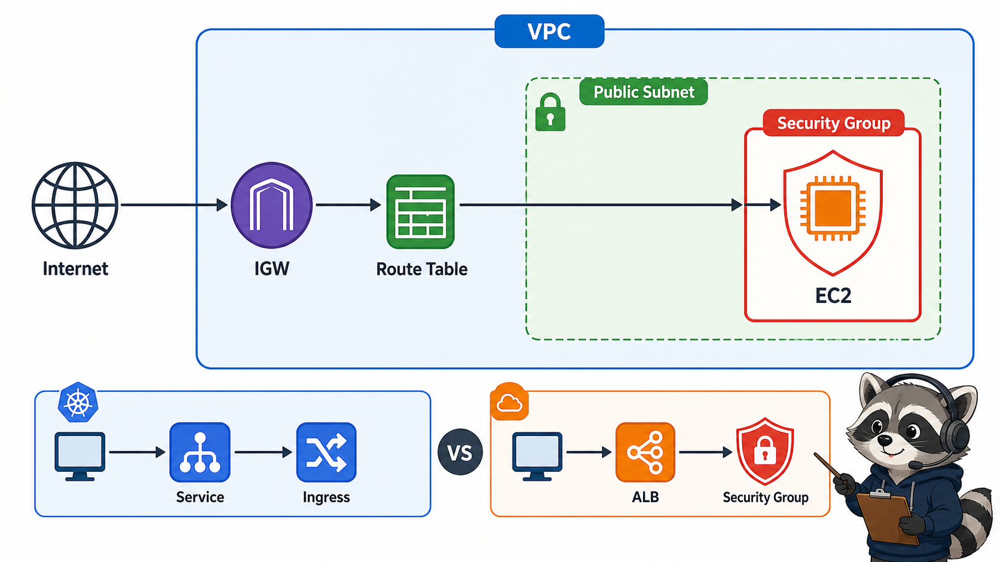
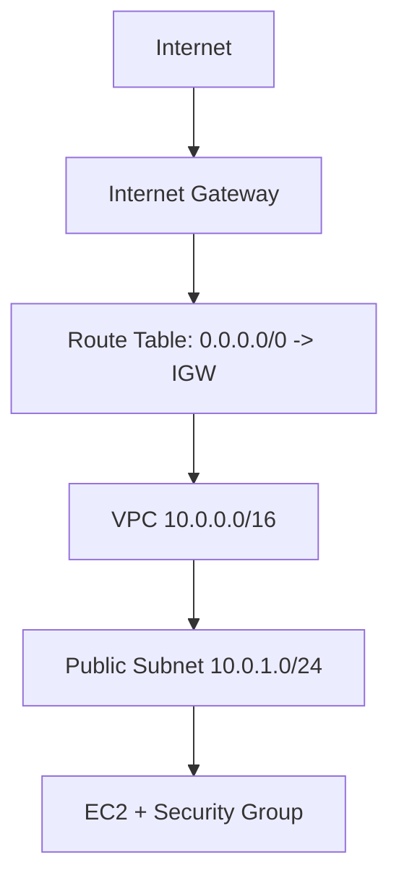

# 5교시: VPC와 Security Group 기본



## 수업 목표
- VPC, subnet, route table, internet gateway, security group의 역할을 구분한다.
- Security Group을 EC2 접근 장애의 첫 번째 확인 지점으로 읽는다.
- Kubernetes Service/Ingress와 AWS network resource를 비교한다.

## 오늘 반드시 가져갈 것
| 필수 개념 | 왜 필수인가 | 놓치면 생기는 문제 | 확인 지점 |
|---|---|---|---|
| VPC | AWS resource가 놓이는 virtual network 경계다 | EC2/ALB/RDS 연결 문제를 한 덩어리로 오해한다 | VPC ID, CIDR |
| Subnet/Route Table | traffic이 public/private 경로를 갖는 기준이다 | public IP가 있어도 접속이 안 되는 이유를 못 찾는다 | subnet route, IGW |
| Security Group | resource 단위 stateful firewall이다 | port가 닫혀 있는데 app 문제로 착각한다 | inbound/outbound rules |
| Kubernetes 비교 | Service/Ingress와 SG/ALB는 계층이 다르다 | cluster 내부 routing과 cloud network access를 혼동한다 | Service, Ingress, ALB, SG |

## VPC 구성요소


| 구성요소 | 짧은 설명 | 첫 확인 지점 |
|---|---|---|
| VPC | AWS 안의 격리된 network | VPC ID, CIDR |
| Subnet | VPC CIDR 일부를 AZ에 배치 | subnet ID, AZ, route table |
| Route Table | traffic의 다음 hop 결정 | `0.0.0.0/0` target |
| Internet Gateway | VPC와 internet 연결 | attached VPC |
| Security Group | resource 단위 inbound/outbound 허용 | protocol, port, source |

## Security Group은 stateful
AWS VPC Security Group은 stateful이다. 허용된 inbound 요청에 대한 응답은 별도 outbound rule을 세밀하게 열지 않아도 돌아갈 수 있다. 이 특성 때문에 Network ACL과 헷갈리지 않도록 한다.

| 질문 | Security Group에서 볼 것 |
|---|---|
| SSH가 안 된다 | inbound TCP 22 source |
| HTTP가 안 된다 | inbound TCP 80 source |
| app port가 다르다 | container/app listen port와 SG port |
| 모든 사람에게 열려 있다 | source `0.0.0.0/0` 또는 `::/0` |
| DB가 public으로 열려 있다 | inbound 3306/5432 source |

## Kubernetes와 비교
| Kubernetes | AWS |
|---|---|
| Pod IP | EC2 private IP 또는 task ENI |
| Service | target group 또는 service discovery와 일부 비교 가능 |
| Ingress/Gateway | ALB listener/rule과 연결 가능 |
| NetworkPolicy | Security Group/NACL과 목적은 비슷하지만 계층과 적용 대상이 다름 |
| `kubectl describe svc` | Console에서 ALB, target group, SG, subnet 확인 |

Service와 Security Group을 같은 것으로 보면 안 된다. Service는 cluster 안에서 endpoint를 추상화하고, Security Group은 AWS resource에 도달 가능한 traffic을 허용하거나 막는다.

## Day2를 위한 사전 관찰
오늘은 VPC를 새로 설계하지 않아도 된다. 다만 Day2에서 EC2/ALB를 만들기 전에 다음을 읽을 수 있어야 한다.

| 항목 | 확인 값 |
|---|---|
| VPC ID |  |
| public subnet ID |  |
| subnet AZ |  |
| route table에 IGW route 존재 |  |
| security group inbound 22/80 source |  |


## 50분 수업 운영 흐름
| 시간 | 활동 | 확인할 evidence |
|---|---|---|
| 0~10분 | VPC 구성요소 용어 정리 | VPC/subnet/route table |
| 10~25분 | public subnet 조건 분석 | IGW route 확인 |
| 25~35분 | Security Group inbound/outbound | 22/80 rule 예시 |
| 35~45분 | Kubernetes와 비교 | Service/Ingress/NetworkPolicy 비교 |
| 45~50분 | Day2 EC2 준비 note | subnet/SG checklist |

## public subnet을 판정하는 절차
1. EC2가 어느 subnet에 있는지 확인한다.
2. 해당 subnet이 연결된 route table을 연다.
3. `0.0.0.0/0` route target이 internet gateway인지 확인한다.
4. instance에 public IPv4가 있는지 확인한다.
5. Security Group이 필요한 inbound port를 허용하는지 확인한다.

이 다섯 단계 중 하나라도 빠지면 "public subnet에 있다"고 느껴도 외부 접속은 실패할 수 있다.

## Security Group과 Network ACL 차이 preview
Day2 실습에서는 Security Group을 중심으로 본다. Network ACL은 subnet 단위 stateless filter이고, 초반에는 함께 다루면 오히려 혼동이 커진다. 다만 현업 장애에서는 NACL도 확인해야 할 수 있다는 preview만 둔다.

| 구분 | Security Group | Network ACL |
|---|---|---|
| 적용 대상 | ENI/resource | subnet |
| 상태 | stateful | stateless |
| 수업 초점 | EC2/ALB 접근 허용 | preview |

## 장애 판단 질문
- timeout인가, connection refused인가, HTTP error인가?
- public IP가 있는가?
- route table에 IGW route가 있는가?
- SG inbound source가 내 IP 또는 public traffic을 허용하는가?
- app이 실제로 해당 port에서 listen하는가?

## 강사 보강 노트
이 교시는 `VPC와 Security Group`을 학생이 말로 설명할 수 있게 만드는 데 초점을 둔다. Console 화면을 따라 누르는 시간으로만 흘러가면 학생은 성공 화면은 보지만, 다음 날 같은 resource를 혼자 다시 만들거나 장애를 설명하지 못한다. 각 단계마다 "지금 무엇을 결정했는가", "그 결정은 비용/보안/관찰 중 어디에 영향을 주는가"를 짧게 되묻는다.

## 학생이 자주 흔들리는 지점
| 흔들리는 지점 | 강사 개입 문장 |
|---|---|
| subnet만 public이면 접속된다고 생각함 | "지금 화면에서 그 판단을 증명하는 값이 어디에 있나요?" |
| SG outbound만 열고 inbound를 놓침 | "이 값이 바뀌면 접속, 비용, 권한 중 무엇이 먼저 달라질까요?" |
| CIDR을 IP 하나처럼 읽음 | "성공 화면 말고 실패했을 때 다시 볼 evidence를 남겼나요?" |

## 실습 중 멈춤 포인트
- 첫 번째 멈춤: 학생이 resource를 생성하기 전에 이름, Region, tag, 예상 비용 발생 지점을 말하게 한다.
- 두 번째 멈춤: 성공 화면이 나온 직후 resource ID와 상태값을 evidence note에 적게 한다.
- 세 번째 멈춤: 실패나 지연이 생기면 새로 클릭하기 전에 이전 단계의 화면과 명령을 다시 보게 한다.
- 네 번째 멈춤: 정리 단계에서 "삭제했다"가 아니라 "검색해도 남아 있지 않다"를 확인하게 한다.

## 확인 질문
1. 오늘 만든 resource가 어느 Region과 어느 계정 경계에 있는가?
2. 이 resource가 비용을 만들기 시작하는 시점은 언제인가?
3. 접속이 실패하면 app, network, permission 중 무엇을 먼저 확인할 것인가?
4. 수업이 끝난 뒤 남겨도 되는 resource와 지워야 하는 resource는 무엇인가?

## 제출 evidence 기준
| evidence | 좋은 예 | 부족한 예 |
|---|---|---|
| 화면 캡처 | VPC ID | 성공 toast만 보이는 캡처 |
| 설정 기록 | subnet public/private 판단 근거 | "기본값 사용"이라고만 적음 |
| 운영 판단 | SG inbound rule | "잘 됨", "안 됨"으로만 적음 |

## Evidence Note
```markdown
# W5D1S5 vpc sg
- VPC ID:
- CIDR:
- public subnet:
- route table internet route:
- security group에서 가장 위험한 rule:
- Kubernetes Service/Ingress와 다른 점:
```

## 혼자 다시 따라오기
- 최소 재현 경로: VPC console에서 default VPC, subnet, route table, security group을 순서대로 연다.
- 공식 문서 키워드: `VPC security groups`, `inbound rules`, `outbound rules`, `stateful`.
- 스스로 확인할 화면: VPC list, Subnets, Route tables, Security groups.
- 흔한 실패 3개: SG port를 열지 않고 app 문제로 봄, Region이 달라 VPC가 다르게 보임, subnet route table을 확인하지 않음.
- 다음 준비 상태: "EC2에 접속이 안 되면 SG, subnet, route table, public IP를 본다"는 순서를 말할 수 있어야 한다.

## 한 줄 요약
```text
VPC는 AWS resource가 놓이는 network 경계이고, Security Group은 그 resource에 도달 가능한 traffic을 정한다.
```
