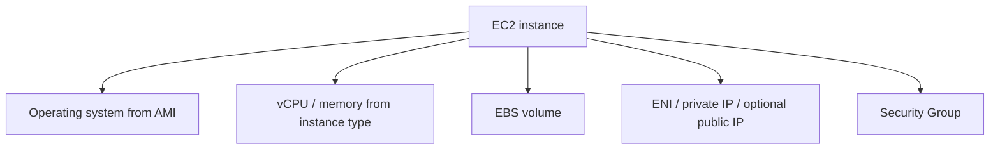

# 6교시: EC2 첫 관찰

## 수업 목표
- EC2 instance를 compute resource 관점으로 읽는다.
- AMI, instance type, key pair, public IP, user data, state를 구분한다.
- stop과 terminate의 비용/복구 차이를 설명한다.

## 오늘 반드시 가져갈 것
| 필수 개념 | 왜 필수인가 | 놓치면 생기는 문제 | 확인 지점 |
|---|---|---|---|
| AMI | instance의 시작 image다 | OS와 기본 패키지 차이를 설명하지 못한다 | AMI name/id |
| Instance type | compute/memory/network capacity와 비용을 좌우한다 | 필요 이상으로 큰 instance를 켠다 | instance type, pricing |
| Key pair/접속 방식 | Linux EC2 접속의 identity material이다 | key를 잃거나 노출한다 | key pair name, SSH/browser connect |
| Stop vs terminate | stop은 일부 비용이 남고, terminate는 영구 삭제다 | 비용이 계속 나거나 데이터를 잃는다 | instance state, EBS volume |

## EC2는 무엇인가
EC2는 AWS에서 virtual server를 제공하는 service다. Docker container나 Kubernetes Pod보다 아래 계층의 compute에 가깝다. EC2 위에 Docker를 설치할 수도 있고, Kubernetes node로 사용할 수도 있다.



## 생성 전 읽을 값
오늘은 실제 생성을 강제하지 않는다. Day2에서 만들기 전에 다음 값을 읽는 법을 익힌다.

| 항목 | 의미 | 위험 |
|---|---|---|
| AMI | 어떤 OS image로 시작하는가 | 문서 명령과 OS가 다르면 실패 |
| Instance type | CPU/memory/network 크기 | 비용 증가 |
| Key pair | SSH 접속 key | 분실/노출 |
| Network | VPC/subnet/public IP | 접속 불가 또는 public 노출 |
| Security Group | 허용 traffic | 22/80 과다 노출 |
| Storage | root EBS size/delete on termination | 잔여 비용 또는 데이터 삭제 |
| Tag | owner/purpose 추적 | cleanup 누락 |

## Stop과 terminate
AWS 공식 문서 기준으로 stopped instance는 compute 사용료가 멈추지만 EBS volume 같은 storage 비용은 남을 수 있다. terminate는 영구 삭제이며 복구할 수 없다.

| 상태 | 의미 | 비용/복구 관점 |
|---|---|---|
| running | instance 실행 중 | compute 비용 발생 |
| stopped | instance 정지 | compute 비용은 멈추지만 EBS 비용 가능 |
| terminated | instance 삭제 | 복구 불가, 연결 불가 |

## User data preview
User data는 instance 최초 부팅 때 실행할 bootstrap script로 자주 사용된다. Day2에서는 간단한 web server를 자동 설치하는 데 사용할 수 있다. 오늘은 "서버에 들어가서 손으로 한 설정"과 "부팅 시 재현되는 설정"이 다르다는 점만 잡는다.

```bash
#!/bin/bash
echo "hello from paperclip w5" > /var/www/html/index.html
```

위 예시는 OS와 web server 설치 상태에 따라 그대로 동작하지 않을 수 있다. Day2에서는 AMI에 맞는 전체 script를 사용한다.

## Evidence Note
```markdown
# W5D1S6 ec2 observation
- AMI 후보:
- instance type 후보:
- VPC/subnet:
- public IP 필요 여부:
- SG inbound 최소 rule:
- stop과 terminate 차이:
- 남을 수 있는 비용:
```

## 혼자 다시 따라오기
- 최소 재현 경로: EC2 launch 화면에서 실제 launch 직전까지 값을 읽고, 생성하지 않고 취소한다.
- 공식 문서 키워드: `EC2 instance lifecycle`, `stop instance`, `terminate instance`, `security group`.
- 스스로 확인할 화면: EC2 Launch instance, Instance state, Storage tab, Security tab.
- 흔한 실패 3개: key pair를 잃음, stop하면 모든 비용이 0이라고 오해함, terminate를 rollback처럼 생각함.
- 다음 준비 상태: Day2에서 EC2를 만들기 전 AMI/type/network/SG/storage/tag를 설명할 수 있어야 한다.

## 한 줄 요약
```text
EC2는 만들기 전에 AMI, type, network, security group, storage, tag, cleanup 기준을 먼저 읽어야 한다.
```
