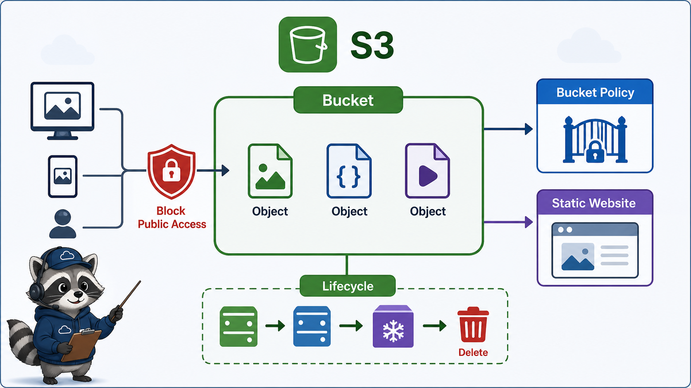
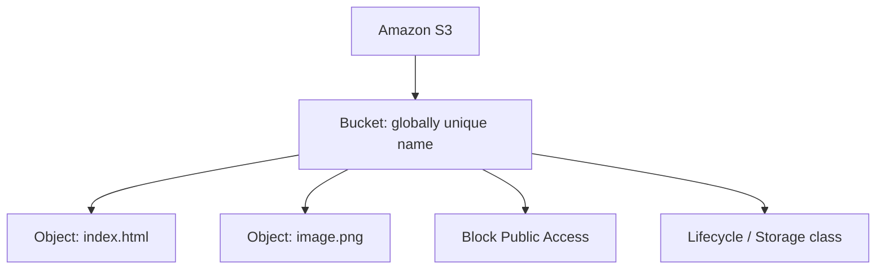

# 7교시: S3 첫 관찰



## 수업 목표
- S3를 file server가 아니라 object storage로 이해한다.
- bucket, object, Region, public access block의 관계를 설명한다.
- static website hosting preview와 public access 위험을 구분한다.

## 오늘 반드시 가져갈 것
| 필수 개념 | 왜 필수인가 | 놓치면 생기는 문제 | 확인 지점 |
|---|---|---|---|
| Bucket/Object | S3는 directory가 아니라 bucket 안 object를 저장한다 | file system처럼 permission과 path를 오해한다 | bucket, object key |
| Public Access Block | public policy/ACL보다 상위에서 public access를 제한한다 | 의도치 않은 공개 또는 공개 실패를 설명하지 못한다 | bucket/account BPA setting |
| Bucket name | bucket name은 전역적으로 unique해야 한다 | 같은 이름으로 만들 수 없어서 Region 문제로 착각한다 | bucket create error |
| Lifecycle/cost | 저장량, 요청, class, versioning에 따라 비용이 달라진다 | 작은 실습 object가 쌓인다 | storage class, lifecycle |

## S3의 기본 구조


S3는 object storage다. object는 key와 data, metadata를 가진다. 폴더처럼 보이는 UI가 있어도 실제 운영 판단은 bucket, object key, permission, public access, versioning, lifecycle을 기준으로 한다.

## Public Access Block
AWS 공식 문서 기준으로 S3 Block Public Access는 account, bucket, access point 수준에서 public access 관리를 돕고, public policy나 permission보다 강하게 작동할 수 있다. 새 bucket은 기본적으로 public access를 허용하지 않는 방향으로 시작한다.

| 상황 | 확인할 것 |
|---|---|
| 정적 웹사이트가 403이다 | Block Public Access, bucket policy, object ownership |
| object를 공개하고 싶다 | 공개 목적, policy, 최소 범위, 교육 계정 규칙 |
| 실습 후 닫고 싶다 | bucket policy 제거, BPA enabled 확인 |
| bucket 삭제가 안 된다 | object/version이 남아 있는지 확인 |

## Static hosting preview
S3 static website hosting은 Day4 이후 storage와 app delivery를 연결할 때 다시 볼 수 있다. 오늘은 preview 수준으로만 본다.

| 일반 object access | static website hosting |
|---|---|
| S3 API endpoint 중심 | website endpoint 제공 |
| permission이 닫혀 있으면 접근 불가 | public hosting을 하려면 별도 설정 필요 |
| private object 저장에 적합 | 공개 정적 사이트에 사용 가능 |

## S3와 Kubernetes storage 비교
| Kubernetes | AWS/S3 |
|---|---|
| ConfigMap mount | 작은 설정 파일처럼 보일 수 있지만 목적이 다름 |
| PV/PVC | block/file storage와 더 가까움 |
| object storage | S3가 대표적 |
| container image layer | ECR이 더 직접적 |

S3는 Pod에 mount하는 일반 disk처럼 생각하면 안 된다. app이 S3 API로 object를 읽고 쓰는 구조가 일반적이다.


## S3를 file server처럼 보면 생기는 문제
S3 Console은 폴더처럼 보이는 UI를 제공하지만, 운영 모델은 object storage다. directory permission을 바꾸는 감각으로 접근하면 bucket policy, object ownership, public access block, lifecycle을 놓치기 쉽다. 특히 web hosting 실습에서 403이 나오면 app server 문제가 아니라 S3 permission 계층 문제일 가능성이 크다.

## Public access 판단 계층
| 계층 | 확인 |
|---|---|
| Account-level Block Public Access | 계정 전체 차단 여부 |
| Bucket-level Block Public Access | bucket 단위 차단 여부 |
| Bucket policy | public read 허용/거부 |
| Object ownership/ACL | ACL 사용 여부와 ownership |
| Website hosting | endpoint와 index document |

## 비용과 삭제
작은 object 몇 개는 비용이 작지만, versioning을 켜고 계속 업로드하거나 log/archive object가 쌓이면 관리가 필요하다. bucket 삭제가 안 될 때는 object뿐 아니라 versioned object와 delete marker도 확인해야 한다.

## 캡처 가이드
Bucket 이름, Region, Block Public Access 상태, Properties의 static website hosting 상태를 따로 캡처한다. 공개 URL을 남길 때는 실습 종료 후 public access를 닫았는지 함께 기록한다.

## 운영 판단 연습
| 판단 질문 | 확인 기준 |
|---|---|
| 이 항목에서 가장 먼저 결정할 것은 무엇인가 | bucket은 Region과 이름 정책을 가진 resource다. |
| 실패했을 때 어느 경계부터 볼 것인가 | object가 있다고 public인 것은 아니다. |
| 수업 뒤 혼자 재현할 때 필요한 최소 정보는 무엇인가 | Block Public Access는 기본 안전장치다. |

## 흔한 실패와 첫 확인 위치
| 흔한 실패 | 첫 확인 위치 |
|---|---|
| URL이 있으니 공개됐다고 생각한다 | object permission과 Block Public Access를 확인한다 |

## Evidence 점검
- 화면에는 민감 정보 대신 resource 이름, Region, 상태값, rule, tag처럼 재현 가능한 값이 보여야 한다.
- 기록에는 "성공했다"보다 어떤 값이 어떤 상태였는지가 남아야 한다.
- 실패를 기록할 때는 증상, 확인한 화면, 수정한 값, 재확인 결과를 한 세트로 남긴다.
- bucket Region, Block Public Access, object metadata 중 최소 두 가지는 배움일기에 남긴다.

## Evidence Note
```markdown
# W5D1S7 s3 observation
- bucket 이름 규칙:
- Region:
- public access block 상태:
- object 예시:
- static hosting을 켤 때 필요한 조건:
- 삭제 전 확인할 것:
```

## 혼자 다시 따라오기
- 최소 재현 경로: S3 create bucket 화면에서 bucket name, Region, Block Public Access 설정을 읽고 생성하지 않아도 된다.
- 공식 문서 키워드: `S3 Block Public Access`, `bucket`, `object`, `static website hosting`.
- 스스로 확인할 화면: S3 Buckets, Permissions tab, Properties tab.
- 흔한 실패 3개: bucket name 중복을 Region 문제로 봄, public access block 때문에 website가 안 되는 것을 app 문제로 봄, bucket 안 object를 지우지 않아 삭제가 안 됨.
- 다음 준비 상태: S3 bucket을 만들기 전 이름, Region, public access, lifecycle, 삭제 기준을 말할 수 있어야 한다.

## 한 줄 요약
```text
S3는 object storage이고, public access는 의도와 안전장치를 함께 확인해야 한다.
```
