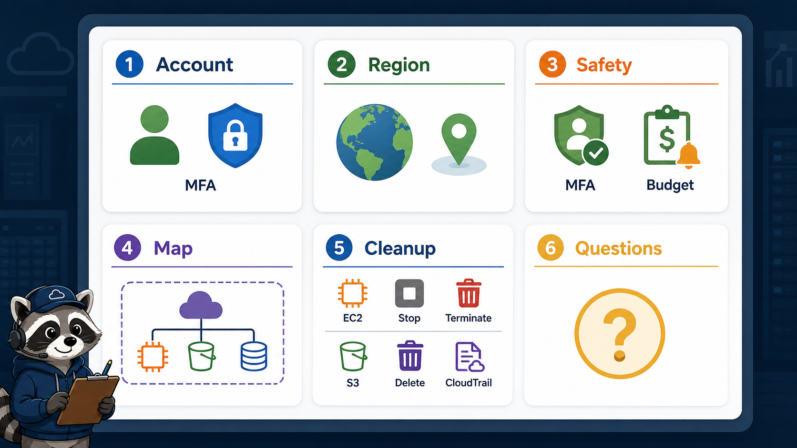
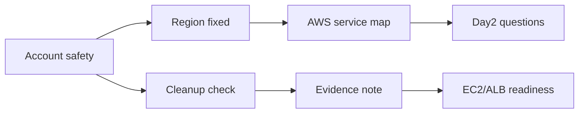

# 8교시: 구름 EXP 배움일기



## 수업 목표
- 오늘 배운 AWS 계정 안전장치와 운영 좌표계를 스스로 정리한다.
- 다음 수업 EC2/ALB 실습 전에 필요한 질문을 남긴다.
- 생성한 resource가 있다면 cleanup 상태를 확인한다.

## 오늘 반드시 가져갈 것
| 필수 개념 | 왜 필수인가 | 놓치면 생기는 문제 | 확인 지점 |
|---|---|---|---|
| 계정 안전 checklist | AWS 실습의 시작 조건이다 | 비용/권한 사고가 먼저 난다 | MFA, Budget, IAM |
| Region 고정 | resource 위치와 비용 분석의 기준이다 | resource를 못 찾는다 | `ap-northeast-2` selector |
| AWS service map | 다음 4일 수업의 공통 지도다 | EC2/S3/VPC/IAM을 따로 외운다 | mapping table |
| Cleanup mindset | cloud resource는 잔여 비용을 남길 수 있다 | 수업 후 비용이 계속 발생한다 | resource list, Billing |

## 오늘 정리할 내용
구름 EXP 배움일기는 긴 블로그가 아니어도 된다. 다만 오늘은 AWS 첫날이므로 다음 항목은 꼭 남긴다.

```markdown
# W5D1 AWS account safety and operating map

## 1. 오늘 사용한 계정/Region
- Account ID:
- Region:
- 실습 identity:

## 2. 계정 안전장치
- root MFA:
- Budget/비용 알림:
- access key 생성 여부:
- 공통 tag:

## 3. Kubernetes에서 AWS로 연결된 개념
| Kubernetes | AWS에서 이어지는 질문 |
|---|---|
| Node |  |
| Service/Ingress |  |
| Secret |  |
| PV/PVC |  |
| logs/metrics/events |  |

## 4. 오늘 가장 헷갈린 AWS 용어 3개
- 
- 
- 

## 5. 다음 수업 전 질문
- 
- 
```

## Cleanup 확인
오늘 실제 resource를 만들었다면 다음을 확인한다.

| resource | 종료 전 상태 |
|---|---|
| EC2 instance | stopped 또는 terminated 여부, EBS 잔여 확인 |
| S3 bucket | object 삭제 여부, public access block 상태 |
| IAM access key | 새로 만들었다면 삭제 또는 비활성화 |
| Budget | 알림 이메일 확인 |
| Region | 다른 Region에 resource가 생기지 않았는지 확인 |

오늘 resource를 만들지 않았다면 "생성 없음"이라고 남긴다. cloud 수업에서는 아무것도 만들지 않은 것도 좋은 evidence가 될 수 있다. 중요한 것은 현재 상태를 설명할 수 있는가다.

## 구조로 보기


## 다음 수업 준비
Day2는 EC2와 ALB를 더 구체적으로 다룬다. 다음 수업 전에 아래 질문을 답할 수 있으면 좋다.

| 질문 | 내 답 |
|---|---|
| EC2 접속은 SSH로 할 것인가, browser-based connect로 할 것인가 |  |
| 내 PC에서 `.pem` key file을 안전하게 보관할 수 있는가 |  |
| HTTP 80을 열 때 source를 어떻게 제한할 것인가 |  |
| 실습이 끝난 뒤 stop과 terminate 중 무엇을 할 것인가 |  |
| ALB가 비용을 만들 수 있다는 점을 알고 있는가 |  |


## 좋은 배움일기의 기준
좋은 배움일기는 길이가 아니라 재현성과 판단 기준이 있다. "AWS 배웠다"가 아니라 "서울 Region에서 IAM user로 로그인했고, root MFA와 Budget을 확인했으며, EC2를 만들 때 public subnet/SG/public IP를 봐야 한다"처럼 다음 행동이 보이는 문장이어야 한다.

## Day2 진입 전 자기 점검
| 질문 | 답할 수 있어야 하는 이유 |
|---|---|
| EC2에 public 접속하려면 무엇이 필요한가 | Day2 접속 장애 분석 |
| SSH 22를 전체 공개하면 왜 위험한가 | SG 보안 기준 |
| stop과 terminate 차이는 무엇인가 | 비용/삭제 판단 |
| ALB는 왜 비용 cleanup 대상인가 | Day2 종료 점검 |

## feedback 질문 예시
- 내 계정에서 Budget 메뉴가 보이지 않으면 어떤 권한을 요청해야 하는가?
- EC2 Instance Connect와 SSH 중 우리 환경에서 어떤 방식을 쓸 수 있는가?
- public subnet이 없으면 Day2 실습을 어떻게 우회할 수 있는가?

## 운영 판단 연습
| 판단 질문 | 확인 기준 |
|---|---|
| 이 항목에서 가장 먼저 결정할 것은 무엇인가 | 남긴 resource와 지운 resource를 구분한다. |
| 실패했을 때 어느 경계부터 볼 것인가 | 다음 날 실습 전 비용과 권한 상태를 확인한다. |
| 수업 뒤 혼자 재현할 때 필요한 최소 정보는 무엇인가 | evidence note는 기억 대신 사용할 수 있어야 한다. |

## 흔한 실패와 첫 확인 위치
| 흔한 실패 | 첫 확인 위치 |
|---|---|
| 삭제했다고 생각했지만 resource가 남아 있다 | 이름/ID로 다시 검색해 남은 resource를 확인한다 |

## Evidence 점검
- 화면에는 민감 정보 대신 resource 이름, Region, 상태값, rule, tag처럼 재현 가능한 값이 보여야 한다.
- 기록에는 "성공했다"보다 어떤 값이 어떤 상태였는지가 남아야 한다.
- 실패를 기록할 때는 증상, 확인한 화면, 수정한 값, 재확인 결과를 한 세트로 남긴다.
- resource list, 삭제/보존 이유, 다음 날 준비 상태 중 최소 두 가지는 배움일기에 남긴다.

## Evidence Note
```markdown
# W5D1S8 journal and cleanup
- Account/Region:
- 확인한 안전장치:
- 오늘 만든 resource:
- 삭제/유지 상태:
- Day2 진입 전 질문:
- 비용/권한 주의사항:
```

## 혼자 다시 따라오기
- 최소 재현 경로: lesson 02의 계정 안전 checklist와 lesson 03의 Region note를 먼저 채운다.
- 공식 문서 키워드: `root user best practices`, `AWS Budgets`, `Regions and Availability Zones`, `Security Groups`, `S3 Block Public Access`.
- 스스로 확인할 화면: IAM, Billing, VPC, EC2 launch preview, S3 bucket create preview.
- 흔한 실패 3개: 배움일기에 계정/Region을 안 남김, cleanup 상태를 추측으로 적음, 다음 수업 질문을 남기지 않음.
- 다음 준비 상태: Day2에서 EC2/ALB를 만들기 전에 비용과 삭제 기준을 말할 수 있어야 한다.

## 한 줄 요약
```text
오늘의 산출물은 AWS resource가 아니라 AWS resource를 안전하게 만들기 위한 운영 지도다.
```
