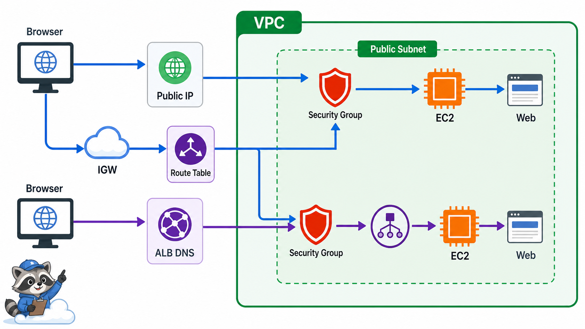
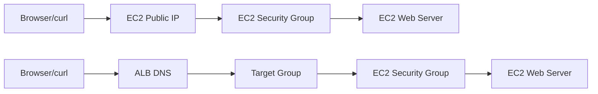

# 1교시: Day1 요약 + AWS 네트워크 실습 지도



## 수업 목표
- W5D1의 계정 안전장치와 Region 고정을 다시 확인한다.
- public subnet이 internet gateway route와 public IP 조건으로 동작한다는 점을 설명한다.
- 오늘 만들 EC2/ALB 실습의 traffic path를 먼저 그린다.

## 오늘 반드시 가져갈 것
| 필수 개념 | 왜 필수인가 | 놓치면 생기는 문제 | 확인 지점 |
|---|---|---|---|
| Public subnet 조건 | internet gateway로 가는 route와 public IP가 있어야 외부 접속이 가능하다 | EC2는 running인데 접속이 안 된다 | route table, public IP |
| Security Group gate | resource 단위 inbound/outbound 허용 지점이다 | app 문제와 network 차단을 섞는다 | SG inbound 22/80 |
| Traffic path | browser에서 EC2까지 어떤 경로를 지나는지 알아야 장애를 좁힐 수 있다 | 어디서 막혔는지 설명하지 못한다 | Browser -> ALB/EC2 -> SG -> app |

## Day1에서 이어지는 준비
W5D1에서 확인한 값이 오늘의 시작점이다.

| W5D1 확인 | W5D2에서 쓰는 이유 |
|---|---|
| Account ID | 비용과 resource 소유 경계 |
| Region `ap-northeast-2` | 모든 resource 조회와 생성 위치 |
| Budget | EC2/ALB 비용 감시 |
| IAM identity | 누가 EC2/ALB를 만들었는지 추적 |
| Tag | cleanup과 비용 추적 |

## 오늘의 traffic path
처음에는 ALB 없이 EC2 public IP로 접속한다. 이후 ALB를 추가해 browser traffic이 load balancer를 거쳐 target instance로 가게 만든다.



## Public subnet 판단
AWS 공식 문서 기준으로 public subnet은 route table에 internet gateway로 가는 route가 있는 subnet이다. 이름에 `public`이라고 적혀 있어도 route가 없으면 public subnet처럼 동작하지 않는다.

| 항목 | 외부 접속에 필요한 이유 |
|---|---|
| VPC | network 경계 |
| Subnet | EC2가 배치되는 AZ/network |
| Route table | internet-bound traffic의 다음 hop |
| Internet Gateway | VPC와 internet 연결 |
| Public IPv4/EIP | internet에서 EC2를 직접 찾는 주소 |
| Security Group | 들어올 protocol/port/source 허용 |

## 오늘의 안전 규칙
- root user로 실습하지 않는다.
- Region을 바꾸지 않는다.
- SSH 22는 가능한 내 IP로 제한한다.
- HTTP 80은 수업 목적에 맞게 열고 종료 전 닫거나 resource를 삭제한다.
- ALB는 비용이 발생하므로 종료 전 삭제한다.
- 모든 resource에 tag를 붙인다.

## Evidence Note
```markdown
# W5D2S1 network lab map
- Account ID:
- Region:
- VPC ID:
- public subnet ID:
- route table: 0.0.0.0/0 -> igw?
- 오늘 만들 resource:
- cleanup 예정 시각:
```

## 혼자 다시 따라오기
- 최소 재현 경로: VPC console에서 VPC, subnet, route table, internet gateway를 순서대로 확인한다.
- 공식 문서 키워드: `public subnet`, `internet gateway`, `route table`, `public IP`.
- 스스로 확인할 화면: VPC subnets, route tables, EC2 launch network settings.
- 흔한 실패 3개: Region을 잘못 봄, subnet 이름만 보고 public이라 생각함, public IP 없이 internet 접속을 기대함.
- 다음 준비 상태: public EC2 접속에 필요한 network 조건 5가지를 말할 수 있어야 한다.

## 한 줄 요약
```text
EC2 접속 장애는 app보다 먼저 Region, subnet route, public IP, Security Group을 본다.
```
