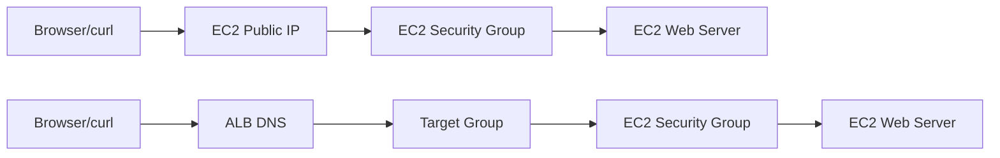

# 1교시: Day1 요약 + AWS 네트워크 실습 지도


## 수업 목표
- W5D1의 계정 안전장치와 Region 고정을 다시 확인한다.
- public subnet이 internet gateway route와 public IP 조건으로 동작한다는 점을 설명한다.
- 오늘 만들 EC2/ALB 실습의 traffic path를 먼저 그린다.

## 오늘 반드시 가져갈 것
| 필수 개념 | 왜 필수인가 | 놓치면 생기는 문제 | 확인 지점 |
|---|---|---|---|
| Public subnet 조건 | internet gateway로 가는 route와 public IP가 있어야 외부 접속이 가능하다 | EC2는 running인데 접속이 안 된다 | route table, public IP |
| Security Group gate | resource 단위 inbound/outbound 허용 지점이다 | app 문제와 network 차단을 섞는다 | SG inbound 22/80 |
| Traffic path | browser에서 EC2까지 어떤 경로를 지나는지 알아야 장애를 좁힐 수 있다 | 어디서 막혔는지 설명하지 못한다 | Browser -> ALB/EC2 -> SG -> app |

## Day1에서 이어지는 준비
W5D1에서 확인한 값이 오늘의 시작점이다.

| W5D1 확인 | W5D2에서 쓰는 이유 |
|---|---|
| Account ID | 비용과 resource 소유 경계 |
| Region `ap-northeast-2` | 모든 resource 조회와 생성 위치 |
| Budget | EC2/ALB 비용 감시 |
| IAM identity | 누가 EC2/ALB를 만들었는지 추적 |
| Tag | cleanup과 비용 추적 |

## 오늘의 traffic path
처음에는 ALB 없이 EC2 public IP로 접속한다. 이후 ALB를 추가해 browser traffic이 load balancer를 거쳐 target instance로 가게 만든다.



## Public subnet 판단
AWS 공식 문서 기준으로 public subnet은 route table에 internet gateway로 가는 route가 있는 subnet이다. 이름에 `public`이라고 적혀 있어도 route가 없으면 public subnet처럼 동작하지 않는다.

| 항목 | 외부 접속에 필요한 이유 |
|---|---|
| VPC | network 경계 |
| Subnet | EC2가 배치되는 AZ/network |
| Route table | internet-bound traffic의 다음 hop |
| Internet Gateway | VPC와 internet 연결 |
| Public IPv4/EIP | internet에서 EC2를 직접 찾는 주소 |
| Security Group | 들어올 protocol/port/source 허용 |

## 오늘의 안전 규칙
- root user로 실습하지 않는다.
- Region을 바꾸지 않는다.
- SSH 22는 가능한 내 IP로 제한한다.
- HTTP 80은 수업 목적에 맞게 열고 종료 전 닫거나 resource를 삭제한다.
- ALB는 비용이 발생하므로 종료 전 삭제한다.
- 모든 resource에 tag를 붙인다.


## 50분 수업 운영 흐름
| 시간 | 활동 | 확인할 evidence |
|---|---|---|
| 0~10분 | W5D1 안전장치 재확인 | account/Region/Budget |
| 10~20분 | VPC public path 그리기 | VPC/subnet/route table |
| 20~30분 | EC2 direct path와 ALB path 비교 | traffic map |
| 30~40분 | 장애 분류 기준 준비 | timeout/refused/HTTP error |
| 40~50분 | 오늘 resource cleanup 계획 | 삭제 예정 resource list |

## 시작 전 금지선
오늘은 실제 비용 resource를 만들 수 있다. 따라서 실습 시작 전에 ALB를 만들지 않는 대체 경로, EC2만 만들고 종료하는 경로, 전체 실습 경로를 분리한다. 계정 상태가 불안정한 학생은 Console preview와 시뮬레이션 evidence만 남겨도 된다. 억지로 유료 resource를 만들지 않는다.

## Traffic path를 먼저 그리는 이유
EC2와 ALB 실습에서 가장 흔한 문제는 "어디가 막혔는지" 모르는 것이다. 요청은 browser에서 시작해 DNS/public IP, route, security group, target group, app process를 지나간다. 이 경로를 먼저 그리면 timeout은 network gate, 503은 target health, 404는 app path처럼 좁혀갈 수 있다.

## 장애 증상 분류
| 증상 | 의미 | 첫 확인 |
|---|---|---|
| timeout | 경로 중간에서 응답 없음 | public IP, route, SG |
| connection refused | host 도달, port listen 안 함 | web server process |
| 403/404 | HTTP server 응답, path/permission 문제 | index/path |
| 503 from ALB | healthy target 없음 | target health |

## 캡처 가이드
VPC ID, subnet ID, route table, SG rule, EC2 public IP, ALB DNS를 각각 따로 캡처한다. 한 장에 다 넣으려다 글자가 안 보이는 캡처는 evidence 가치가 낮다.

## 강사 보강 노트
이 교시는 `EC2/ALB 실습 경계`을 학생이 말로 설명할 수 있게 만드는 데 초점을 둔다. Console 화면을 따라 누르는 시간으로만 흘러가면 학생은 성공 화면은 보지만, 다음 날 같은 resource를 혼자 다시 만들거나 장애를 설명하지 못한다. 각 단계마다 "지금 무엇을 결정했는가", "그 결정은 비용/보안/관찰 중 어디에 영향을 주는가"를 짧게 되묻는다.

## 학생이 자주 흔들리는 지점
| 흔들리는 지점 | 강사 개입 문장 |
|---|---|
| VPC와 subnet을 기본값으로 쓰면서 의미를 모름 | "지금 화면에서 그 판단을 증명하는 값이 어디에 있나요?" |
| EC2부터 만들고 SG/Key Pair를 나중에 찾음 | "이 값이 바뀌면 접속, 비용, 권한 중 무엇이 먼저 달라질까요?" |
| ALB는 무료일 것이라 생각함 | "성공 화면 말고 실패했을 때 다시 볼 evidence를 남겼나요?" |

## 실습 중 멈춤 포인트
- 첫 번째 멈춤: 학생이 resource를 생성하기 전에 이름, Region, tag, 예상 비용 발생 지점을 말하게 한다.
- 두 번째 멈춤: 성공 화면이 나온 직후 resource ID와 상태값을 evidence note에 적게 한다.
- 세 번째 멈춤: 실패나 지연이 생기면 새로 클릭하기 전에 이전 단계의 화면과 명령을 다시 보게 한다.
- 네 번째 멈춤: 정리 단계에서 "삭제했다"가 아니라 "검색해도 남아 있지 않다"를 확인하게 한다.

## 확인 질문
1. 오늘 만든 resource가 어느 Region과 어느 계정 경계에 있는가?
2. 이 resource가 비용을 만들기 시작하는 시점은 언제인가?
3. 접속이 실패하면 app, network, permission 중 무엇을 먼저 확인할 것인가?
4. 수업이 끝난 뒤 남겨도 되는 resource와 지워야 하는 resource는 무엇인가?

## 제출 evidence 기준
| evidence | 좋은 예 | 부족한 예 |
|---|---|---|
| 화면 캡처 | 오늘 만들 resource checklist | 성공 toast만 보이는 캡처 |
| 설정 기록 | 예상 비용 발생 지점 | "기본값 사용"이라고만 적음 |
| 운영 판단 | 삭제 순서 | "잘 됨", "안 됨"으로만 적음 |

## Evidence Note
```markdown
# W5D2S1 network lab map
- Account ID:
- Region:
- VPC ID:
- public subnet ID:
- route table: 0.0.0.0/0 -> igw?
- 오늘 만들 resource:
- cleanup 예정 시각:
```

## 혼자 다시 따라오기
- 최소 재현 경로: VPC console에서 VPC, subnet, route table, internet gateway를 순서대로 확인한다.
- 공식 문서 키워드: `public subnet`, `internet gateway`, `route table`, `public IP`.
- 스스로 확인할 화면: VPC subnets, route tables, EC2 launch network settings.
- 흔한 실패 3개: Region을 잘못 봄, subnet 이름만 보고 public이라 생각함, public IP 없이 internet 접속을 기대함.
- 다음 준비 상태: public EC2 접속에 필요한 network 조건 5가지를 말할 수 있어야 한다.

## 한 줄 요약
```text
EC2 접속 장애는 app보다 먼저 Region, subnet route, public IP, Security Group을 본다.
```
