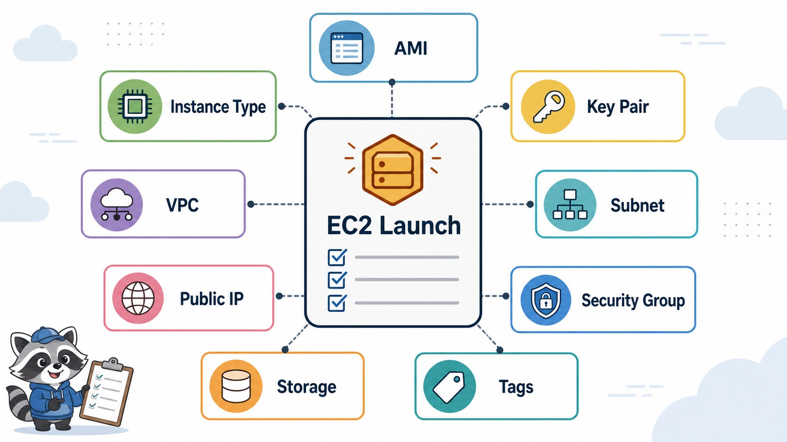
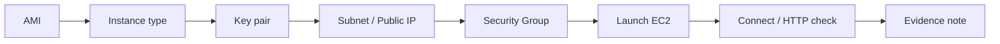

# 2교시: EC2 Console 실습



## 수업 목표
- EC2 launch 화면의 주요 설정을 운영 기준으로 읽는다.
- key pair, subnet, public IP, Security Group, storage, tag를 생성 전 확인한다.
- EC2 Instance Connect와 SSH client 접속 조건을 구분한다.

## 오늘 반드시 가져갈 것
| 필수 개념 | 왜 필수인가 | 놓치면 생기는 문제 | 확인 지점 |
|---|---|---|---|
| Launch checklist | EC2는 클릭 한 번이 아니라 여러 운영 선택의 묶음이다 | 잘못된 subnet/SG/type으로 비용과 접속 문제가 생긴다 | launch summary |
| Key pair | Linux instance 접속 identity material이다 | private key 분실 또는 노출 | key pair name, local file |
| Public IP | internet 직접 접속 조건이다 | instance running인데 외부 접속이 안 된다 | network settings |
| Tag | owner와 cleanup 추적 기준이다 | 실습 resource가 남는다 | Tags tab |

## EC2 launch 순서
Console에서 EC2를 만들 때는 다음 순서로 읽는다.

| 단계 | 확인 |
|---|---|
| Name and tags | `Course=paperclip`, `Week=5`, `Day=2`, `Owner=<id>` |
| AMI | 수업 OS와 명령이 맞는지 |
| Instance type | 비용 통제 가능한 작은 type |
| Key pair | 새로 만들면 안전하게 보관, 기존 key 재사용 시 소유 확인 |
| Network settings | VPC, public subnet, auto-assign public IP |
| Security Group | SSH/HTTP inbound 최소 허용 |
| Storage | root volume size와 delete on termination |
| Advanced details | user data 사용 여부 |

## 접속 방식
AWS 공식 문서 기준으로 EC2 key pair는 public/private key 기반 credential이다. Linux instance에서는 private key로 SSH 접속을 증명한다. EC2 Instance Connect를 사용할 수 있으면 browser 기반 접속도 가능하다.

| 방식 | 장점 | 확인할 것 |
|---|---|---|
| EC2 Instance Connect | browser에서 빠르게 접속 가능 | instance OS/Region/subnet/public IP/SG 조건 |
| SSH client | 현업 환경과 유사 | private key 권한, username, local network |
| Session Manager | 운영 친화적 | SSM agent, IAM role, VPC endpoint 또는 internet route |

Day2는 EC2 Instance Connect 또는 SSH 중 가능한 방식으로 접속한다. 둘 다 실패하면 먼저 Security Group과 public IP를 확인한다.

## Security Group 최소 예시
| 목적 | Protocol | Port | Source |
|---|---|---|---|
| SSH | TCP | 22 | 내 IP 또는 교육장 CIDR |
| HTTP | TCP | 80 | 수업 중 임시 `0.0.0.0/0` 가능, 종료 전 삭제 |

`0.0.0.0/0`은 모든 IPv4 source를 뜻한다. SSH 22를 전체 공개로 오래 유지하지 않는다.

## 구조로 보기


## 생성 전 멈춤 지점
EC2 launch 화면의 마지막 버튼을 누르기 전에 반드시 summary를 읽는다. 실무에서도 배포 전 review 단계가 있는 이유와 같다. AMI, type, subnet, public IP, SG, storage, tag 중 하나라도 설명하지 못하면 아직 launch할 준비가 되지 않은 것이다.

## Key pair 운영 주의
private key는 다시 다운로드할 수 없다. 잃어버리면 해당 방식으로 접속하기 어렵고, 공개 repository에 올라가면 credential 사고가 된다. Windows/macOS/Linux별 파일 권한 처리도 다르므로, 수업에서는 key 파일 위치를 배움일기에 기록하되 파일 내용은 절대 붙이지 않는다.

## 접속 실패 판단
| 실패 지점 | 증상 | 확인 |
|---|---|---|
| key 문제 | permission denied | username/key pair |
| SG 22 닫힘 | SSH timeout | inbound 22 source |
| public IP 없음 | 외부 접속 불가 | instance networking |
| Instance Connect 불가 | Connect 버튼 실패 | supported OS, network |

## 비용 판단
Instance type은 성능 선택이면서 비용 선택이다. 수업에서는 성능보다 비용 통제를 우선한다. 큰 instance를 쓰면 실습은 빨라질 수 있지만 학생에게 잘못된 기본값을 심어줄 수 있다.

## 운영 판단 연습
| 판단 질문 | 확인 기준 |
|---|---|
| 이 항목에서 가장 먼저 결정할 것은 무엇인가 | AMI, instance type, key pair, SG는 모두 운영 결정이다. |
| 실패했을 때 어느 경계부터 볼 것인가 | key pair는 분실하면 접속 복구가 어려울 수 있다. |
| 수업 뒤 혼자 재현할 때 필요한 최소 정보는 무엇인가 | default SG를 그대로 쓰면 의도하지 않은 rule을 가져올 수 있다. |

## 흔한 실패와 첫 확인 위치
| 흔한 실패 | 첫 확인 위치 |
|---|---|
| instance는 떴는데 접속 방법을 모른다 | key pair, public IP, SG 22/80 rule을 확인한다 |

## Evidence 점검
- 화면에는 민감 정보 대신 resource 이름, Region, 상태값, rule, tag처럼 재현 가능한 값이 보여야 한다.
- 기록에는 "성공했다"보다 어떤 값이 어떤 상태였는지가 남아야 한다.
- 실패를 기록할 때는 증상, 확인한 화면, 수정한 값, 재확인 결과를 한 세트로 남긴다.
- AMI 이름, instance type, key pair와 SG 중 최소 두 가지는 배움일기에 남긴다.

## Evidence Note
```markdown
# W5D2S2 EC2 launch
- Instance name:
- AMI:
- Instance type:
- Key pair:
- VPC/subnet:
- Public IP auto-assign:
- Security Group inbound:
- Tags:
- Storage:
```

## 혼자 다시 따라오기
- 최소 재현 경로: EC2 launch 화면에서 summary까지 값을 채운 뒤, 실제 launch 전 모든 항목을 소리 내어 설명한다.
- 공식 문서 키워드: `EC2 key pairs`, `EC2 Instance Connect`, `launch instance`, `security groups`.
- 스스로 확인할 화면: EC2 launch summary, Instances list, Security tab.
- 흔한 실패 3개: key pair 파일을 잃음, public IP를 끔, default SG에 의존함.
- 다음 준비 상태: launch summary를 보고 비용/접속/cleanup 위험을 설명할 수 있어야 한다.

## 한 줄 요약
```text
EC2 launch는 AMI/type/key/network/SG/storage/tag를 한 번에 결정하는 운영 선택이다.
```
