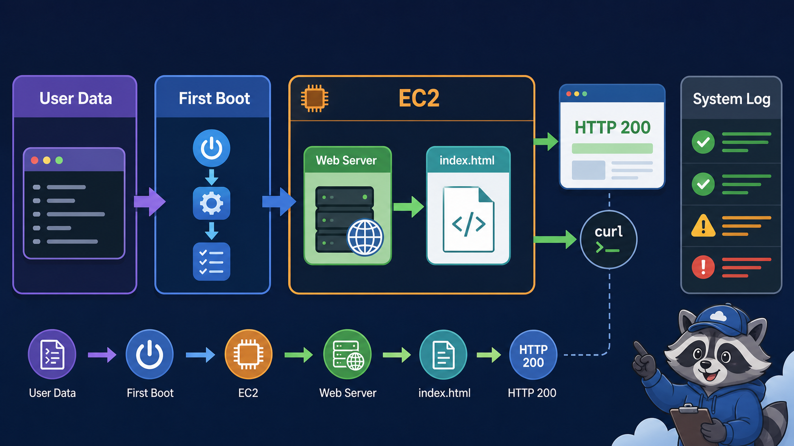

# 3교시: EC2 웹 서버 실행



## 수업 목표
- user data로 EC2 bootstrap을 재현 가능한 형태로 만든다.
- browser와 `curl`로 HTTP 응답을 확인한다.
- user data 실패 시 system log와 instance 상태를 확인한다.

## 오늘 반드시 가져갈 것
| 필수 개념 | 왜 필수인가 | 놓치면 생기는 문제 | 확인 지점 |
|---|---|---|---|
| User Data | 최초 부팅 시 설정을 자동 실행해 재현성을 높인다 | 서버마다 손작업이 달라진다 | Advanced details, system log |
| Listen port | app이 실제로 어느 port에서 응답하는지 알아야 한다 | SG는 열렸는데 응답이 없다 | HTTP 80, process |
| HTTP evidence | "됐다"는 말보다 status/body를 남겨야 한다 | 장애 재현과 비교가 안 된다 | browser, curl |

## User data 예시
AMI에 따라 package manager와 service name이 다르다. Amazon Linux 계열을 기준으로 단순 HTTP 응답을 만들 때는 다음 형태를 사용할 수 있다.

```bash
#!/bin/bash
dnf update -y
dnf install -y httpd
systemctl enable --now httpd
cat > /var/www/html/index.html <<'EOF'
<h1>paperclip w5d2 ec2 web</h1>
<p>hello from EC2 user data</p>
EOF
```

Ubuntu 계열을 선택했다면 `apt`와 `apache2` 기준으로 달라진다. 수업에서는 AMI와 명령을 맞추는 것을 중요하게 본다.

## 확인 순서
```text
EC2 state = running
Status checks = passed
Public IPv4 exists
Security Group allows TCP 80
Browser/curl returns HTTP response
```

```bash
curl -i http://<EC2_PUBLIC_IP>/
```

기대 결과는 `HTTP/1.1 200 OK` 또는 브라우저에서 index page가 보이는 것이다.

## 실패 증상별 첫 확인
| 증상 | 첫 확인 |
|---|---|
| timeout | public IP, route table, SG inbound 80 |
| connection refused | web server process/listen port |
| 403/404 | document root, index file |
| SSH는 되는데 HTTP 안 됨 | SG 80, web server |
| user data가 안 된 것 같음 | system log, cloud-init log |

## 직접 설치 경로
user data가 실패하면 SSH 또는 EC2 Instance Connect로 접속해 같은 작업을 직접 수행할 수 있다. 다만 직접 고친 내용은 재현성이 떨어진다. 수업 evidence에는 "user data 실패 -> system log 확인 -> 직접 설치로 임시 복구"처럼 경로를 남긴다.


## 50분 수업 운영 흐름
| 시간 | 활동 | 확인할 evidence |
|---|---|---|
| 0~10분 | user data 목적 설명 | bootstrap flow |
| 10~25분 | user data로 web server 설치 | script, system log |
| 25~35분 | public IP와 curl 확인 | HTTP status/body |
| 35~45분 | 실패 시 system log/SG/process 확인 | failure evidence |
| 45~50분 | 재현 가능한 절차 정리 | runbook note |

## user data와 수동 설치 비교
| 구분 | user data | 수동 설치 |
|---|---|---|
| 재현성 | instance 생성과 함께 반복 가능 | 사람이 기억해야 함 |
| 실패 확인 | system log/cloud-init log | shell history/log |
| 수정 속도 | 재생성 필요할 수 있음 | 빠르게 고칠 수 있음 |
| 수업 목적 | 표준 절차 학습 | 장애 복구 보조 |

## HTTP 확인 기준
브라우저에 페이지가 보이는 것만으로는 부족하다. `curl -i`로 status code와 response header/body를 같이 확인하면 ALB, cache, redirect, 403/404 같은 문제를 더 정확히 볼 수 있다.

## 복구 절차 예시
1. `curl` timeout이면 SG와 public IP를 확인한다.
2. SSH는 되는데 HTTP가 안 되면 web server service 상태를 확인한다.
3. service가 없으면 user data가 실패했는지 system log를 본다.
4. AMI와 package manager가 맞는지 확인한다.
5. 직접 설치로 임시 복구했다면 user data 수정 필요성을 기록한다.

## 캡처 가이드
EC2 details의 public IP, Security tab의 inbound 80, browser/curl 결과, system log 일부를 각각 캡처한다. private key나 terminal prompt에 민감정보가 보이지 않게 한다.

## 강사 보강 노트
이 교시는 `User Data와 bootstrap`을 학생이 말로 설명할 수 있게 만드는 데 초점을 둔다. Console 화면을 따라 누르는 시간으로만 흘러가면 학생은 성공 화면은 보지만, 다음 날 같은 resource를 혼자 다시 만들거나 장애를 설명하지 못한다. 각 단계마다 "지금 무엇을 결정했는가", "그 결정은 비용/보안/관찰 중 어디에 영향을 주는가"를 짧게 되묻는다.

## 학생이 자주 흔들리는 지점
| 흔들리는 지점 | 강사 개입 문장 |
|---|---|
| user data가 매번 재실행된다고 생각함 | "지금 화면에서 그 판단을 증명하는 값이 어디에 있나요?" |
| web server가 안 뜨면 바로 SG만 의심함 | "이 값이 바뀌면 접속, 비용, 권한 중 무엇이 먼저 달라질까요?" |
| log 위치를 확인하지 않음 | "성공 화면 말고 실패했을 때 다시 볼 evidence를 남겼나요?" |

## 실습 중 멈춤 포인트
- 첫 번째 멈춤: 학생이 resource를 생성하기 전에 이름, Region, tag, 예상 비용 발생 지점을 말하게 한다.
- 두 번째 멈춤: 성공 화면이 나온 직후 resource ID와 상태값을 evidence note에 적게 한다.
- 세 번째 멈춤: 실패나 지연이 생기면 새로 클릭하기 전에 이전 단계의 화면과 명령을 다시 보게 한다.
- 네 번째 멈춤: 정리 단계에서 "삭제했다"가 아니라 "검색해도 남아 있지 않다"를 확인하게 한다.

## 확인 질문
1. 오늘 만든 resource가 어느 Region과 어느 계정 경계에 있는가?
2. 이 resource가 비용을 만들기 시작하는 시점은 언제인가?
3. 접속이 실패하면 app, network, permission 중 무엇을 먼저 확인할 것인가?
4. 수업이 끝난 뒤 남겨도 되는 resource와 지워야 하는 resource는 무엇인가?

## 제출 evidence 기준
| evidence | 좋은 예 | 부족한 예 |
|---|---|---|
| 화면 캡처 | user data script | 성공 toast만 보이는 캡처 |
| 설정 기록 | system log 또는 cloud-init log | "기본값 사용"이라고만 적음 |
| 운영 판단 | HTTP 응답 | "잘 됨", "안 됨"으로만 적음 |

## Evidence Note
```markdown
# W5D2S3 EC2 web
- EC2 public IP:
- User data 사용 여부:
- Web server package:
- SG inbound 80:
- curl result:
- 실패 시 첫 확인:
```

## 혼자 다시 따라오기
- 최소 재현 경로: EC2 public IP로 `curl -i`를 실행하고 status/body를 기록한다.
- 공식 문서 키워드: `EC2 user data`, `system log`, `EC2 status checks`.
- 스스로 확인할 화면: EC2 instance details, Connect tab, System log, Security tab.
- 흔한 실패 3개: AMI와 package manager가 다름, SG 80을 열지 않음, public IP를 확인하지 않음.
- 다음 준비 상태: EC2 직접 접속과 HTTP 응답 확인을 분리해서 설명할 수 있어야 한다.

## 한 줄 요약
```text
EC2 웹 서버 실습의 성공 증거는 instance running이 아니라 HTTP response다.
```
