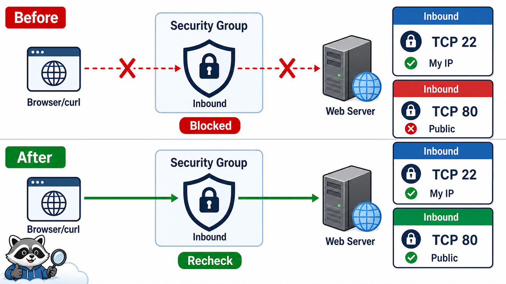
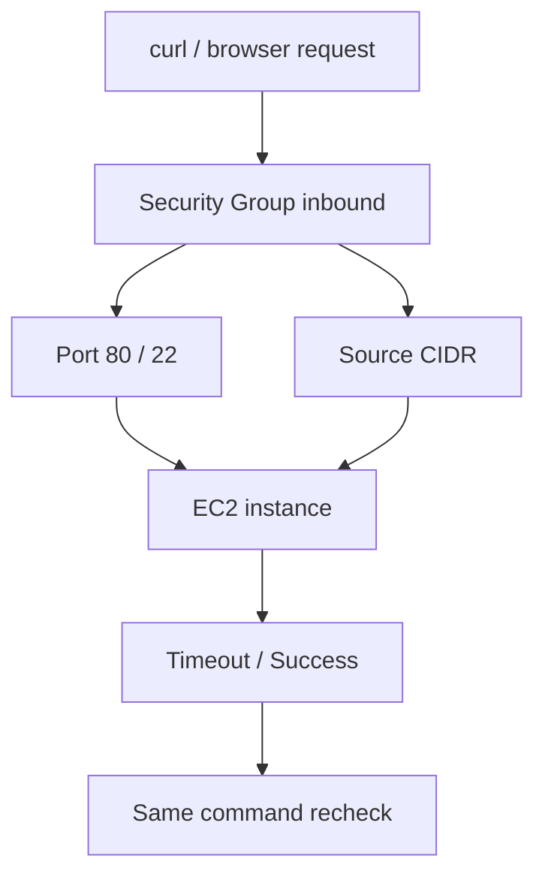

# 4교시: Security Group 장애 분석



## 수업 목표
- Security Group rule 변경으로 의도적 접속 실패를 만들고 복구한다.
- SSH 22와 HTTP 80의 source CIDR 위험을 구분한다.
- wrong rule, wrong port, wrong source를 evidence로 분석한다.

## 오늘 반드시 가져갈 것
| 필수 개념 | 왜 필수인가 | 놓치면 생기는 문제 | 확인 지점 |
|---|---|---|---|
| Inbound rule | 외부에서 resource로 들어오는 traffic gate다 | app 장애로 오진한다 | SG inbound tab |
| Source CIDR | 누가 들어올 수 있는지 정한다 | SSH가 전체 공개된다 | 내 IP, `0.0.0.0/0` |
| Port mismatch | app listen port와 SG port가 맞아야 한다 | SG를 열어도 응답이 없다 | port 80/8080 |
| Recheck | rule 수정 후 같은 명령으로 다시 확인해야 한다 | 고쳤는지 증명하지 못한다 | curl/ssh retry |

## 장애 주입 1: HTTP 80 닫기
1. EC2 Security Group inbound rule에서 TCP 80을 제거한다.
2. 브라우저 또는 `curl`로 다시 접속한다.
3. timeout 또는 접속 실패를 기록한다.
4. TCP 80 rule을 복구한다.
5. 같은 `curl` 명령으로 다시 확인한다.

```bash
curl -m 5 -i http://<EC2_PUBLIC_IP>/
```

## 장애 주입 2: source 잘못 지정
HTTP 80 source를 현재 내 IP가 아닌 다른 CIDR로 제한하면 외부에서 접속이 실패한다. 이때 instance와 web server는 정상일 수 있다.

| 원인 | 증거 |
|---|---|
| app process down | EC2 접속 후 process/service 상태 불량 |
| SG 80 closed | TCP timeout, inbound rule 없음 |
| wrong source | rule은 있으나 source가 내 IP와 다름 |
| wrong port | app은 8080, SG는 80 또는 반대 |

## SSH 22 주의
SSH 22를 `0.0.0.0/0`으로 오래 열어두지 않는다. 교육장/개인 IP가 자주 바뀌는 경우에는 일시적으로 열 수 있지만, evidence에 사유와 종료 시각을 남긴다.

| Rule | 수업 판단 |
|---|---|
| TCP 22 from my IP | 권장 |
| TCP 22 from `0.0.0.0/0` | 임시 예외, 종료 전 삭제 |
| TCP 80 from `0.0.0.0/0` | public web 확인 목적 가능 |
| DB port from `0.0.0.0/0` | 금지에 가깝게 다룸 |


## 왜 일부러 고장내는가
운영자는 정상 화면만 보고 성장하지 않는다. 일부러 80을 닫고, source를 틀리고, port를 바꾸어 보면 증상이 어떻게 달라지는지 몸으로 익힌다. 이 경험이 있어야 실제 장애에서 app code와 cloud network 문제를 분리할 수 있다.

## SG 변경 시 주의
Security Group rule 변경은 즉시 반영될 수 있다. 같은 instance를 여러 학생이 공유하면 한 명의 rule 변경이 다른 사람 실습에 영향을 준다. 개인 계정/개인 SG를 쓰는 이유는 이 영향 범위를 줄이기 위해서다.

## Recheck 원칙
복구했다면 반드시 실패를 확인했던 같은 명령으로 다시 확인한다. 브라우저 새로고침만으로는 DNS/cache/redirect 때문에 판단이 흐릴 수 있다. `curl -m 5 -i` 같은 명령을 고정하면 전후 비교가 쉽다.

## 운영 판단 표
| 바꿀 rule | 수업 중 허용 | 종료 후 상태 |
|---|---|---|
| TCP 22 from my IP | 가능 | 필요 없으면 삭제 |
| TCP 22 from public | 피함 | 반드시 삭제 |
| TCP 80 from public | HTTP 실습 중 가능 | EC2/ALB 삭제 또는 rule 삭제 |
| DB port from public | 사용하지 않음 | 없어야 함 |

## 구조로 보기


## 운영 판단 연습
| 판단 질문 | 확인 기준 |
|---|---|
| 이 항목에서 가장 먼저 결정할 것은 무엇인가 | port, source, direction을 함께 봐야 한다. |
| 실패했을 때 어느 경계부터 볼 것인가 | 실패와 복구는 같은 명령으로 비교한다. |
| 수업 뒤 혼자 재현할 때 필요한 최소 정보는 무엇인가 | SSH public open은 임시 예외로만 다룬다. |

## 흔한 실패와 첫 확인 위치
| 흔한 실패 | 첫 확인 위치 |
|---|---|
| port만 보고 source CIDR을 놓친다 | inbound rule의 source와 현재 IP를 비교한다 |

## Evidence 점검
- 화면에는 민감 정보 대신 resource 이름, Region, 상태값, rule, tag처럼 재현 가능한 값이 보여야 한다.
- 기록에는 "성공했다"보다 어떤 값이 어떤 상태였는지가 남아야 한다.
- 실패를 기록할 때는 증상, 확인한 화면, 수정한 값, 재확인 결과를 한 세트로 남긴다.
- before/after rule, curl 실패, curl 복구 중 최소 두 가지는 배움일기에 남긴다.

## Evidence Note
```markdown
# W5D2S4 SG failure drill
- 실패 주입:
- 실패 증상:
- SG rule before:
- SG rule after:
- 같은 명령으로 recheck:
- 보안상 위험했던 rule:
```

## 혼자 다시 따라오기
- 최소 재현 경로: TCP 80 inbound rule을 제거하고 `curl -m 5` 실패를 확인한 뒤 복구한다.
- 공식 문서 키워드: `EC2 security groups`, `inbound rules`, `outbound rules`, `virtual firewall`.
- 스스로 확인할 화면: EC2 Security tab, Security Groups inbound rules.
- 흔한 실패 3개: outbound만 보고 inbound를 안 봄, source CIDR을 안 봄, rule 수정 후 같은 명령으로 재확인하지 않음.
- 다음 준비 상태: "timeout이면 app log보다 SG/route/public IP를 먼저 본다"는 판단을 설명할 수 있어야 한다.

## 한 줄 요약
```text
Security Group 장애 분석은 port, source, direction, recheck를 한 세트로 본다.
```
