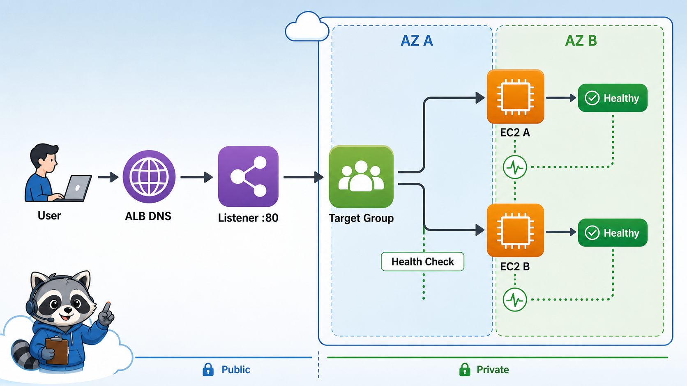
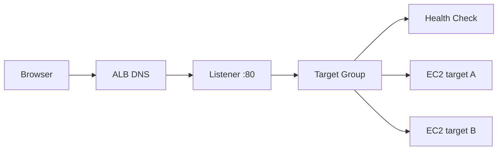

# 5교시: Load Balancing 개념



## 수업 목표
- ALB, listener, target group, health check의 역할을 구분한다.
- public endpoint와 private target의 경계를 이해한다.
- Kubernetes Service/Ingress/Gateway와 ALB의 연결점을 설명한다.

## 오늘 반드시 가져갈 것
| 필수 개념 | 왜 필수인가 | 놓치면 생기는 문제 | 확인 지점 |
|---|---|---|---|
| ALB | HTTP/HTTPS 요청을 여러 target으로 분산하는 entry point다 | EC2 public IP에만 의존한다 | ALB DNS name |
| Listener | ALB가 어떤 protocol/port로 요청을 받을지 정한다 | 80/443 접속 실패 원인을 못 찾는다 | listener rules |
| Target Group | ALB가 traffic을 보낼 대상 묶음이다 | instance와 ALB 연결을 설명하지 못한다 | registered targets |
| Health Check | healthy target에만 traffic을 보내기 위한 판단이다 | ALB는 떠 있는데 503이 난다 | target health |

## ALB 요청 흐름


AWS 공식 문서 기준으로 target group은 EC2 같은 target으로 protocol/port에 맞춰 요청을 보낸다. ALB health check는 target이 traffic을 받을 수 있는지 주기적으로 확인한다.

## Public ALB와 private target
처음에는 단순화를 위해 public subnet의 EC2를 target으로 사용한다. 운영 환경에서는 ALB는 public subnet에 두고 app target은 private subnet에 두는 구조도 자주 쓴다.

| 구성 | 의미 |
|---|---|
| Internet-facing ALB | internet에서 접근 가능한 ALB |
| Internal ALB | VPC 내부에서만 접근 |
| Public subnet | ALB 같은 public endpoint 배치 |
| Private subnet | app/DB target 배치 |
| Security Group | ALB -> target traffic 허용 |

## Kubernetes와 비교
| Kubernetes | AWS ALB |
|---|---|
| Service | target group과 일부 역할 유사 |
| Ingress/Gateway | listener/rule과 연결 가능 |
| readinessProbe | target health check와 목적 유사 |
| EndpointSlice | registered target 목록과 비교 가능 |
| kube-proxy/routing | ALB data plane과 계층이 다름 |

비교는 이해를 돕기 위한 것이다. Kubernetes object와 ALB resource는 같은 계층이 아니다.

## ALB 비용 주의
ALB는 실습이 끝나도 남아 있으면 비용이 발생할 수 있다. target group만 비워도 ALB 자체가 남으면 비용이 계속될 수 있다. Day2 종료 전 삭제 확인을 반드시 한다.

## Evidence Note
```markdown
# W5D2S5 ALB concept
- ALB type:
- Listener:
- Target group protocol/port:
- Health check path:
- Public endpoint:
- 비용 cleanup 대상:
```

## 혼자 다시 따라오기
- 최소 재현 경로: ALB, listener, target group, health check를 그림으로 그리고 각 역할을 한 줄씩 적는다.
- 공식 문서 키워드: `Application Load Balancer`, `listener`, `target group`, `health check`.
- 스스로 확인할 화면: EC2 Load Balancers, Target Groups, Health checks.
- 흔한 실패 3개: ALB DNS와 EC2 public IP를 혼동함, target group port가 app port와 다름, health check path가 실제 응답 path와 다름.
- 다음 준비 상태: ALB 503이 나면 target health부터 확인해야 한다는 점을 설명할 수 있어야 한다.

## 한 줄 요약
```text
ALB는 public entry point이고, target group과 health check가 실제 traffic 대상을 결정한다.
```
