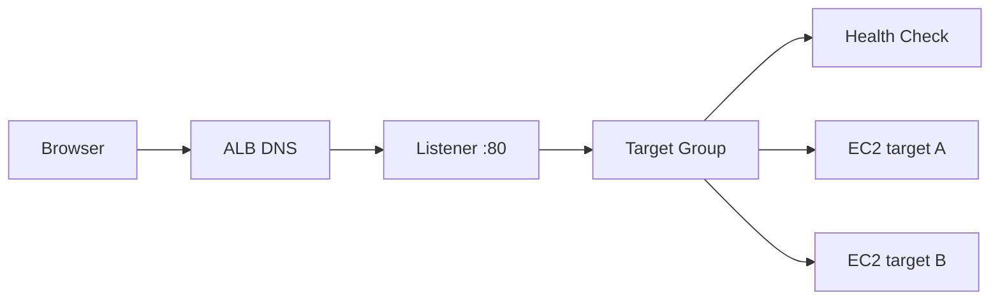

# 5교시: Load Balancing 개념


## 수업 목표
- ALB, listener, target group, health check의 역할을 구분한다.
- public endpoint와 private target의 경계를 이해한다.
- Kubernetes Service/Ingress/Gateway와 ALB의 연결점을 설명한다.

## 오늘 반드시 가져갈 것
| 필수 개념 | 왜 필수인가 | 놓치면 생기는 문제 | 확인 지점 |
|---|---|---|---|
| ALB | HTTP/HTTPS 요청을 여러 target으로 분산하는 entry point다 | EC2 public IP에만 의존한다 | ALB DNS name |
| Listener | ALB가 어떤 protocol/port로 요청을 받을지 정한다 | 80/443 접속 실패 원인을 못 찾는다 | listener rules |
| Target Group | ALB가 traffic을 보낼 대상 묶음이다 | instance와 ALB 연결을 설명하지 못한다 | registered targets |
| Health Check | healthy target에만 traffic을 보내기 위한 판단이다 | ALB는 떠 있는데 503이 난다 | target health |

## ALB 요청 흐름


AWS 공식 문서 기준으로 target group은 EC2 같은 target으로 protocol/port에 맞춰 요청을 보낸다. ALB health check는 target이 traffic을 받을 수 있는지 주기적으로 확인한다.

## Public ALB와 private target
처음에는 단순화를 위해 public subnet의 EC2를 target으로 사용한다. 운영 환경에서는 ALB는 public subnet에 두고 app target은 private subnet에 두는 구조도 자주 쓴다.

| 구성 | 의미 |
|---|---|
| Internet-facing ALB | internet에서 접근 가능한 ALB |
| Internal ALB | VPC 내부에서만 접근 |
| Public subnet | ALB 같은 public endpoint 배치 |
| Private subnet | app/DB target 배치 |
| Security Group | ALB -> target traffic 허용 |

## Kubernetes와 비교
| Kubernetes | AWS ALB |
|---|---|
| Service | target group과 일부 역할 유사 |
| Ingress/Gateway | listener/rule과 연결 가능 |
| readinessProbe | target health check와 목적 유사 |
| EndpointSlice | registered target 목록과 비교 가능 |
| kube-proxy/routing | ALB data plane과 계층이 다름 |

비교는 이해를 돕기 위한 것이다. Kubernetes object와 ALB resource는 같은 계층이 아니다.

## ALB 비용 주의
ALB는 실습이 끝나도 남아 있으면 비용이 발생할 수 있다. target group만 비워도 ALB 자체가 남으면 비용이 계속될 수 있다. Day2 종료 전 삭제 확인을 반드시 한다.


## 50분 수업 운영 흐름
| 시간 | 활동 | 확인할 evidence |
|---|---|---|
| 0~10분 | EC2 direct 접속 한계 | 단일 IP 의존 |
| 10~20분 | ALB 구성요소 정의 | ALB/listener/TG |
| 20~30분 | health check와 readiness 비교 | target health |
| 30~40분 | public/private boundary 설명 | subnet/SG relation |
| 40~50분 | 비용/cleanup 지점 확인 | ALB cleanup note |

## ALB가 해결하는 운영 문제
EC2 public IP에 직접 접속하면 instance 교체, 장애, 확장 때 사용자가 영향을 바로 받는다. ALB는 사용자가 보는 endpoint와 backend target을 분리한다. target을 추가하거나 교체해도 사용자는 ALB DNS를 기준으로 접근한다. 이 분리가 load balancing의 핵심이다.

## Health check는 배포 품질 gate다
Health check는 단순 ping이 아니다. 사용자가 받을 traffic을 target에 보내도 되는지 판단하는 gate다. path가 틀리거나 app port가 다르면 target은 unhealthy가 되고 ALB는 traffic을 보내지 않는다. Kubernetes readinessProbe를 배운 이유가 여기서 다시 등장한다.

## ALB 구성요소별 질문
| 구성요소 | 질문 |
|---|---|
| ALB | internet-facing인가 internal인가 |
| Listener | 어떤 port/protocol로 받는가 |
| Rule | 어떤 요청을 어디로 보내는가 |
| Target Group | 어떤 대상과 port로 보내는가 |
| Health Check | 어떤 path/status를 정상으로 보는가 |
| SG | user -> ALB, ALB -> target이 열려 있는가 |

## 비용 경계
ALB는 target이 없거나 traffic이 없어도 생성되어 있으면 비용이 발생할 수 있다. 실습 후 삭제하지 않는 ALB는 초보 cloud 비용 사고의 좋은 예시다.

## 강사 보강 노트
이 교시는 `ALB 개념`을 학생이 말로 설명할 수 있게 만드는 데 초점을 둔다. Console 화면을 따라 누르는 시간으로만 흘러가면 학생은 성공 화면은 보지만, 다음 날 같은 resource를 혼자 다시 만들거나 장애를 설명하지 못한다. 각 단계마다 "지금 무엇을 결정했는가", "그 결정은 비용/보안/관찰 중 어디에 영향을 주는가"를 짧게 되묻는다.

## 학생이 자주 흔들리는 지점
| 흔들리는 지점 | 강사 개입 문장 |
|---|---|
| ALB DNS만 만들면 app이 살아난다고 생각함 | "지금 화면에서 그 판단을 증명하는 값이 어디에 있나요?" |
| target health와 instance health를 혼동함 | "이 값이 바뀌면 접속, 비용, 권한 중 무엇이 먼저 달라질까요?" |
| health check path를 app과 안 맞춤 | "성공 화면 말고 실패했을 때 다시 볼 evidence를 남겼나요?" |

## 실습 중 멈춤 포인트
- 첫 번째 멈춤: 학생이 resource를 생성하기 전에 이름, Region, tag, 예상 비용 발생 지점을 말하게 한다.
- 두 번째 멈춤: 성공 화면이 나온 직후 resource ID와 상태값을 evidence note에 적게 한다.
- 세 번째 멈춤: 실패나 지연이 생기면 새로 클릭하기 전에 이전 단계의 화면과 명령을 다시 보게 한다.
- 네 번째 멈춤: 정리 단계에서 "삭제했다"가 아니라 "검색해도 남아 있지 않다"를 확인하게 한다.

## 확인 질문
1. 오늘 만든 resource가 어느 Region과 어느 계정 경계에 있는가?
2. 이 resource가 비용을 만들기 시작하는 시점은 언제인가?
3. 접속이 실패하면 app, network, permission 중 무엇을 먼저 확인할 것인가?
4. 수업이 끝난 뒤 남겨도 되는 resource와 지워야 하는 resource는 무엇인가?

## 제출 evidence 기준
| evidence | 좋은 예 | 부족한 예 |
|---|---|---|
| 화면 캡처 | listener 설정 | 성공 toast만 보이는 캡처 |
| 설정 기록 | target group protocol/port | "기본값 사용"이라고만 적음 |
| 운영 판단 | health check path | "잘 됨", "안 됨"으로만 적음 |

## Evidence Note
```markdown
# W5D2S5 ALB concept
- ALB type:
- Listener:
- Target group protocol/port:
- Health check path:
- Public endpoint:
- 비용 cleanup 대상:
```

## 혼자 다시 따라오기
- 최소 재현 경로: ALB, listener, target group, health check를 그림으로 그리고 각 역할을 한 줄씩 적는다.
- 공식 문서 키워드: `Application Load Balancer`, `listener`, `target group`, `health check`.
- 스스로 확인할 화면: EC2 Load Balancers, Target Groups, Health checks.
- 흔한 실패 3개: ALB DNS와 EC2 public IP를 혼동함, target group port가 app port와 다름, health check path가 실제 응답 path와 다름.
- 다음 준비 상태: ALB 503이 나면 target health부터 확인해야 한다는 점을 설명할 수 있어야 한다.

## 한 줄 요약
```text
ALB는 public entry point이고, target group과 health check가 실제 traffic 대상을 결정한다.
```
