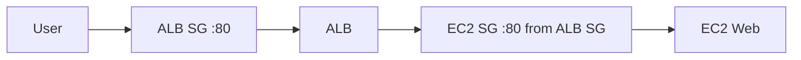

# 6교시: ALB Console 실습


## 수업 목표
- target group을 만들고 EC2 instance를 target으로 등록한다.
- ALB listener와 target group을 연결한다.
- ALB DNS로 HTTP 응답을 확인한다.

## 오늘 반드시 가져갈 것
| 필수 개념 | 왜 필수인가 | 놓치면 생기는 문제 | 확인 지점 |
|---|---|---|---|
| Target registration | ALB가 보낼 대상이 있어야 한다 | ALB는 생성됐지만 traffic이 갈 곳이 없다 | registered targets |
| Health check path | target이 healthy가 되는 기준이다 | health check failed로 traffic이 가지 않는다 | health check settings |
| ALB Security Group | user가 ALB에 들어오는 gate다 | ALB DNS가 timeout난다 | ALB SG inbound 80 |
| Target Security Group | ALB에서 EC2로 가는 gate다 | ALB는 받지만 target이 unreachable | EC2 SG source |

## 생성 흐름
1. Target group 생성
   - Target type: instance
   - Protocol: HTTP
   - Port: 80
   - VPC: EC2와 같은 VPC
   - Health check path: `/`
2. EC2 instance target 등록
3. ALB 생성
   - Scheme: internet-facing
   - Subnet: 최소 2개 AZ의 public subnet 선택
   - Security Group: HTTP 80 inbound 허용
   - Listener: HTTP 80 -> target group
4. Target health 확인
5. ALB DNS로 접속

## ALB와 EC2 Security Group 관계
운영적으로는 EC2 SG source를 `0.0.0.0/0`로 계속 열어두기보다 ALB Security Group에서 오는 traffic만 허용하는 구성이 더 안전하다. 수업에서는 먼저 단순한 public HTTP 확인을 하고, 이후 ALB SG를 source로 제한하는 개념을 설명한다.



## 성공 기준
| 확인 | 성공 기준 |
|---|---|
| Target group | target registered |
| Health | healthy |
| ALB | active |
| Listener | HTTP 80 forwards to target group |
| Browser/curl | ALB DNS에서 EC2 web page 응답 |

```bash
curl -i http://<ALB_DNS_NAME>/
```

## 실패 증상
| 증상 | 첫 확인 |
|---|---|
| ALB DNS timeout | ALB SG inbound, subnet, ALB status |
| 503 Service Unavailable | target group health |
| target unhealthy | EC2 SG, health check path, app port |
| EC2 직접 접속은 됨, ALB는 안 됨 | target group/listener/ALB SG |


## 50분 수업 운영 흐름
| 시간 | 활동 | 확인할 evidence |
|---|---|---|
| 0~10분 | EC2 web 정상 확인 | direct curl |
| 10~20분 | target group 생성 | TG settings |
| 20~30분 | ALB/listener 생성 | ALB DNS/listener |
| 30~40분 | target health 확인 | healthy/unhealthy reason |
| 40~50분 | ALB DNS curl과 실패 복구 | HTTP response |

## 생성 전 선행 조건
ALB를 만들기 전에 EC2 direct path가 정상이어야 한다. EC2 web server 자체가 응답하지 않는데 ALB를 붙이면 장애 범위가 늘어난다. 순서는 `EC2 direct success -> target group -> ALB -> ALB DNS`가 안전하다.

## target group health reason 읽기
| reason 예시 | 해석 | 첫 조치 |
|---|---|---|
| timeout | target 도달 실패 | SG, subnet, port |
| 404 | health path 없음 | path 수정 |
| 5xx | app error | app log 확인 |
| unused | ALB/listener 연결 없음 | listener/rule 확인 |

## ALB SG와 EC2 SG 분리
운영적으로는 ALB SG가 public 80을 받고, EC2 SG는 ALB SG에서 오는 80만 받게 만드는 구성이 더 좋다. 수업 초반에는 단순화를 위해 EC2 80 public을 열 수 있지만, 최종 정리에서는 더 안전한 구조를 반드시 언급한다.

## 캡처 가이드
ALB DNS, listener rule, target group health, EC2 SG source를 캡처한다. ALB DNS는 공개되어도 큰 비밀은 아니지만, 실습 종료 후 삭제했는지 함께 기록한다.

## 강사 보강 노트
이 교시는 `ALB 구성 실습`을 학생이 말로 설명할 수 있게 만드는 데 초점을 둔다. Console 화면을 따라 누르는 시간으로만 흘러가면 학생은 성공 화면은 보지만, 다음 날 같은 resource를 혼자 다시 만들거나 장애를 설명하지 못한다. 각 단계마다 "지금 무엇을 결정했는가", "그 결정은 비용/보안/관찰 중 어디에 영향을 주는가"를 짧게 되묻는다.

## 학생이 자주 흔들리는 지점
| 흔들리는 지점 | 강사 개입 문장 |
|---|---|
| target 등록을 빼먹음 | "지금 화면에서 그 판단을 증명하는 값이 어디에 있나요?" |
| wrong port target group을 만듦 | "이 값이 바뀌면 접속, 비용, 권한 중 무엇이 먼저 달라질까요?" |
| DNS propagation과 health check 시간을 장애로 오해함 | "성공 화면 말고 실패했을 때 다시 볼 evidence를 남겼나요?" |

## 실습 중 멈춤 포인트
- 첫 번째 멈춤: 학생이 resource를 생성하기 전에 이름, Region, tag, 예상 비용 발생 지점을 말하게 한다.
- 두 번째 멈춤: 성공 화면이 나온 직후 resource ID와 상태값을 evidence note에 적게 한다.
- 세 번째 멈춤: 실패나 지연이 생기면 새로 클릭하기 전에 이전 단계의 화면과 명령을 다시 보게 한다.
- 네 번째 멈춤: 정리 단계에서 "삭제했다"가 아니라 "검색해도 남아 있지 않다"를 확인하게 한다.

## 확인 질문
1. 오늘 만든 resource가 어느 Region과 어느 계정 경계에 있는가?
2. 이 resource가 비용을 만들기 시작하는 시점은 언제인가?
3. 접속이 실패하면 app, network, permission 중 무엇을 먼저 확인할 것인가?
4. 수업이 끝난 뒤 남겨도 되는 resource와 지워야 하는 resource는 무엇인가?

## 제출 evidence 기준
| evidence | 좋은 예 | 부족한 예 |
|---|---|---|
| 화면 캡처 | ALB DNS | 성공 toast만 보이는 캡처 |
| 설정 기록 | target health reason | "기본값 사용"이라고만 적음 |
| 운영 판단 | listener rule | "잘 됨", "안 됨"으로만 적음 |

## Evidence Note
```markdown
# W5D2S6 ALB console
- Target group name:
- Health check path:
- Registered target:
- Target health:
- ALB name/DNS:
- Listener:
- curl result:
```

## 혼자 다시 따라오기
- 최소 재현 경로: EC2 web server가 먼저 응답하는지 확인한 뒤 target group과 ALB를 만든다.
- 공식 문서 키워드: `Application Load Balancer`, `target groups`, `register targets`, `health checks`.
- 스스로 확인할 화면: Target Groups Targets tab, Load Balancers Listeners tab, ALB DNS.
- 흔한 실패 3개: target group VPC가 EC2와 다름, health check path가 틀림, ALB SG와 EC2 SG 중 하나가 닫힘.
- 다음 준비 상태: ALB DNS 접속 실패를 listener, target group, health check, SG로 나눠 설명할 수 있어야 한다.

## 한 줄 요약
```text
ALB 실습 성공은 ALB active가 아니라 target healthy와 ALB DNS HTTP 응답이다.
```
