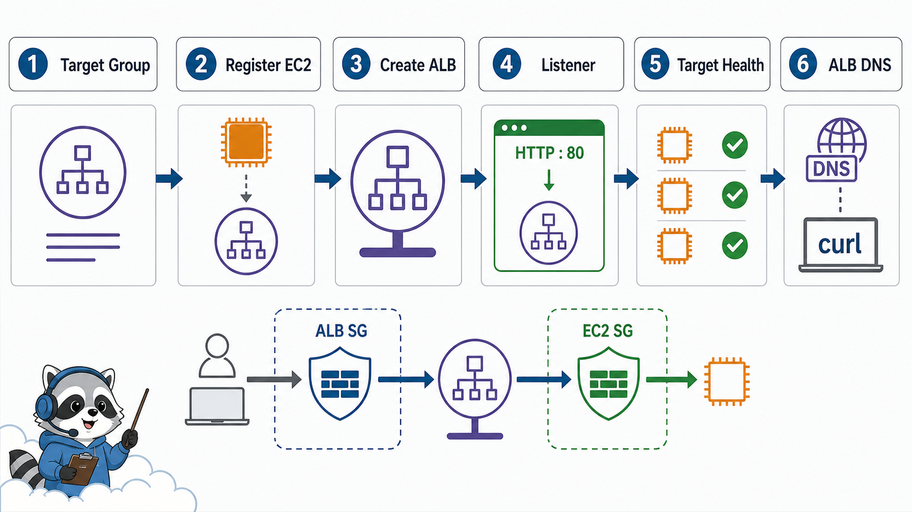
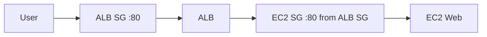

# 6교시: ALB Console 실습



## 수업 목표
- target group을 만들고 EC2 instance를 target으로 등록한다.
- ALB listener와 target group을 연결한다.
- ALB DNS로 HTTP 응답을 확인한다.

## 오늘 반드시 가져갈 것
| 필수 개념 | 왜 필수인가 | 놓치면 생기는 문제 | 확인 지점 |
|---|---|---|---|
| Target registration | ALB가 보낼 대상이 있어야 한다 | ALB는 생성됐지만 traffic이 갈 곳이 없다 | registered targets |
| Health check path | target이 healthy가 되는 기준이다 | health check failed로 traffic이 가지 않는다 | health check settings |
| ALB Security Group | user가 ALB에 들어오는 gate다 | ALB DNS가 timeout난다 | ALB SG inbound 80 |
| Target Security Group | ALB에서 EC2로 가는 gate다 | ALB는 받지만 target이 unreachable | EC2 SG source |

## 생성 흐름
1. Target group 생성
   - Target type: instance
   - Protocol: HTTP
   - Port: 80
   - VPC: EC2와 같은 VPC
   - Health check path: `/`
2. EC2 instance target 등록
3. ALB 생성
   - Scheme: internet-facing
   - Subnet: 최소 2개 AZ의 public subnet 선택
   - Security Group: HTTP 80 inbound 허용
   - Listener: HTTP 80 -> target group
4. Target health 확인
5. ALB DNS로 접속

## ALB와 EC2 Security Group 관계
운영적으로는 EC2 SG source를 `0.0.0.0/0`로 계속 열어두기보다 ALB Security Group에서 오는 traffic만 허용하는 구성이 더 안전하다. 수업에서는 먼저 단순한 public HTTP 확인을 하고, 이후 ALB SG를 source로 제한하는 개념을 설명한다.



## 성공 기준
| 확인 | 성공 기준 |
|---|---|
| Target group | target registered |
| Health | healthy |
| ALB | active |
| Listener | HTTP 80 forwards to target group |
| Browser/curl | ALB DNS에서 EC2 web page 응답 |

```bash
curl -i http://<ALB_DNS_NAME>/
```

## 실패 증상
| 증상 | 첫 확인 |
|---|---|
| ALB DNS timeout | ALB SG inbound, subnet, ALB status |
| 503 Service Unavailable | target group health |
| target unhealthy | EC2 SG, health check path, app port |
| EC2 직접 접속은 됨, ALB는 안 됨 | target group/listener/ALB SG |


## 생성 전 선행 조건
ALB를 만들기 전에 EC2 direct path가 정상이어야 한다. EC2 web server 자체가 응답하지 않는데 ALB를 붙이면 장애 범위가 늘어난다. 순서는 `EC2 direct success -> target group -> ALB -> ALB DNS`가 안전하다.

## target group health reason 읽기
| reason 예시 | 해석 | 첫 조치 |
|---|---|---|
| timeout | target 도달 실패 | SG, subnet, port |
| 404 | health path 없음 | path 수정 |
| 5xx | app error | app log 확인 |
| unused | ALB/listener 연결 없음 | listener/rule 확인 |

## ALB SG와 EC2 SG 분리
운영적으로는 ALB SG가 public 80을 받고, EC2 SG는 ALB SG에서 오는 80만 받게 만드는 구성이 더 좋다. 수업 초반에는 단순화를 위해 EC2 80 public을 열 수 있지만, 최종 정리에서는 더 안전한 구조를 반드시 언급한다.

## 캡처 가이드
ALB DNS, listener rule, target group health, EC2 SG source를 캡처한다. ALB DNS는 공개되어도 큰 비밀은 아니지만, 실습 종료 후 삭제했는지 함께 기록한다.

## 운영 판단 연습
| 판단 질문 | 확인 기준 |
|---|---|
| 이 항목에서 가장 먼저 결정할 것은 무엇인가 | ALB는 public endpoint이고 target group은 backend 연결이다. |
| 실패했을 때 어느 경계부터 볼 것인가 | healthy가 되기 전까지는 기다림과 관찰이 필요하다. |
| 수업 뒤 혼자 재현할 때 필요한 최소 정보는 무엇인가 | wrong port는 가장 흔한 ALB 실습 실패다. |

## 흔한 실패와 첫 확인 위치
| 흔한 실패 | 첫 확인 위치 |
|---|---|
| target이 unhealthy로 남는다 | target group port와 health check path를 확인한다 |

## Evidence 점검
- 화면에는 민감 정보 대신 resource 이름, Region, 상태값, rule, tag처럼 재현 가능한 값이 보여야 한다.
- 기록에는 "성공했다"보다 어떤 값이 어떤 상태였는지가 남아야 한다.
- 실패를 기록할 때는 증상, 확인한 화면, 수정한 값, 재확인 결과를 한 세트로 남긴다.
- ALB DNS, target health, listener rule 중 최소 두 가지는 배움일기에 남긴다.

## Evidence Note
```markdown
# W5D2S6 ALB console
- Target group name:
- Health check path:
- Registered target:
- Target health:
- ALB name/DNS:
- Listener:
- curl result:
```

## 혼자 다시 따라오기
- 최소 재현 경로: EC2 web server가 먼저 응답하는지 확인한 뒤 target group과 ALB를 만든다.
- 공식 문서 키워드: `Application Load Balancer`, `target groups`, `register targets`, `health checks`.
- 스스로 확인할 화면: Target Groups Targets tab, Load Balancers Listeners tab, ALB DNS.
- 흔한 실패 3개: target group VPC가 EC2와 다름, health check path가 틀림, ALB SG와 EC2 SG 중 하나가 닫힘.
- 다음 준비 상태: ALB DNS 접속 실패를 listener, target group, health check, SG로 나눠 설명할 수 있어야 한다.

## 한 줄 요약
```text
ALB 실습 성공은 ALB active가 아니라 target healthy와 ALB DNS HTTP 응답이다.
```
