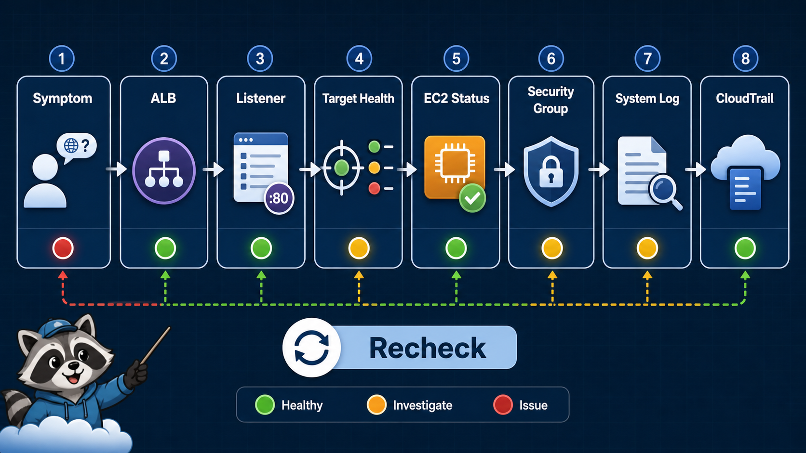

# 7교시: EC2/ALB 운영 관찰



## 수업 목표
- EC2 instance status, system log, Security Group, ALB target health를 연결해 본다.
- 접속 실패를 사용자 관점, load balancer 관점, target 관점으로 나눈다.
- CloudWatch/CloudTrail로 넘어갈 관찰 질문을 만든다.

## 오늘 반드시 가져갈 것
| 필수 개념 | 왜 필수인가 | 놓치면 생기는 문제 | 확인 지점 |
|---|---|---|---|
| Layered observation | 사용자 요청은 여러 계층을 지난다 | 한 화면만 보고 결론 낸다 | browser, ALB, target, EC2 |
| Target health reason | ALB가 왜 target을 unhealthy로 보는지 알려준다 | ALB 문제인지 app 문제인지 모른다 | target health reason |
| System log | boot/user data 실패를 확인할 수 있다 | user data 실패를 app 문제로 본다 | EC2 system log |
| Audit preview | 누가 rule을 바꿨는지 추적해야 한다 | 변경 원인을 찾지 못한다 | CloudTrail event history |

## 관찰 순서
```text
1. 사용자 증상: browser/curl 결과
2. ALB 상태: active, listener, DNS
3. Target group: target health, reason
4. EC2 상태: running, status checks
5. Network gate: ALB SG, EC2 SG, route/subnet
6. App 상태: web server process, user data/system log
7. 변경 추적: CloudTrail preview
```

## 장애 예시
| 사용자 증상 | 가능한 원인 | 첫 확인 |
|---|---|---|
| ALB DNS timeout | ALB SG, subnet, DNS propagation | ALB SG inbound |
| 503 | no healthy target | Target health |
| EC2 public IP는 됨, ALB는 안 됨 | listener/TG/health check | Listener, TG |
| EC2 public IP도 안 됨 | SG/public IP/app | EC2 SG, instance |
| 갑자기 접속 안 됨 | 누군가 SG 변경 | CloudTrail event |

## Evidence를 남기는 방식
장애 분석은 "아마 SG 문제"로 끝내지 않는다.

```markdown
증상: ALB DNS 접속 시 503
증거1: ALB active
증거2: target group target unhealthy
증거3: health check path /health, app은 / 만 응답
조치: health check path를 / 로 변경
재확인: target healthy, curl 200
```

## CloudWatch/CloudTrail preview
Day3 이후 CloudWatch Logs/Metrics를 더 다루지만, 오늘도 위치는 확인한다.

| 도구 | 오늘 수준 |
|---|---|
| CloudWatch Metrics | ALB/EC2 metric 위치 확인 |
| CloudWatch Logs | app log 수집은 preview |
| CloudTrail | SG/ALB/EC2 API 변경 이벤트 확인 |


## 관찰을 계층으로 나누기
사용자 증상 하나에 여러 계층이 숨어 있다. ALB 503은 app code 문제일 수도 있지만, target group에 healthy target이 없는 문제일 수도 있다. EC2 public IP는 되는데 ALB는 안 되면 ALB/listener/target group을 본다. 둘 다 안 되면 app 또는 EC2 network를 본다.

## 운영 incident note 예시
```markdown
증상: ALB DNS 접속 시 503
영향: public endpoint에서 web page 접근 불가
증거: ALB active, target group unhealthy
원인 후보: health check path mismatch
조치: health check path / 로 변경
재확인: target healthy, curl 200
예방: app health endpoint와 target group 설정을 runbook에 기록
```

## CloudTrail preview
Security Group rule을 누가 바꿨는지는 CloudWatch Logs가 아니라 CloudTrail에서 찾는다. Event history에서 `AuthorizeSecurityGroupIngress`, `RevokeSecurityGroupIngress` 같은 API event를 검색할 수 있다.

## 캡처 가이드
장애 분석 캡처는 전후가 있어야 한다. 실패 curl, unhealthy target, 수정한 설정, 성공 curl을 한 묶음으로 남긴다.

## 운영 판단 연습
| 판단 질문 | 확인 기준 |
|---|---|
| 이 항목에서 가장 먼저 결정할 것은 무엇인가 | status check, target health, metric, event는 서로 다른 관찰 데이터다. |
| 실패했을 때 어느 경계부터 볼 것인가 | CloudTrail은 API 변경 이력이고 app log가 아니다. |
| 수업 뒤 혼자 재현할 때 필요한 최소 정보는 무엇인가 | Billing data는 지연될 수 있다. |

## 흔한 실패와 첫 확인 위치
| 흔한 실패 | 첫 확인 위치 |
|---|---|
| CloudWatch 데이터가 바로 없어서 실패로 판단한다 | resource 상태와 event부터 확인한다 |

## Evidence 점검
- 화면에는 민감 정보 대신 resource 이름, Region, 상태값, rule, tag처럼 재현 가능한 값이 보여야 한다.
- 기록에는 "성공했다"보다 어떤 값이 어떤 상태였는지가 남아야 한다.
- 실패를 기록할 때는 증상, 확인한 화면, 수정한 값, 재확인 결과를 한 세트로 남긴다.
- EC2 status, ALB target health, CloudTrail event 중 최소 두 가지는 배움일기에 남긴다.

## Evidence Note
```markdown
# W5D2S7 operations observation
- User symptom:
- ALB status:
- Listener:
- Target health:
- EC2 status checks:
- SG checked:
- System log checked:
- Recheck result:
```

## 혼자 다시 따라오기
- 최소 재현 경로: ALB DNS 응답 하나를 기준으로 target health와 EC2 status를 함께 기록한다.
- 공식 문서 키워드: `check target health`, `EC2 system log`, `CloudTrail event history`.
- 스스로 확인할 화면: Target health, EC2 Status checks, EC2 System log, CloudTrail Event history.
- 흔한 실패 3개: ALB active만 보고 정상이라고 판단함, target health reason을 안 봄, 변경자를 추적하지 않음.
- 다음 준비 상태: 장애를 사용자 증상, ALB, target, EC2, SG, app으로 나눠 설명할 수 있어야 한다.

## 한 줄 요약
```text
운영 관찰은 한 화면의 초록불이 아니라 요청 경로 전체의 evidence를 연결하는 일이다.
```
