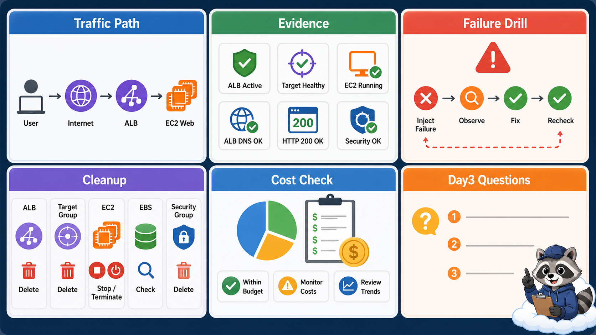

# 8교시: 구름 EXP 배움일기



## 수업 목표
- 오늘 만든 EC2/ALB/network evidence를 정리한다.
- 비용이 남는 resource를 cleanup한다.
- Day3 ECR/ECS/App Runner 수업으로 이어질 질문을 남긴다.

## 오늘 반드시 가져갈 것
| 필수 개념 | 왜 필수인가 | 놓치면 생기는 문제 | 확인 지점 |
|---|---|---|---|
| Cleanup audit | EC2/ALB/EBS는 실습 후 비용이 남을 수 있다 | 수업 후 비용 발생 | EC2, ALB, target group, EBS |
| Traffic evidence | 다음 수업 컨테이너 배포의 기준이 된다 | ECS/ALB 연결 때 다시 헤맨다 | ALB DNS, target health |
| Failure note | 장애 주입과 복구가 운영 학습의 핵심이다 | 성공 화면만 남고 판단력이 안 는다 | SG drill note |

## 배움일기 템플릿
```markdown
# W5D2 AWS network and EC2/ALB

## 1. 오늘 만든 resource
- Region:
- EC2:
- Security Group:
- Target Group:
- ALB:

## 2. Traffic path
Browser/curl -> ? -> ? -> ? -> EC2 web server

## 3. 성공 evidence
- EC2 public IP curl:
- ALB DNS curl:
- Target health:

## 4. 장애 분석
- 주입한 실패:
- 실패 증상:
- 확인한 위치:
- 복구 방법:
- recheck 결과:

## 5. Cleanup
- EC2:
- ALB:
- Target Group:
- Security Group:
- EBS:
- Key Pair:

## 6. Day3 질문
-
-
```

## Cleanup 순서
수업 resource를 삭제하는 경우 다음 순서를 권장한다.

| 순서 | 대상 | 확인 |
|---|---|---|
| 1 | ALB listener/load balancer | deleted 또는 deleting |
| 2 | Target group | unused 후 delete |
| 3 | EC2 instance | stop 또는 terminate |
| 4 | EBS volume | delete on termination 또는 detached volume 확인 |
| 5 | Security Group | default가 아닌 실습 SG 삭제 |
| 6 | Key Pair | 필요 없으면 삭제, local private key도 관리 |
| 7 | Cost/Billing | 비용 항목 확인 |

## 유지하는 경우
Day3에서 같은 EC2를 이어 쓸 수는 있다. 하지만 유지한다면 다음을 남긴다.

| 유지 대상 | 유지 사유 | 예상 비용 | 삭제 예정 |
|---|---|---|---|
| EC2 |  |  |  |
| ALB |  |  |  |
| EBS |  |  |  |

ALB는 특히 "잠깐 남겨둔다"가 비용으로 이어질 수 있다. 남기려면 사유와 삭제 예정 시각을 적는다.


## 50분 수업 운영 흐름
| 시간 | 활동 | 확인할 evidence |
|---|---|---|
| 0~15분 | resource 목록 작성 | EC2/ALB/TG/EBS/SG |
| 15~30분 | 삭제 또는 유지 결정 | 유지 사유/삭제 예정 |
| 30~40분 | 배움일기 작성 | traffic path/failure note |
| 40~50분 | Day3 연결 질문 | image/port/health/log |

## cleanup audit가 중요한 이유
cloud 실습은 종료 버튼을 누르는 순간 끝나지 않는다. ALB, EBS, Elastic IP, log group, snapshot, NAT Gateway처럼 눈에 잘 안 띄는 resource가 비용을 만든다. 그래서 cleanup은 별도 과제가 아니라 실습의 마지막 단계다.

## 삭제 전 확인할 관계
| resource | 의존 관계 | 삭제 순서 힌트 |
|---|---|---|
| ALB | listener, target group | ALB 삭제 후 TG 삭제 |
| Target Group | registered target | ALB 연결 해제 후 삭제 |
| EC2 | EBS, SG, key pair | terminate/stop 결정 |
| EBS | EC2 root/data volume | detached volume 확인 |
| SG | EC2/ALB attached 여부 | 연결 해제 후 삭제 |

## Day3 연결
D3에서는 EC2에 직접 설치한 app 대신 container image를 service가 실행한다. 따라서 오늘의 ALB, target group, health check, port 개념이 그대로 다시 등장한다. Day2 배움일기에 port와 health check를 정리해두면 Day3가 훨씬 쉬워진다.

## 좋은 cleanup 기록
"삭제함"이라고만 쓰지 말고 resource 이름, 상태, 삭제 시각, 유지 사유를 적는다. 비용이 걱정되는 resource는 Cost Explorer에서 service별 비용으로 다시 확인한다.

## 강사 보강 노트
이 교시는 `정리와 비용 회수`을 학생이 말로 설명할 수 있게 만드는 데 초점을 둔다. Console 화면을 따라 누르는 시간으로만 흘러가면 학생은 성공 화면은 보지만, 다음 날 같은 resource를 혼자 다시 만들거나 장애를 설명하지 못한다. 각 단계마다 "지금 무엇을 결정했는가", "그 결정은 비용/보안/관찰 중 어디에 영향을 주는가"를 짧게 되묻는다.

## 학생이 자주 흔들리는 지점
| 흔들리는 지점 | 강사 개입 문장 |
|---|---|
| EC2만 지우고 ALB를 남김 | "지금 화면에서 그 판단을 증명하는 값이 어디에 있나요?" |
| target group과 SG를 남김 | "이 값이 바뀌면 접속, 비용, 권한 중 무엇이 먼저 달라질까요?" |
| Elastic IP/EBS 등 부가 resource를 확인하지 않음 | "성공 화면 말고 실패했을 때 다시 볼 evidence를 남겼나요?" |

## 실습 중 멈춤 포인트
- 첫 번째 멈춤: 학생이 resource를 생성하기 전에 이름, Region, tag, 예상 비용 발생 지점을 말하게 한다.
- 두 번째 멈춤: 성공 화면이 나온 직후 resource ID와 상태값을 evidence note에 적게 한다.
- 세 번째 멈춤: 실패나 지연이 생기면 새로 클릭하기 전에 이전 단계의 화면과 명령을 다시 보게 한다.
- 네 번째 멈춤: 정리 단계에서 "삭제했다"가 아니라 "검색해도 남아 있지 않다"를 확인하게 한다.

## 확인 질문
1. 오늘 만든 resource가 어느 Region과 어느 계정 경계에 있는가?
2. 이 resource가 비용을 만들기 시작하는 시점은 언제인가?
3. 접속이 실패하면 app, network, permission 중 무엇을 먼저 확인할 것인가?
4. 수업이 끝난 뒤 남겨도 되는 resource와 지워야 하는 resource는 무엇인가?

## 제출 evidence 기준
| evidence | 좋은 예 | 부족한 예 |
|---|---|---|
| 화면 캡처 | 삭제 전 resource 목록 | 성공 toast만 보이는 캡처 |
| 설정 기록 | 삭제 후 검색 결과 | "기본값 사용"이라고만 적음 |
| 운영 판단 | Budget 또는 Billing 확인 | "잘 됨", "안 됨"으로만 적음 |

## 혼자 다시 따라오기
- 최소 재현 경로: 배움일기 템플릿의 traffic path와 cleanup 항목을 먼저 채운다.
- 공식 문서 키워드: `EC2 instance lifecycle`, `Application Load Balancer`, `target group`, `security group`.
- 스스로 확인할 화면: EC2 Instances, Load Balancers, Target Groups, Volumes, Security Groups.
- 흔한 실패 3개: ALB만 삭제하고 target group을 남김, EC2 stop 후 EBS 비용을 잊음, key pair/private key 관리 상태를 안 남김.
- 다음 준비 상태: Day3에서 container image를 ALB 뒤에 붙일 때 listener/target group/health check 개념을 재사용할 수 있어야 한다.

## 한 줄 요약
```text
W5D2의 끝은 ALB 접속 성공이 아니라 evidence 정리와 cleanup audit이다.
```
