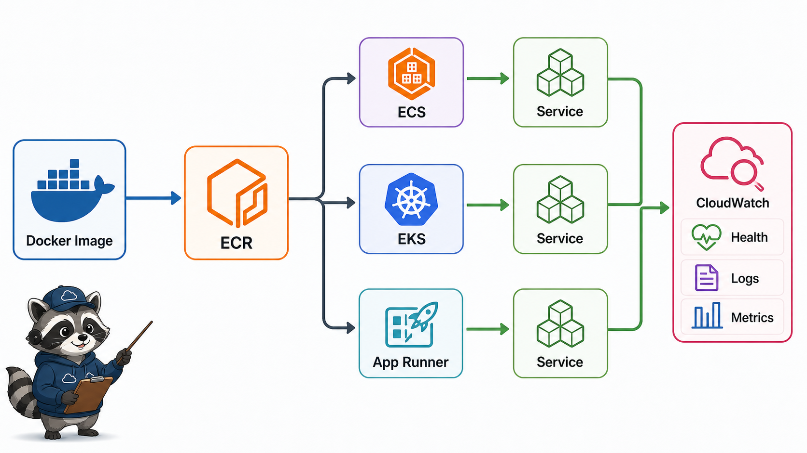
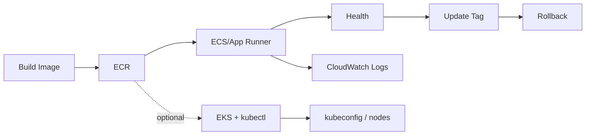

# 1교시: Day2 요약 + 컨테이너 실행 서비스 매핑



## 수업 목표
- W5D2의 EC2/ALB traffic path를 container service 관점으로 확장한다.
- ECR, ECS, EKS, App Runner가 해결하는 문제를 Docker/Kubernetes와 비교한다.
- 오늘의 운영 루프를 image -> service -> health -> logs -> update -> rollback으로 잡는다.

## 오늘 반드시 가져갈 것
| 필수 개념 | 왜 필수인가 | 놓치면 생기는 문제 | 확인 지점 |
|---|---|---|---|
| Registry와 runtime 분리 | ECR은 image 저장소이고 ECS/App Runner는 실행 계층이다 | ECR에 push하면 서비스가 실행된다고 오해한다 | ECR repo vs running service |
| Task/service 관점 | container는 한 번 실행보다 유지/복구/확장이 중요하다 | desired count와 health를 못 읽는다 | ECS service, App Runner service |
| 운영 루프 | 배포는 image 변경 후 로그/health/evidence까지 이어진다 | push 성공만 보고 배포 성공으로 착각한다 | logs, health, metrics |

## Day2에서 이어지는 구조
Day2는 EC2 web server와 ALB를 직접 연결했다.

```text
Browser -> ALB -> Target Group -> EC2 Web Server
```

Day3는 EC2에 직접 web server를 설치하는 대신, container image를 registry에 저장하고 managed container service가 실행하게 한다.

```text
Docker image -> ECR -> ECS/App Runner -> Health/Logs -> ALB or Service URL
```

## AWS container service map
| 서비스 | 역할 | Docker/Kubernetes와 연결 |
|---|---|---|
| ECR | container image 저장소 | Docker Hub와 유사한 private registry |
| ECS | task/service 기반 container 실행 | Kubernetes Deployment/Service 일부와 비교 가능 |
| EKS | managed Kubernetes control plane | Kubernetes를 AWS에서 운영 |
| App Runner | web app 실행 단순화 managed service | image/source에서 web service로 빠르게 배포 |
| CloudWatch | logs/metrics/alarm | `docker logs`, `kubectl logs`, metrics 관찰 확장 |

## EKS는 선택 심화로 다룬다
EKS는 Week4에서 배운 Kubernetes API와 `kubectl` 경험을 AWS로 옮기는 경로다. 다만 ECS/App Runner보다 준비물이 많다. cluster endpoint, kubeconfig, IAM identity, Kubernetes RBAC, VPC subnet, node 비용을 함께 이해해야 하므로 기본 경로가 아니라 선택 심화 실습으로 둔다.

EKS 경로를 선택하면 수업의 성공 기준은 service URL이 아니라 다음 연결 증거다.

| 확인 | evidence |
|---|---|
| AWS identity | `aws sts get-caller-identity` 또는 `aws sts get-caller-identity --profile default` |
| kubeconfig 연결 | `aws eks update-kubeconfig --name <cluster> --profile default` |
| cluster context | `kubectl config current-context` |
| cluster 접근 | `kubectl get nodes`, `kubectl get ns` |
| cleanup | cluster/node/load balancer/log/kubeconfig context 잔여 확인 |

## ECS와 App Runner 선택
오늘은 계정 권한, 비용, 수업 환경에 따라 ECS 또는 App Runner를 선택할 수 있다.

| 기준 | ECS | App Runner | EKS 선택 심화 |
|---|---|---|---|
| 학습 포인트 | task definition, service, ALB 연결 | source/image 기반 web service 단순 배포 | managed Kubernetes, kubeconfig, kubectl |
| 네트워크 제어 | VPC/subnet/SG/ALB 이해 필요 | 상대적으로 단순 | VPC/subnet/API endpoint/node 경계 확인 |
| Kubernetes 연결 | Deployment/Service/desired state 비교가 좋음 | managed platform 감각이 좋음 | Week4 `kubectl` 경험을 그대로 확장 |
| 실습 난이도 | 높음 | 낮음 | 매우 높음, 비용/권한 통제 필요 |

## 오늘의 운영 루프



## 왜 컨테이너 실행 서비스가 필요한가
EC2에 직접 web server를 설치하면 서버 단위 운영이 된다. container image를 사용하면 실행 패키지가 표준화되고, service는 원하는 개수의 task를 유지하며, 배포 변경은 image tag와 revision으로 추적할 수 있다. 이 변화는 Week2 Docker와 Week4 Kubernetes의 중간 다리다.

## 서비스 선택 의사결정
| 질문 | ECS가 적합 | App Runner가 적합 | EKS 선택 심화가 적합 |
|---|---|---|---|
| ALB/target group 연결을 직접 보고 싶은가 | 예 | 제한적 | Service type과 Ingress/LoadBalancer를 별도 설계 |
| 빠르게 public web service를 보고 싶은가 | 상대적으로 복잡 | 예 | 느림, cluster 준비 필요 |
| Kubernetes 개념과 비교하고 싶은가 | task/service가 비교에 좋음 | platform 관점 비교 | 직접 `kubectl`로 확인 가능 |
| 네트워크 제어가 중요한가 | subnet/SG 설정 가능 | 단순화됨 | subnet, endpoint, node, CNI까지 확인 |
| `kubectl`을 AWS cluster에 연결하고 싶은가 | 간접 비교 | 아니오 | EKS 선택 심화 |

## 운영 루프에서 확인할 것
Image가 ECR에 있어도 service가 pull하지 못하면 배포는 실패한다. Service가 떠도 health check가 실패하면 traffic은 가지 않는다. Health가 좋아도 log와 metric을 보지 않으면 성능/오류를 놓친다. 그래서 오늘의 성공 기준은 ECR, service health, logs, metrics까지 이어진다.

## 캡처 가이드
ECR repository, service detail, health/status, CloudWatch log group을 각각 캡처한다. Console 화면마다 Region이 보이면 좋다.

## 운영 판단 연습
| 판단 질문 | 확인 기준 |
|---|---|
| 이 항목에서 가장 먼저 결정할 것은 무엇인가 | ECR은 image 저장소이고 실행 서비스가 아니다. |
| 실패했을 때 어느 경계부터 볼 것인가 | ECS/App Runner는 container 실행 책임 경계가 다르다. |
| 수업 뒤 혼자 재현할 때 필요한 최소 정보는 무엇인가 | managed service도 비용과 관찰 책임은 남는다. |

## 흔한 실패와 첫 확인 위치
| 흔한 실패 | 첫 확인 위치 |
|---|---|
| ECR에 push하면 app이 실행된다고 생각한다 | image 저장과 runtime service를 분리한다 |

## Evidence 점검
- 화면에는 민감 정보 대신 resource 이름, Region, 상태값, rule, tag처럼 재현 가능한 값이 보여야 한다.
- 기록에는 "성공했다"보다 어떤 값이 어떤 상태였는지가 남아야 한다.
- 실패를 기록할 때는 증상, 확인한 화면, 수정한 값, 재확인 결과를 한 세트로 남긴다.
- 서비스 선택 표, image 위치, runtime 책임 중 최소 두 가지는 배움일기에 남긴다.

## Evidence Note
```markdown
# W5D3S1 container service map
- 선택 경로: ECS / App Runner
- image registry:
- 실행 service:
- health 확인 위치:
- logs 확인 위치:
- rollback 기준:
```

## 혼자 다시 따라오기
- 최소 재현 경로: ECR, ECS, App Runner, CloudWatch를 각각 "저장/실행/관찰" 관점으로 분류한다.
- 공식 문서 키워드: `ECR repositories`, `ECS task definition`, `ECS service`, `App Runner service`, `EKS update-kubeconfig`, `CloudWatch Logs`.
- 스스로 확인할 화면: ECR repositories, ECS clusters/services, App Runner services, EKS clusters, CloudWatch Logs.
- 흔한 실패 3개: ECR push를 배포 성공으로 봄, desired count와 running count를 구분하지 않음, logs 위치를 모름.
- 다음 준비 상태: image와 service와 health/log를 분리해 설명할 수 있어야 한다.

## 한 줄 요약
```text
AWS 컨테이너 운영은 image 저장소와 실행 서비스와 관찰 계층을 분리해서 읽어야 한다.
```
