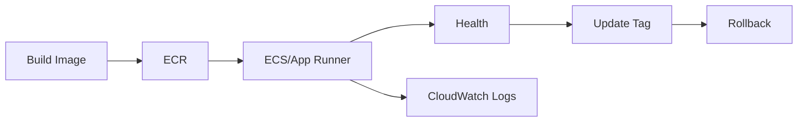

# 1교시: Day2 요약 + 컨테이너 실행 서비스 매핑


## 수업 목표
- W5D2의 EC2/ALB traffic path를 container service 관점으로 확장한다.
- ECR, ECS, EKS, App Runner가 해결하는 문제를 Docker/Kubernetes와 비교한다.
- 오늘의 운영 루프를 image -> service -> health -> logs -> update -> rollback으로 잡는다.

## 오늘 반드시 가져갈 것
| 필수 개념 | 왜 필수인가 | 놓치면 생기는 문제 | 확인 지점 |
|---|---|---|---|
| Registry와 runtime 분리 | ECR은 image 저장소이고 ECS/App Runner는 실행 계층이다 | ECR에 push하면 서비스가 실행된다고 오해한다 | ECR repo vs running service |
| Task/service 관점 | container는 한 번 실행보다 유지/복구/확장이 중요하다 | desired count와 health를 못 읽는다 | ECS service, App Runner service |
| 운영 루프 | 배포는 image 변경 후 로그/health/evidence까지 이어진다 | push 성공만 보고 배포 성공으로 착각한다 | logs, health, metrics |

## Day2에서 이어지는 구조
Day2는 EC2 web server와 ALB를 직접 연결했다.

```text
Browser -> ALB -> Target Group -> EC2 Web Server
```

Day3는 EC2에 직접 web server를 설치하는 대신, container image를 registry에 저장하고 managed container service가 실행하게 한다.

```text
Docker image -> ECR -> ECS/App Runner -> Health/Logs -> ALB or Service URL
```

## AWS container service map
| 서비스 | 역할 | Docker/Kubernetes와 연결 |
|---|---|---|
| ECR | container image 저장소 | Docker Hub와 유사한 private registry |
| ECS | task/service 기반 container 실행 | Kubernetes Deployment/Service 일부와 비교 가능 |
| EKS | managed Kubernetes control plane | Kubernetes를 AWS에서 운영 |
| App Runner | web app 실행 단순화 managed service | image/source에서 web service로 빠르게 배포 |
| CloudWatch | logs/metrics/alarm | `docker logs`, `kubectl logs`, metrics 관찰 확장 |

## ECS와 App Runner 선택
오늘은 계정 권한, 비용, 수업 환경에 따라 ECS 또는 App Runner를 선택할 수 있다.

| 기준 | ECS | App Runner |
|---|---|---|
| 학습 포인트 | task definition, service, ALB 연결 | source/image 기반 web service 단순 배포 |
| 네트워크 제어 | VPC/subnet/SG/ALB 이해 필요 | 상대적으로 단순 |
| Kubernetes 연결 | Deployment/Service/desired state 비교가 좋음 | managed platform 감각이 좋음 |
| 실습 난이도 | 높음 | 낮음 |

## 오늘의 운영 루프



## 50분 수업 운영 흐름
| 시간 | 활동 | 확인할 evidence |
|---|---|---|
| 0~10분 | Day2 ALB/health 복기 | target health note |
| 10~20분 | ECR/ECS/EKS/App Runner 역할 분류 | service map |
| 20~30분 | image -> service 운영 루프 설명 | lifecycle diagram |
| 30~40분 | ECS와 App Runner 선택 기준 | decision table |
| 40~50분 | 오늘 실습 경로 선택 | ECS/App Runner/simulation |

## 왜 컨테이너 실행 서비스가 필요한가
EC2에 직접 web server를 설치하면 서버 단위 운영이 된다. container image를 사용하면 실행 패키지가 표준화되고, service는 원하는 개수의 task를 유지하며, 배포 변경은 image tag와 revision으로 추적할 수 있다. 이 변화는 Week2 Docker와 Week4 Kubernetes의 중간 다리다.

## 서비스 선택 의사결정
| 질문 | ECS가 적합 | App Runner가 적합 |
|---|---|---|
| ALB/target group 연결을 직접 보고 싶은가 | 예 | 제한적 |
| 빠르게 public web service를 보고 싶은가 | 상대적으로 복잡 | 예 |
| Kubernetes 개념과 비교하고 싶은가 | task/service가 비교에 좋음 | platform 관점 비교 |
| 네트워크 제어가 중요한가 | subnet/SG 설정 가능 | 단순화됨 |

## 운영 루프에서 확인할 것
Image가 ECR에 있어도 service가 pull하지 못하면 배포는 실패한다. Service가 떠도 health check가 실패하면 traffic은 가지 않는다. Health가 좋아도 log와 metric을 보지 않으면 성능/오류를 놓친다. 그래서 오늘의 성공 기준은 ECR, service health, logs, metrics까지 이어진다.

## 캡처 가이드
ECR repository, service detail, health/status, CloudWatch log group을 각각 캡처한다. Console 화면마다 Region이 보이면 좋다.

## 강사 보강 노트
이 교시는 `컨테이너 서비스 선택`을 학생이 말로 설명할 수 있게 만드는 데 초점을 둔다. Console 화면을 따라 누르는 시간으로만 흘러가면 학생은 성공 화면은 보지만, 다음 날 같은 resource를 혼자 다시 만들거나 장애를 설명하지 못한다. 각 단계마다 "지금 무엇을 결정했는가", "그 결정은 비용/보안/관찰 중 어디에 영향을 주는가"를 짧게 되묻는다.

## 학생이 자주 흔들리는 지점
| 흔들리는 지점 | 강사 개입 문장 |
|---|---|
| ECR을 Docker Hub와 완전히 같다고 봄 | "지금 화면에서 그 판단을 증명하는 값이 어디에 있나요?" |
| ECS task와 Kubernetes Pod를 1:1로 고정함 | "이 값이 바뀌면 접속, 비용, 권한 중 무엇이 먼저 달라질까요?" |
| managed service가 운영 책임을 없앤다고 생각함 | "성공 화면 말고 실패했을 때 다시 볼 evidence를 남겼나요?" |

## 실습 중 멈춤 포인트
- 첫 번째 멈춤: 학생이 resource를 생성하기 전에 이름, Region, tag, 예상 비용 발생 지점을 말하게 한다.
- 두 번째 멈춤: 성공 화면이 나온 직후 resource ID와 상태값을 evidence note에 적게 한다.
- 세 번째 멈춤: 실패나 지연이 생기면 새로 클릭하기 전에 이전 단계의 화면과 명령을 다시 보게 한다.
- 네 번째 멈춤: 정리 단계에서 "삭제했다"가 아니라 "검색해도 남아 있지 않다"를 확인하게 한다.

## 확인 질문
1. 오늘 만든 resource가 어느 Region과 어느 계정 경계에 있는가?
2. 이 resource가 비용을 만들기 시작하는 시점은 언제인가?
3. 접속이 실패하면 app, network, permission 중 무엇을 먼저 확인할 것인가?
4. 수업이 끝난 뒤 남겨도 되는 resource와 지워야 하는 resource는 무엇인가?

## 제출 evidence 기준
| evidence | 좋은 예 | 부족한 예 |
|---|---|---|
| 화면 캡처 | 서비스 선택 표 | 성공 toast만 보이는 캡처 |
| 설정 기록 | container image 위치 | "기본값 사용"이라고만 적음 |
| 운영 판단 | runtime 책임 경계 | "잘 됨", "안 됨"으로만 적음 |

## Evidence Note
```markdown
# W5D3S1 container service map
- 선택 경로: ECS / App Runner
- image registry:
- 실행 service:
- health 확인 위치:
- logs 확인 위치:
- rollback 기준:
```

## 혼자 다시 따라오기
- 최소 재현 경로: ECR, ECS, App Runner, CloudWatch를 각각 "저장/실행/관찰" 관점으로 분류한다.
- 공식 문서 키워드: `ECR repositories`, `ECS task definition`, `ECS service`, `App Runner service`, `CloudWatch Logs`.
- 스스로 확인할 화면: ECR repositories, ECS clusters/services, App Runner services, CloudWatch Logs.
- 흔한 실패 3개: ECR push를 배포 성공으로 봄, desired count와 running count를 구분하지 않음, logs 위치를 모름.
- 다음 준비 상태: image와 service와 health/log를 분리해 설명할 수 있어야 한다.

## 한 줄 요약
```text
AWS 컨테이너 운영은 image 저장소와 실행 서비스와 관찰 계층을 분리해서 읽어야 한다.
```
