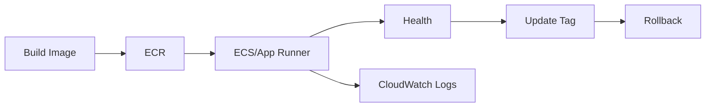

# 1교시: Day2 요약 + 컨테이너 실행 서비스 매핑


## 수업 목표
- W5D2의 EC2/ALB traffic path를 container service 관점으로 확장한다.
- ECR, ECS, EKS, App Runner가 해결하는 문제를 Docker/Kubernetes와 비교한다.
- 오늘의 운영 루프를 image -> service -> health -> logs -> update -> rollback으로 잡는다.

## 오늘 반드시 가져갈 것
| 필수 개념 | 왜 필수인가 | 놓치면 생기는 문제 | 확인 지점 |
|---|---|---|---|
| Registry와 runtime 분리 | ECR은 image 저장소이고 ECS/App Runner는 실행 계층이다 | ECR에 push하면 서비스가 실행된다고 오해한다 | ECR repo vs running service |
| Task/service 관점 | container는 한 번 실행보다 유지/복구/확장이 중요하다 | desired count와 health를 못 읽는다 | ECS service, App Runner service |
| 운영 루프 | 배포는 image 변경 후 로그/health/evidence까지 이어진다 | push 성공만 보고 배포 성공으로 착각한다 | logs, health, metrics |

## Day2에서 이어지는 구조
Day2는 EC2 web server와 ALB를 직접 연결했다.

```text
Browser -> ALB -> Target Group -> EC2 Web Server
```

Day3는 EC2에 직접 web server를 설치하는 대신, container image를 registry에 저장하고 managed container service가 실행하게 한다.

```text
Docker image -> ECR -> ECS/App Runner -> Health/Logs -> ALB or Service URL
```

## AWS container service map
| 서비스 | 역할 | Docker/Kubernetes와 연결 |
|---|---|---|
| ECR | container image 저장소 | Docker Hub와 유사한 private registry |
| ECS | task/service 기반 container 실행 | Kubernetes Deployment/Service 일부와 비교 가능 |
| EKS | managed Kubernetes control plane | Kubernetes를 AWS에서 운영 |
| App Runner | web app 실행 단순화 managed service | image/source에서 web service로 빠르게 배포 |
| CloudWatch | logs/metrics/alarm | `docker logs`, `kubectl logs`, metrics 관찰 확장 |

## ECS와 App Runner 선택
오늘은 계정 권한, 비용, 수업 환경에 따라 ECS 또는 App Runner를 선택할 수 있다.

| 기준 | ECS | App Runner |
|---|---|---|
| 학습 포인트 | task definition, service, ALB 연결 | source/image 기반 web service 단순 배포 |
| 네트워크 제어 | VPC/subnet/SG/ALB 이해 필요 | 상대적으로 단순 |
| Kubernetes 연결 | Deployment/Service/desired state 비교가 좋음 | managed platform 감각이 좋음 |
| 실습 난이도 | 높음 | 낮음 |

## 오늘의 운영 루프


## Evidence Note
```markdown
# W5D3S1 container service map
- 선택 경로: ECS / App Runner
- image registry:
- 실행 service:
- health 확인 위치:
- logs 확인 위치:
- rollback 기준:
```

## 혼자 다시 따라오기
- 최소 재현 경로: ECR, ECS, App Runner, CloudWatch를 각각 "저장/실행/관찰" 관점으로 분류한다.
- 공식 문서 키워드: `ECR repositories`, `ECS task definition`, `ECS service`, `App Runner service`, `CloudWatch Logs`.
- 스스로 확인할 화면: ECR repositories, ECS clusters/services, App Runner services, CloudWatch Logs.
- 흔한 실패 3개: ECR push를 배포 성공으로 봄, desired count와 running count를 구분하지 않음, logs 위치를 모름.
- 다음 준비 상태: image와 service와 health/log를 분리해 설명할 수 있어야 한다.

## 한 줄 요약
```text
AWS 컨테이너 운영은 image 저장소와 실행 서비스와 관찰 계층을 분리해서 읽어야 한다.
```
