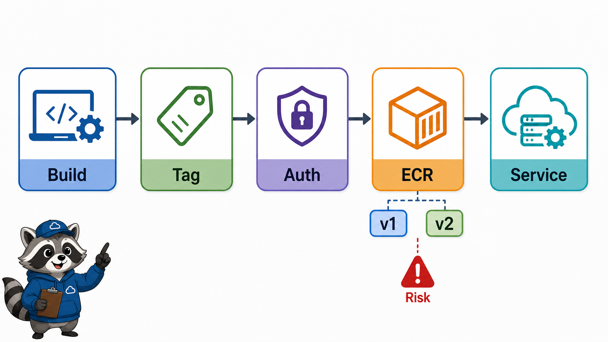

# 2교시: ECR 실습



## 수업 목표
- ECR repository, image tag, push/pull 인증 흐름을 이해한다.
- Docker image tag와 ECR URI의 관계를 설명한다.
- credential과 access key 노출 위험을 점검한다.

## 오늘 반드시 가져갈 것
| 필수 개념 | 왜 필수인가 | 놓치면 생기는 문제 | 확인 지점 |
|---|---|---|---|
| Repository | image를 저장하는 logical 공간이다 | image 저장 위치와 실행 위치를 혼동한다 | ECR repository URI |
| Image tag | 배포할 version 선택 기준이다 | `latest`만 쓰고 rollback 기준이 사라진다 | image tag list |
| Authentication | Docker client가 ECR에 push하려면 인증이 필요하다 | push 실패를 Dockerfile 문제로 오해한다 | login command, IAM permission |
| Credential hygiene | token/key 노출은 계정 사고로 이어진다 | README나 screenshot에 credential이 남는다 | command history, screenshot |

## ECR repository 만들기
ECR repository는 Region 안에 생성된다. repository URI는 보통 다음 형태다.

```text
<account-id>.dkr.ecr.<region>.amazonaws.com/<repository-name>
```

| 항목 | 예시 |
|---|---|
| Account ID | `123456789012` |
| Region | `ap-northeast-2` |
| Repository | `paperclip-w5d3-app` |
| Image tag | `v1`, `v2`, `rollback-ok` |

## Push 흐름
AWS 공식 문서의 ECR push 흐름은 보통 다음 단계다.

```text
authenticate Docker client
build image
tag image with ECR URI
push image
verify image tag in ECR
```

CLI를 쓰는 경우 계정 권한과 AWS CLI 설정이 필요하다. 수업 환경에서 CLI 설정이 어렵다면 Console에서 repository와 push command 예시를 읽고, image tag 구조를 이해하는 시뮬레이션 경로로 진행한다.

## Tag 전략
`latest`는 편하지만 운영 evidence에는 약하다. 오늘은 최소한 `v1`, `v2`처럼 변경 전후를 구분할 수 있는 tag를 남긴다.

| tag | 운영 의미 |
|---|---|
| `latest` | 편하지만 정확한 version 추적이 약함 |
| `v1`, `v2` | 수업 변경 비교에 적합 |
| commit SHA | CI/CD와 연결하기 좋음 |
| digest | 가장 엄격한 image 식별 |

## Credential 주의
ECR push command에는 인증 token을 얻는 흐름이 포함될 수 있다. 출력, screenshot, README, 배움일기에 credential 값을 그대로 남기지 않는다.

## Evidence Note
```markdown
# W5D3S2 ECR
- Repository name:
- Repository URI:
- Region:
- Image tag:
- Push 여부: actual / simulated
- 인증 방식:
- credential 노출 여부 확인:
```

## 혼자 다시 따라오기
- 최소 재현 경로: ECR repository를 만들고 URI와 image tag 구조를 기록한다. CLI가 가능하면 push까지 진행한다.
- 공식 문서 키워드: `ECR private repository`, `docker push`, `authenticate Docker client`, `image tag`.
- 스스로 확인할 화면: ECR repositories, Images tab, push commands.
- 흔한 실패 3개: Region이 달라 repository를 못 찾음, Docker login 인증이 안 됨, image tag를 ECR URI로 다시 tag하지 않음.
- 다음 준비 상태: ECS/App Runner가 실행할 image URI를 말할 수 있어야 한다.

## 한 줄 요약
```text
ECR은 container image의 저장소이고, 배포 성공은 ECR push 이후 실행 서비스 health까지 확인해야 한다.
```
