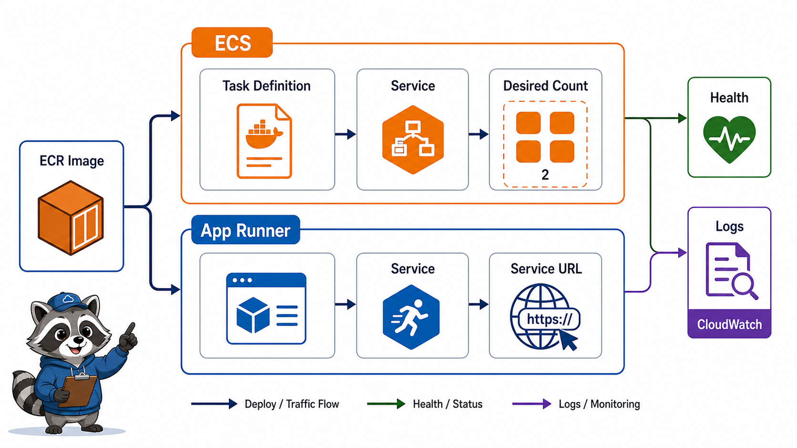

# 3교시: ECS 또는 App Runner 맛보기



## 수업 목표
- ECS task definition/service 또는 App Runner service의 실행 단위를 이해한다.
- image, port, env, desired count, logs, health를 확인한다.
- 계정/비용/권한 상태에 따라 실제 생성 또는 시뮬레이션 경로를 선택한다.

## 오늘 반드시 가져갈 것
| 필수 개념 | 왜 필수인가 | 놓치면 생기는 문제 | 확인 지점 |
|---|---|---|---|
| Task definition | ECS에서 container 실행 방법을 정의한다 | image/port/env가 어디에 있는지 모른다 | task definition revision |
| Service | desired count만큼 task를 유지한다 | task 1회 실행과 운영 서비스를 혼동한다 | desired/running count |
| App Runner service | image/source에서 web service를 단순 실행한다 | managed service여도 health/log를 안 본다 | service URL, logs |
| Port mapping | container가 listen하는 port와 외부 연결 port가 맞아야 한다 | health check와 traffic이 실패한다 | container port |

## ECS 경로
ECS를 선택하면 다음 구조를 본다.

```text
ECR image
  -> Task Definition
  -> ECS Service
  -> Desired Count
  -> Logs/Health
```

| 항목 | 확인 |
|---|---|
| Cluster | service가 속한 논리적 묶음 |
| Task Definition | image, CPU/memory, port, env, log config |
| Service | desired count, deployment, load balancer |
| Task | 실제 실행 단위 |
| Logs | CloudWatch log group/stream |

## App Runner 경로
App Runner를 선택하면 ECR image 또는 source에서 web service를 빠르게 만들 수 있다.

| 항목 | 확인 |
|---|---|
| Source | ECR image 또는 source repository |
| Port | app이 listen하는 port |
| Service URL | public endpoint |
| Deployment | image 변경 반영 |
| Logs | build/deploy/app log |

## 실습 판단
| 상황 | 추천 |
|---|---|
| IAM/ECS 권한 충분, ALB 연결까지 보고 싶음 | ECS |
| 빠른 web service 실행과 logs를 보고 싶음 | App Runner |
| 비용/권한이 불안정함 | Console 시뮬레이션 + 개념 evidence |


## 50분 수업 운영 흐름
| 시간 | 활동 | 확인할 evidence |
|---|---|---|
| 0~10분 | 선택 경로 확정 | ECS/App Runner |
| 10~25분 | image/port/env 설정 확인 | task/service settings |
| 25~35분 | service 생성 또는 preview | endpoint/status |
| 35~45분 | health/log 위치 확인 | health/log evidence |
| 45~50분 | 비용/cleanup 계획 | service cleanup note |

## ECS에서 꼭 읽을 값
| 화면 | 읽을 값 | 이유 |
|---|---|---|
| Task Definition | image, portMappings, env, log config | container 실행 정의 |
| Service | desired/running count, deployment | 운영 유지 상태 |
| Tasks | stopped reason, started time | 실패 분석 |
| Logs | app stdout/stderr | 실행 증거 |

## App Runner에서 꼭 읽을 값
| 화면 | 읽을 값 | 이유 |
|---|---|---|
| Source | image repository/tag | 배포 대상 |
| Configuration | port, env, instance size | 실행 조건 |
| Deployments | latest deployment status | 변경 상태 |
| Logs | deployment/application log | 실패 원인 |

## 시뮬레이션 경로도 유효한 이유
모든 학생 계정에서 ECS/App Runner 생성 권한과 비용 상태가 같지 않다. 실제 생성이 어려운 경우에도 Console에서 설정 화면을 읽고, 어떤 값이 image/port/log/health를 결정하는지 evidence를 남기면 학습 목표는 상당 부분 달성된다. 단, 실제 생성과 시뮬레이션을 배움일기에 명확히 구분한다.

## 장애 판단
service가 만들어져도 endpoint가 정상이라는 뜻은 아니다. desired count, running count, deployment status, health, logs를 함께 확인해야 한다.

## 강사 보강 노트
이 교시는 `ECS와 App Runner`을 학생이 말로 설명할 수 있게 만드는 데 초점을 둔다. Console 화면을 따라 누르는 시간으로만 흘러가면 학생은 성공 화면은 보지만, 다음 날 같은 resource를 혼자 다시 만들거나 장애를 설명하지 못한다. 각 단계마다 "지금 무엇을 결정했는가", "그 결정은 비용/보안/관찰 중 어디에 영향을 주는가"를 짧게 되묻는다.

## 학생이 자주 흔들리는 지점
| 흔들리는 지점 | 강사 개입 문장 |
|---|---|
| ECS가 항상 어렵고 App Runner가 항상 쉽다고 단정함 | "지금 화면에서 그 판단을 증명하는 값이 어디에 있나요?" |
| network와 scaling 책임을 놓침 | "이 값이 바뀌면 접속, 비용, 권한 중 무엇이 먼저 달라질까요?" |
| container env/secrets를 그냥 hardcode함 | "성공 화면 말고 실패했을 때 다시 볼 evidence를 남겼나요?" |

## 실습 중 멈춤 포인트
- 첫 번째 멈춤: 학생이 resource를 생성하기 전에 이름, Region, tag, 예상 비용 발생 지점을 말하게 한다.
- 두 번째 멈춤: 성공 화면이 나온 직후 resource ID와 상태값을 evidence note에 적게 한다.
- 세 번째 멈춤: 실패나 지연이 생기면 새로 클릭하기 전에 이전 단계의 화면과 명령을 다시 보게 한다.
- 네 번째 멈춤: 정리 단계에서 "삭제했다"가 아니라 "검색해도 남아 있지 않다"를 확인하게 한다.

## 확인 질문
1. 오늘 만든 resource가 어느 Region과 어느 계정 경계에 있는가?
2. 이 resource가 비용을 만들기 시작하는 시점은 언제인가?
3. 접속이 실패하면 app, network, permission 중 무엇을 먼저 확인할 것인가?
4. 수업이 끝난 뒤 남겨도 되는 resource와 지워야 하는 resource는 무엇인가?

## 제출 evidence 기준
| evidence | 좋은 예 | 부족한 예 |
|---|---|---|
| 화면 캡처 | service responsibility table | 성공 toast만 보이는 캡처 |
| 설정 기록 | runtime 설정 | "기본값 사용"이라고만 적음 |
| 운영 판단 | public endpoint 여부 | "잘 됨", "안 됨"으로만 적음 |

## Evidence Note
```markdown
# W5D3S3 service taste
- 선택 경로: ECS / App Runner / simulation
- Image URI:
- Container port:
- Desired count 또는 service instance:
- Service URL 또는 endpoint:
- Health:
- Logs 위치:
```

## 혼자 다시 따라오기
- 최소 재현 경로: ECS task definition 또는 App Runner service 화면에서 image, port, env, logs 위치를 찾는다.
- 공식 문서 키워드: `ECS task definition`, `ECS service`, `desired count`, `App Runner image service`.
- 스스로 확인할 화면: ECS Task definitions, ECS Services, App Runner Services, CloudWatch Logs.
- 흔한 실패 3개: container port를 잘못 설정함, desired count 0을 정상 서비스로 착각함, service 생성 후 logs를 안 봄.
- 다음 준비 상태: "image를 어떻게 실행 서비스가 가져와서 web endpoint로 노출하는가"를 설명할 수 있어야 한다.

## 한 줄 요약
```text
ECS/App Runner 실습의 핵심은 image가 service로 실행되고 health/log로 검증되는 흐름이다.
```
