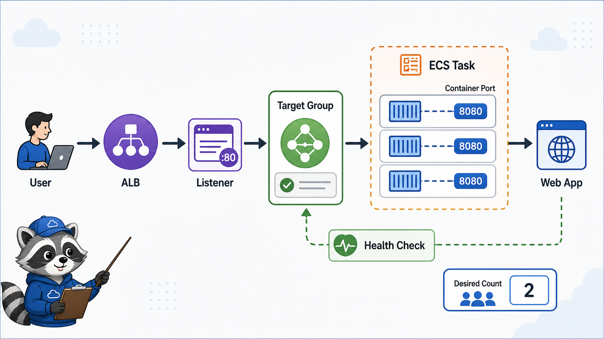
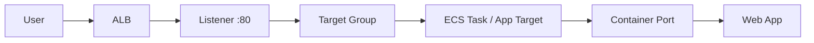

# 4교시: Container service와 ALB 연결



## 수업 목표
- container service와 ALB/listener/target group/health check를 연결한다.
- container port와 target group port가 맞아야 하는 이유를 설명한다.
- desired count와 target health를 함께 본다.

## 오늘 반드시 가져갈 것
| 필수 개념 | 왜 필수인가 | 놓치면 생기는 문제 | 확인 지점 |
|---|---|---|---|
| Container port | app이 container 안에서 listen하는 port다 | ALB health check가 실패한다 | task definition portMappings |
| Target group | ALB가 traffic을 보낼 container/task 대상이다 | ALB 503을 해결하지 못한다 | registered targets |
| Desired/running count | service가 유지하려는 task 수와 실제 실행 수다 | 배포가 충분히 떠 있는지 모른다 | ECS service counts |
| Health check | traffic 받을 준비 여부를 판단한다 | 서비스 URL만 보고 정상으로 착각한다 | target health reason |

## 연결 흐름


## ECS와 ALB
ECS service를 ALB에 연결하면 service가 target group에 task를 등록하고, ALB health check가 target 상태를 확인한다. target type, VPC, subnet, SG, container port가 맞아야 한다.

| 설정 | 확인 |
|---|---|
| ALB listener | HTTP 80 또는 HTTPS 443 |
| Target group | protocol/port, health check path |
| Container port | app listen port |
| Service desired count | 1 이상 |
| Security Group | ALB -> task traffic 허용 |

## App Runner와 외부 endpoint
App Runner는 자체 service URL을 제공할 수 있어 Day2의 ALB 구조보다 단순하게 보일 수 있다. 하지만 custom domain, VPC connector, observability를 붙이면 여전히 network와 health 개념이 중요하다.

## 실패 증상
| 증상 | 첫 확인 |
|---|---|
| ALB 503 | target health, desired/running count |
| target unhealthy | health check path, container port, SG |
| service deployment pending | image pull 권한, subnet/capacity |
| service URL 5xx | app logs, env, port |


## 50분 수업 운영 흐름
| 시간 | 활동 | 확인할 evidence |
|---|---|---|
| 0~10분 | Day2 ALB 구성 복기 | listener/TG/health |
| 10~20분 | container port와 target port 연결 | port mapping |
| 20~30분 | ECS service load balancing 설정 | TG/service mapping |
| 30~40분 | target health 실패 분석 | unhealthy reason |
| 40~50분 | App Runner와 ALB 비교 | endpoint decision |

## container port가 중요한 이유
EC2에 직접 설치한 web server는 보통 80에서 들었다. container app은 3000, 5000, 8080 같은 다른 port에서 listen할 수 있다. ALB target group과 ECS task definition이 이 port를 정확히 알아야 health check와 traffic routing이 성공한다.

## target health 실패의 대표 원인
| 원인 | 증상 | 복구 |
|---|---|---|
| wrong container port | target timeout/refused | task port mapping 수정 |
| wrong health path | 404/unhealthy | path를 실제 endpoint로 변경 |
| SG blocked | timeout | ALB SG -> task SG 허용 |
| task stopped | no target/running count 0 | task stopped reason 확인 |

## App Runner와 ALB의 차이
App Runner는 자체 URL을 제공하므로 Day2의 ALB 연결이 보이지 않을 수 있다. 그러나 managed service 안에서도 health, port, logs, deployment status는 동일하게 중요하다. ALB를 직접 보느냐, service가 추상화하느냐의 차이다.

## 운영 판단 질문
- 이 app은 public endpoint가 필요한가?
- health check path는 실제 app이 빠르게 응답하는 path인가?
- target이 unhealthy일 때 traffic을 받지 않게 되는가?
- desired count가 1이면 장애 시 어떤 위험이 있는가?

## 강사 보강 노트
이 교시는 `Container와 ALB 연결`을 학생이 말로 설명할 수 있게 만드는 데 초점을 둔다. Console 화면을 따라 누르는 시간으로만 흘러가면 학생은 성공 화면은 보지만, 다음 날 같은 resource를 혼자 다시 만들거나 장애를 설명하지 못한다. 각 단계마다 "지금 무엇을 결정했는가", "그 결정은 비용/보안/관찰 중 어디에 영향을 주는가"를 짧게 되묻는다.

## 학생이 자주 흔들리는 지점
| 흔들리는 지점 | 강사 개입 문장 |
|---|---|
| container가 8080인데 target 80으로 보냄 | "지금 화면에서 그 판단을 증명하는 값이 어디에 있나요?" |
| health check가 root path만 본다고 가정함 | "이 값이 바뀌면 접속, 비용, 권한 중 무엇이 먼저 달라질까요?" |
| ALB 문제와 image 문제를 섞음 | "성공 화면 말고 실패했을 때 다시 볼 evidence를 남겼나요?" |

## 실습 중 멈춤 포인트
- 첫 번째 멈춤: 학생이 resource를 생성하기 전에 이름, Region, tag, 예상 비용 발생 지점을 말하게 한다.
- 두 번째 멈춤: 성공 화면이 나온 직후 resource ID와 상태값을 evidence note에 적게 한다.
- 세 번째 멈춤: 실패나 지연이 생기면 새로 클릭하기 전에 이전 단계의 화면과 명령을 다시 보게 한다.
- 네 번째 멈춤: 정리 단계에서 "삭제했다"가 아니라 "검색해도 남아 있지 않다"를 확인하게 한다.

## 확인 질문
1. 오늘 만든 resource가 어느 Region과 어느 계정 경계에 있는가?
2. 이 resource가 비용을 만들기 시작하는 시점은 언제인가?
3. 접속이 실패하면 app, network, permission 중 무엇을 먼저 확인할 것인가?
4. 수업이 끝난 뒤 남겨도 되는 resource와 지워야 하는 resource는 무엇인가?

## 제출 evidence 기준
| evidence | 좋은 예 | 부족한 예 |
|---|---|---|
| 화면 캡처 | container port | 성공 toast만 보이는 캡처 |
| 설정 기록 | target group port | "기본값 사용"이라고만 적음 |
| 운영 판단 | health check result | "잘 됨", "안 됨"으로만 적음 |

## Evidence Note
```markdown
# W5D3S4 container alb link
- Service:
- Container port:
- ALB/listener:
- Target group:
- Health check path:
- Desired/running count:
- Target health:
```

## 혼자 다시 따라오기
- 최소 재현 경로: ALB target group이 어떤 port와 path로 container를 검사하는지 기록한다.
- 공식 문서 키워드: `ECS service load balancing`, `target group`, `container port`, `health check`.
- 스스로 확인할 화면: ECS service networking/load balancing, Target Groups, ALB Listeners.
- 흔한 실패 3개: target group port와 container port가 다름, health check path가 app과 다름, desired count 0 또는 task stopped를 놓침.
- 다음 준비 상태: ALB 503을 target health와 service count로 분석할 수 있어야 한다.

## 한 줄 요약
```text
Container service와 ALB 연결은 listener, target group, container port, health check가 모두 맞아야 성공한다.
```
