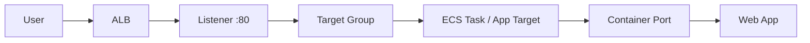

# 4교시: Container service와 ALB 연결


## 수업 목표
- container service와 ALB/listener/target group/health check를 연결한다.
- container port와 target group port가 맞아야 하는 이유를 설명한다.
- desired count와 target health를 함께 본다.

## 오늘 반드시 가져갈 것
| 필수 개념 | 왜 필수인가 | 놓치면 생기는 문제 | 확인 지점 |
|---|---|---|---|
| Container port | app이 container 안에서 listen하는 port다 | ALB health check가 실패한다 | task definition portMappings |
| Target group | ALB가 traffic을 보낼 container/task 대상이다 | ALB 503을 해결하지 못한다 | registered targets |
| Desired/running count | service가 유지하려는 task 수와 실제 실행 수다 | 배포가 충분히 떠 있는지 모른다 | ECS service counts |
| Health check | traffic 받을 준비 여부를 판단한다 | 서비스 URL만 보고 정상으로 착각한다 | target health reason |

## 연결 흐름


## ECS와 ALB
ECS service를 ALB에 연결하면 service가 target group에 task를 등록하고, ALB health check가 target 상태를 확인한다. target type, VPC, subnet, SG, container port가 맞아야 한다.

| 설정 | 확인 |
|---|---|
| ALB listener | HTTP 80 또는 HTTPS 443 |
| Target group | protocol/port, health check path |
| Container port | app listen port |
| Service desired count | 1 이상 |
| Security Group | ALB -> task traffic 허용 |

## App Runner와 외부 endpoint
App Runner는 자체 service URL을 제공할 수 있어 Day2의 ALB 구조보다 단순하게 보일 수 있다. 하지만 custom domain, VPC connector, observability를 붙이면 여전히 network와 health 개념이 중요하다.

## 실패 증상
| 증상 | 첫 확인 |
|---|---|
| ALB 503 | target health, desired/running count |
| target unhealthy | health check path, container port, SG |
| service deployment pending | image pull 권한, subnet/capacity |
| service URL 5xx | app logs, env, port |


## container port가 중요한 이유
EC2에 직접 설치한 web server는 보통 80에서 들었다. container app은 3000, 5000, 8080 같은 다른 port에서 listen할 수 있다. ALB target group과 ECS task definition이 이 port를 정확히 알아야 health check와 traffic routing이 성공한다.

## target health 실패의 대표 원인
| 원인 | 증상 | 복구 |
|---|---|---|
| wrong container port | target timeout/refused | task port mapping 수정 |
| wrong health path | 404/unhealthy | path를 실제 endpoint로 변경 |
| SG blocked | timeout | ALB SG -> task SG 허용 |
| task stopped | no target/running count 0 | task stopped reason 확인 |

## App Runner와 ALB의 차이
App Runner는 자체 URL을 제공하므로 Day2의 ALB 연결이 보이지 않을 수 있다. 그러나 managed service 안에서도 health, port, logs, deployment status는 동일하게 중요하다. ALB를 직접 보느냐, service가 추상화하느냐의 차이다.

## 운영 판단 질문
- 이 app은 public endpoint가 필요한가?
- health check path는 실제 app이 빠르게 응답하는 path인가?
- target이 unhealthy일 때 traffic을 받지 않게 되는가?
- desired count가 1이면 장애 시 어떤 위험이 있는가?

## 운영 판단 연습
| 판단 질문 | 확인 기준 |
|---|---|
| 이 항목에서 가장 먼저 결정할 것은 무엇인가 | container port와 target group port가 맞아야 한다. |
| 실패했을 때 어느 경계부터 볼 것인가 | health check path는 app이 실제 응답하는 경로여야 한다. |
| 수업 뒤 혼자 재현할 때 필요한 최소 정보는 무엇인가 | ALB 장애와 image 장애를 분리한다. |

## 흔한 실패와 첫 확인 위치
| 흔한 실패 | 첫 확인 위치 |
|---|---|
| container 8080을 target 80으로 보낸다 | container port, target port, health check를 대조한다 |

## Evidence 점검
- 화면에는 민감 정보 대신 resource 이름, Region, 상태값, rule, tag처럼 재현 가능한 값이 보여야 한다.
- 기록에는 "성공했다"보다 어떤 값이 어떤 상태였는지가 남아야 한다.
- 실패를 기록할 때는 증상, 확인한 화면, 수정한 값, 재확인 결과를 한 세트로 남긴다.
- container port, target port, health check result 중 최소 두 가지는 배움일기에 남긴다.

## Evidence Note
```markdown
# W5D3S4 container alb link
- Service:
- Container port:
- ALB/listener:
- Target group:
- Health check path:
- Desired/running count:
- Target health:
```

## 혼자 다시 따라오기
- 최소 재현 경로: ALB target group이 어떤 port와 path로 container를 검사하는지 기록한다.
- 공식 문서 키워드: `ECS service load balancing`, `target group`, `container port`, `health check`.
- 스스로 확인할 화면: ECS service networking/load balancing, Target Groups, ALB Listeners.
- 흔한 실패 3개: target group port와 container port가 다름, health check path가 app과 다름, desired count 0 또는 task stopped를 놓침.
- 다음 준비 상태: ALB 503을 target health와 service count로 분석할 수 있어야 한다.

## 한 줄 요약
```text
Container service와 ALB 연결은 listener, target group, container port, health check가 모두 맞아야 성공한다.
```
