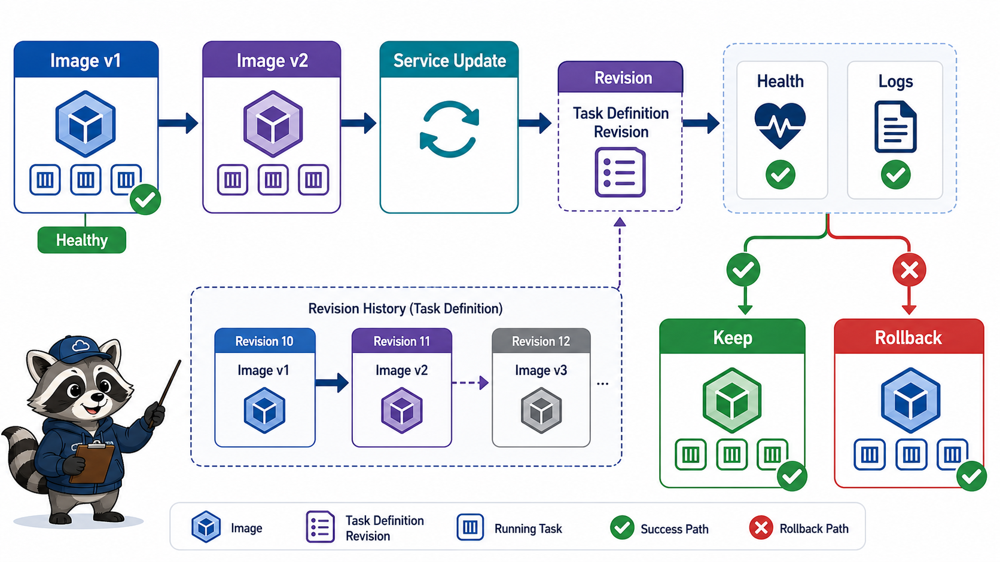
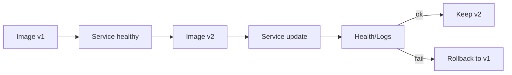

# 5교시: 배포 변경과 rollback preview



## 수업 목표
- 새 image tag를 service에 반영하는 배포 변경 흐름을 이해한다.
- 실패한 image 또는 health check 실패를 이전 정상 revision으로 되돌리는 기준을 잡는다.
- image tag, task definition revision, deployment history를 evidence로 남긴다.

## 오늘 반드시 가져갈 것
| 필수 개념 | 왜 필수인가 | 놓치면 생기는 문제 | 확인 지점 |
|---|---|---|---|
| Image tag update | container 배포 변경의 기본 단위다 | 어떤 version이 실행 중인지 모른다 | ECR image tag, task definition |
| Revision | ECS task definition은 revision으로 변경을 추적한다 | rollback 기준이 흐려진다 | task definition revision |
| Health-based rollback | 새 배포가 healthy인지 확인한 뒤 유지한다 | 실패 배포를 계속 serving한다 | deployment status, target health |
| Evidence before/after | 변경 전후 상태가 있어야 복구할 수 있다 | "아까 됐는데"만 남는다 | old/new tag, curl, logs |

## 변경 흐름


## ECS rollback preview
ECS에서는 image tag가 바뀌면 보통 task definition 새 revision을 만들고 service update로 반영한다. 실패하면 이전 task definition revision으로 service를 다시 update하는 방식으로 되돌릴 수 있다.

| 단계 | Evidence |
|---|---|
| 변경 전 | task definition revision, image tag, target health |
| 변경 | new image tag, new revision |
| 검증 | running count, target health, CloudWatch Logs |
| rollback | previous revision, previous tag |

## App Runner rollback preview
App Runner는 deployment history와 image source를 기준으로 이전 정상 image로 되돌리는 사고방식을 잡는다. Console 기능은 계정/시점에 따라 다르게 보일 수 있으므로, 오늘은 "이전 image tag로 service를 다시 배포한다"는 원리를 강조한다.

## 실패 image 예시
수업에서 실제로 실패 image를 만들지 않아도 된다. 다만 실패 시나리오는 구분한다.

| 실패 | 증상 |
|---|---|
| bad image tag | image pull 실패 |
| app crash | task stopped, logs error |
| wrong port | health check fail |
| wrong env | app 5xx, logs config error |


## 변경 전 evidence가 필요한 이유
배포 실패 후 가장 어려운 질문은 "정상 상태가 무엇이었나"이다. 이전 image tag, task definition revision, target health, 주요 metric을 기록하지 않으면 rollback이 감이 된다. 운영에서 rollback은 빠른 복구지만, 기준 없는 rollback은 또 다른 장애가 될 수 있다.

## 실패 시나리오별 rollback 판단
| 실패 | rollback 우선도 | 이유 |
|---|---|---|
| image pull 실패 | 높음 | 새 image를 실행조차 못 함 |
| container crash | 높음 | service capacity 감소 |
| wrong health path | 설정 수정 가능 | image 문제가 아닐 수 있음 |
| latency 증가 | metric 확인 후 판단 | rollback 또는 scale 조정 |

## update와 rollback evidence template
```markdown
Before: image=v1, revision=3, target=healthy
Change: image=v2, revision=4
Check: target=unhealthy, logs=port error
Action: service update to revision=3
Recheck: target=healthy, curl=200
```

## 비용/위험
배포 실패 task가 반복 생성되면 log가 쌓이고 service가 불안정해진다. 실패 배포를 방치하지 말고 desired count, deployment status, log 증가를 함께 확인한다.

## 운영 판단 연습
| 판단 질문 | 확인 기준 |
|---|---|
| 이 항목에서 가장 먼저 결정할 것은 무엇인가 | 새 버전 전후 evidence가 있어야 롤백이 가능하다. |
| 실패했을 때 어느 경계부터 볼 것인가 | tag를 덮어쓰면 이전 상태 추적이 어려워진다. |
| 수업 뒤 혼자 재현할 때 필요한 최소 정보는 무엇인가 | deployment event와 health check를 함께 본다. |

## 흔한 실패와 첫 확인 위치
| 흔한 실패 | 첫 확인 위치 |
|---|---|
| 어떤 tag로 되돌릴지 모른다 | before/after tag와 service event를 기록한다 |

## Evidence 점검
- 화면에는 민감 정보 대신 resource 이름, Region, 상태값, rule, tag처럼 재현 가능한 값이 보여야 한다.
- 기록에는 "성공했다"보다 어떤 값이 어떤 상태였는지가 남아야 한다.
- 실패를 기록할 때는 증상, 확인한 화면, 수정한 값, 재확인 결과를 한 세트로 남긴다.
- before tag, after tag, service status 중 최소 두 가지는 배움일기에 남긴다.

## Evidence Note
```markdown
# W5D3S5 deploy rollback
- Previous image tag:
- New image tag:
- Service/revision before:
- Service/revision after:
- Health check result:
- Logs result:
- Rollback 기준:
```

## 혼자 다시 따라오기
- 최소 재현 경로: service가 사용하는 image tag와 변경 전 revision을 기록한다.
- 공식 문서 키워드: `ECS deployment`, `task definition revision`, `App Runner deployment`, `image tag`.
- 스스로 확인할 화면: ECS service deployments, Task definition revisions, App Runner deployments, ECR Images.
- 흔한 실패 3개: `latest`만 써서 이전 version을 모름, health 확인 없이 성공 처리함, rollback할 revision을 기록하지 않음.
- 다음 준비 상태: 새 image 배포 전후 어떤 evidence를 남길지 설명할 수 있어야 한다.

## 한 줄 요약
```text
Rollback은 감으로 되돌리는 것이 아니라 이전 image tag와 revision evidence로 되돌리는 작업이다.
```
