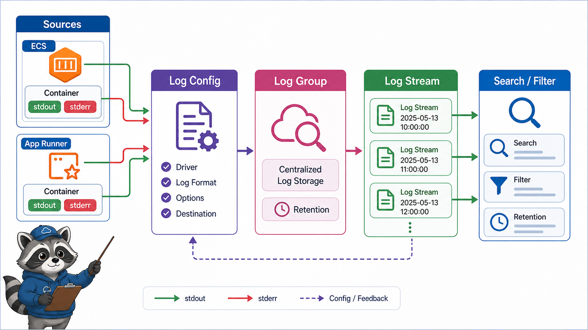
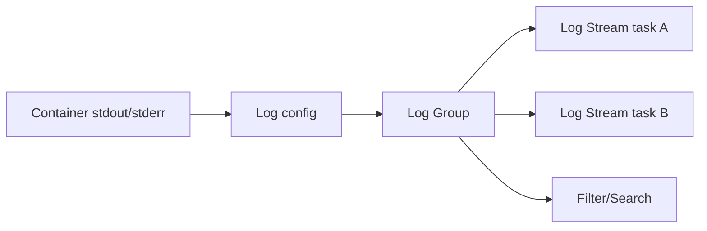

# 6교시: CloudWatch Logs 기본



## 수업 목표
- app stdout/stderr가 CloudWatch Logs의 log group/log stream으로 연결되는 흐름을 이해한다.
- ECS/App Runner logs 위치를 찾는다.
- log가 없을 때 logging 설정, service 상태, app 실행 여부를 확인한다.

## 오늘 반드시 가져갈 것
| 필수 개념 | 왜 필수인가 | 놓치면 생기는 문제 | 확인 지점 |
|---|---|---|---|
| Log group | 같은 목적의 log stream 묶음이다 | 로그 위치를 못 찾는다 | CloudWatch Logs |
| Log stream | task/instance/deployment 단위 log 흐름이다 | 어떤 실행 단위의 로그인지 모른다 | stream name/time |
| stdout/stderr | container app log의 기본 출구다 | 파일 로그만 찾다가 놓친다 | app output |
| Retention | log도 저장 비용과 보존 정책이 있다 | 불필요한 로그가 계속 쌓인다 | retention setting |

## CloudWatch Logs 구조


## ECS logs
ECS task definition에는 log configuration이 들어갈 수 있다. `awslogs` driver를 쓰면 CloudWatch Logs로 container output을 보낼 수 있다.

| 확인 | 의미 |
|---|---|
| log group | service/app 단위 log 묶음 |
| log stream prefix | task/container 구분 |
| timestamp | 장애 시점 비교 |
| error message | config/port/crash 원인 |

## App Runner logs
App Runner도 service log를 CloudWatch에서 확인할 수 있다. build/deploy/app log가 나뉘어 보일 수 있으므로 "어느 단계의 로그인가"를 구분한다.

| 로그 | 질문 |
|---|---|
| deployment log | image pull/build/deploy가 성공했는가 |
| application log | app이 시작되고 요청을 처리하는가 |
| service event | service 상태 전환이 있었는가 |

## Log가 없을 때
| 증상 | 첫 확인 |
|---|---|
| log group이 없음 | logging 설정, service 생성 여부 |
| log stream이 없음 | task가 실제 실행됐는가 |
| error가 안 보임 | app이 stdout/stderr로 출력하는가 |
| 시간이 안 맞음 | time range, Region |


## 로그를 읽는 순서
먼저 시간 범위를 장애 시점으로 맞춘다. 그 다음 service/task/deployment에 해당하는 log stream을 고른다. 마지막으로 error, warning, startup message, request log를 본다. 로그를 볼 때 가장 흔한 실수는 time range가 맞지 않아 "로그가 없다"고 판단하는 것이다.

## 로그와 이벤트 구분
CloudWatch Logs는 app이 남긴 출력이고, ECS/App Runner event는 service lifecycle 상태 변화다. task가 왜 stopped 되었는지는 ECS task stopped reason이나 service event가 더 직접적일 수 있다. app stack trace는 log stream에서 본다.

## 보존 정책
학습 계정에서 log group이 무기한 보존되면 비용은 작더라도 관리 부채가 된다. 실습용 log group에는 retention을 짧게 두는 습관을 만든다.

## 장애 예시
| 로그 | 해석 | 다음 확인 |
|---|---|---|
| listen EADDRINUSE | port 충돌 | container port/process |
| missing env | config 누락 | env/secret 설정 |
| connection refused DB | DB endpoint/SG | Day4 연결 |
| permission denied | IAM/role/파일 권한 | task role, policy |

## 운영 판단 연습
| 판단 질문 | 확인 기준 |
|---|---|
| 이 항목에서 가장 먼저 결정할 것은 무엇인가 | log group과 stream을 먼저 찾는다. |
| 실패했을 때 어느 경계부터 볼 것인가 | timestamp 기준으로 배포 전후를 비교한다. |
| 수업 뒤 혼자 재현할 때 필요한 최소 정보는 무엇인가 | retention 설정은 비용과 보존 정책에 영향을 준다. |

## 흔한 실패와 첫 확인 위치
| 흔한 실패 | 첫 확인 위치 |
|---|---|
| 다른 Region의 log group을 본다 | Region과 log group 이름을 먼저 확인한다 |

## Evidence 점검
- 화면에는 민감 정보 대신 resource 이름, Region, 상태값, rule, tag처럼 재현 가능한 값이 보여야 한다.
- 기록에는 "성공했다"보다 어떤 값이 어떤 상태였는지가 남아야 한다.
- 실패를 기록할 때는 증상, 확인한 화면, 수정한 값, 재확인 결과를 한 세트로 남긴다.
- log group, log stream, retention 중 최소 두 가지는 배움일기에 남긴다.

## Evidence Note
```markdown
# W5D3S6 CloudWatch Logs
- Service:
- Log group:
- Log stream:
- 확인한 시간대:
- 정상 log:
- error/warning:
- retention:
```

## 혼자 다시 따라오기
- 최소 재현 경로: CloudWatch Logs에서 오늘 service의 log group과 stream을 찾고 요청 시각 전후 로그를 확인한다.
- 공식 문서 키워드: `CloudWatch Logs`, `log group`, `log stream`, `ECS awslogs`.
- 스스로 확인할 화면: CloudWatch Logs groups, stream events, ECS task logs, App Runner logs.
- 흔한 실패 3개: Region이 다름, time range가 맞지 않음, service는 stopped인데 로그를 찾음.
- 다음 준비 상태: app 장애 시 log group과 log stream을 찾아 첫 error를 읽을 수 있어야 한다.

## 한 줄 요약
```text
CloudWatch Logs는 container가 남긴 stdout/stderr를 운영 증거로 모으는 곳이다.
```
