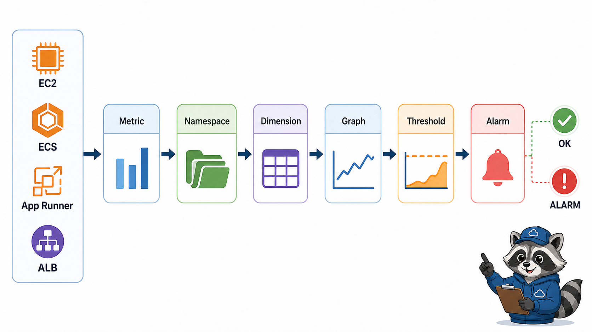

# 7교시: CloudWatch Metrics와 Alarm



## 수업 목표
- CloudWatch Metrics의 namespace, metric, dimension 개념을 이해한다.
- EC2/ECS/App Runner/ALB에서 볼 핵심 metric을 구분한다.
- Alarm의 threshold와 state를 preview한다.

## 오늘 반드시 가져갈 것
| 필수 개념 | 왜 필수인가 | 놓치면 생기는 문제 | 확인 지점 |
|---|---|---|---|
| Metric | 시간에 따른 수치형 관찰 데이터다 | 로그와 지표를 혼동한다 | CloudWatch Metrics |
| Dimension | metric을 resource별로 구분하는 label이다 | 어떤 service의 CPU인지 모른다 | dimension filter |
| Alarm | 조건을 만족하면 상태가 바뀌는 감시 규칙이다 | 장애 알림 기준이 없다 | threshold, state |
| ALB target metric | user traffic 관점의 장애 징후를 본다 | app task만 보고 외부 장애를 놓친다 | target response, unhealthy host |

## Logs와 Metrics 차이
| 구분 | Logs | Metrics |
|---|---|---|
| 형태 | event/text | number over time |
| 예시 | error stack, request log | CPUUtilization, 5xx count |
| 질문 | 무슨 일이 있었나 | 얼마나 자주/크게 일어났나 |
| 도구 | Log groups/streams | Metrics/graphs/alarms |

## 볼 수 있는 metric 예시
| 대상 | metric 예시 | 질문 |
|---|---|---|
| EC2 | CPUUtilization, NetworkIn/Out | instance가 과부하인가 |
| ECS | CPU/Memory utilization | service resource가 부족한가 |
| App Runner | request count, latency, 5xx 계열 | managed service가 응답하는가 |
| ALB | TargetResponseTime, HTTPCode_Target_5XX_Count, UnHealthyHostCount | user traffic이 정상인가 |

## Alarm preview
Alarm은 metric이 일정 조건을 만족하면 상태가 바뀌는 규칙이다. 오늘은 알림 채널까지 깊게 만들지 않아도 된다. 다만 threshold, period, evaluation, state 개념을 읽는다.

```text
Metric -> Threshold -> Evaluation -> Alarm State
```

| Alarm state | 의미 |
|---|---|
| OK | 조건 미충족, 정상 범위 |
| ALARM | 조건 충족 |
| INSUFFICIENT_DATA | 판단할 데이터 부족 |


## metric을 고를 때의 기준
좋은 metric은 운영 행동으로 이어진다. CPU가 높으면 scale이나 instance size를 검토할 수 있고, 5xx가 늘면 app error를 조사하며, unhealthy host가 생기면 target health를 확인한다. 숫자를 보는 이유는 그래프를 예쁘게 만들기 위해서가 아니라 다음 행동을 빠르게 결정하기 위해서다.

## 주요 metric 후보
| 상황 | metric | 다음 행동 |
|---|---|---|
| task가 느림 | CPU/Memory utilization | resource/scale 확인 |
| 사용자가 오류 경험 | ALB 5xx, App Runner 5xx | logs와 deployment 확인 |
| target 장애 | UnHealthyHostCount | target health reason |
| traffic 증가 | RequestCount | scale/cost 확인 |

## Alarm을 너무 빨리 만들 때의 문제
threshold를 이해하지 못하고 alarm을 만들면 noise가 된다. 수업에서는 alarm 생성 자체보다 어떤 metric에 어떤 threshold를 걸면 어떤 운영 행동을 할지 설명하는 데 집중한다.

## 캡처 가이드
Metric graph는 time range, metric name, dimension이 보이게 캡처한다. alarm preview는 threshold와 state가 보이면 충분하다.

## 운영 판단 연습
| 판단 질문 | 확인 기준 |
|---|---|
| 이 항목에서 가장 먼저 결정할 것은 무엇인가 | metric은 숫자로 보는 상태 변화다. |
| 실패했을 때 어느 경계부터 볼 것인가 | dimension을 봐야 어떤 resource의 metric인지 안다. |
| 수업 뒤 혼자 재현할 때 필요한 최소 정보는 무엇인가 | alarm은 다음 행동을 정할 수 있을 때 만든다. |

## 흔한 실패와 첫 확인 위치
| 흔한 실패 | 첫 확인 위치 |
|---|---|
| 전체 평균만 보고 target 문제를 놓친다 | namespace와 dimension을 확인한다 |

## Evidence 점검
- 화면에는 민감 정보 대신 resource 이름, Region, 상태값, rule, tag처럼 재현 가능한 값이 보여야 한다.
- 기록에는 "성공했다"보다 어떤 값이 어떤 상태였는지가 남아야 한다.
- 실패를 기록할 때는 증상, 확인한 화면, 수정한 값, 재확인 결과를 한 세트로 남긴다.
- metric namespace, dimension, threshold 후보 중 최소 두 가지는 배움일기에 남긴다.

## Evidence Note
```markdown
# W5D3S7 CloudWatch Metrics Alarm
- Service:
- Metric namespace:
- Metric name:
- Dimension:
- 그래프 시간 범위:
- Alarm 후보:
- threshold:
```

## 혼자 다시 따라오기
- 최소 재현 경로: CloudWatch Metrics에서 ALB 또는 ECS/App Runner 관련 metric 하나를 찾아 그래프 시간을 조정한다.
- 공식 문서 키워드: `CloudWatch Metrics`, `namespace`, `dimension`, `CloudWatch alarm`, `threshold`.
- 스스로 확인할 화면: CloudWatch Metrics, Graphed metrics, Alarms.
- 흔한 실패 3개: metric이 아직 안 쌓였는데 장애로 판단함, Region이 다름, 로그에서 봐야 할 error를 metric에서 찾음.
- 다음 준비 상태: log와 metric과 alarm의 역할을 구분할 수 있어야 한다.

## 한 줄 요약
```text
CloudWatch Metrics는 상태를 숫자로 보고, Alarm은 그 숫자에 운영 기준을 붙인다.
```
