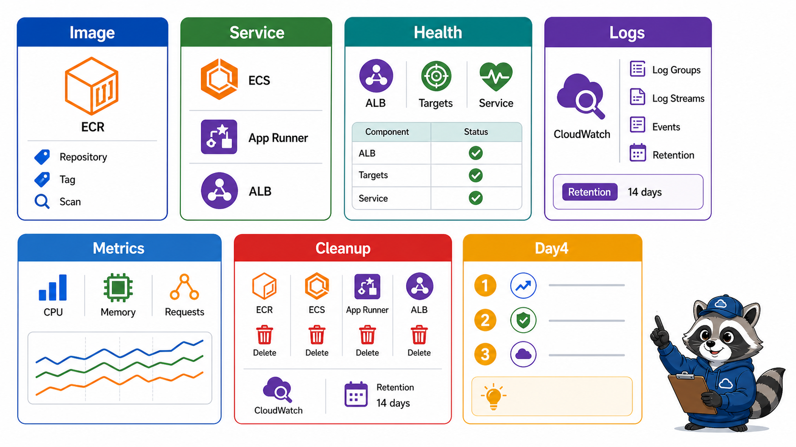
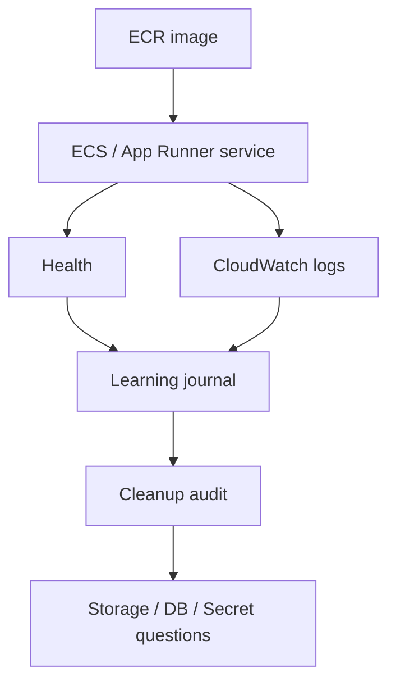

# 8교시: 구름 EXP 배움일기



## 수업 목표
- ECR/ECS/App Runner/CloudWatch evidence를 정리한다.
- container service 관련 잔여 비용과 resource를 cleanup한다.
- Day4 storage/database/secret 수업으로 이어질 질문을 남긴다.

## 오늘 반드시 가져갈 것
| 필수 개념 | 왜 필수인가 | 놓치면 생기는 문제 | 확인 지점 |
|---|---|---|---|
| Image-to-service evidence | image와 실행 service가 연결되어야 배포를 설명할 수 있다 | push 성공만 기록한다 | ECR tag, service health |
| Health/log/metric | 운영 검증은 다층 증거로 한다 | URL만 보고 정상 처리한다 | health, logs, metrics |
| Cleanup | ECS/App Runner/ALB/ECR/log는 비용과 보존 정책을 남긴다 | 실습 후 비용 또는 로그 저장 누락 | service, image, log retention |

## 배움일기 템플릿
```markdown
# W5D3 AWS container service

## 1. 선택 경로
- ECS / App Runner / simulation:
- 선택 이유:

## 2. Image
- ECR repository:
- Image URI:
- Image tag:

## 3. Service
- Service name:
- Container port:
- Desired/running count 또는 service status:
- Endpoint:
- Health:

## 4. Update/Rollback
- 변경 전 tag/revision:
- 변경 후 tag/revision:
- rollback 기준:

## 5. Observability
- Log group:
- Log stream:
- Metric:
- Alarm 후보:

## 6. Cleanup
- ECS/App Runner service:
- ALB/Target Group:
- ECR image/repository:
- CloudWatch log retention:
- 비용 확인:

## 7. Day4 질문
-
-
```

## Cleanup 확인
| resource | 종료 전 확인 |
|---|---|
| ECS service | desired count 0 또는 delete |
| ECS cluster | 실습용이면 delete 여부 |
| App Runner service | pause/delete 또는 유지 사유 |
| ALB/Target Group | delete 여부 |
| ECR repository/image | 유지 사유와 retention |
| CloudWatch Logs | retention 설정 |
| IAM role | 실습용 role 잔여 여부 |

## 구조로 보기


## Day4로 이어지는 질문
컨테이너 service가 실행되면 다음 질문은 data와 config다.

| 오늘 질문 | Day4 질문 |
|---|---|
| image는 어디서 가져오는가 | app data는 어디에 저장하는가 |
| env는 어디서 넣는가 | secret은 어디에 보관하는가 |
| service health는 어떻게 보는가 | database 연결 실패를 어떻게 분석하는가 |
| logs는 어디서 보는가 | storage/database 비용은 어떻게 통제하는가 |


## D3 배움일기의 핵심
오늘 배움일기는 URL 하나가 아니라 운영 루프 전체를 남겨야 한다. ECR image가 어떤 tag로 있고, 어떤 service가 그 image를 실행하며, health는 어디서 보고, log group은 어디인지, 문제가 생기면 어떤 revision으로 돌아갈지까지 연결되어야 한다.

## cleanup 판단
| 대상 | 삭제/유지 판단 |
|---|---|
| ECR repository | Day4 이후 계속 쓸 image가 아니면 삭제 또는 retention 계획 |
| ECS service | desired count 0 또는 delete |
| App Runner service | pause/delete 또는 유지 사유 |
| ALB/TG | ECS 연결 실습 후 삭제 |
| CloudWatch Logs | retention 설정 |
| IAM role | 실습용이면 잔여 권한 확인 |

## Day4로 이어지는 운영 질문
container app이 실행되면 곧바로 data와 secret 문제가 등장한다. DB endpoint는 어디서 가져오는가, password는 env에 넣어도 되는가, S3 object를 public으로 열어야 하는가, RDS를 private subnet에 두면 app은 어떻게 연결하는가. 이 질문들이 Day4의 중심이다.

## 좋은 산출물 예시
```markdown
Image: paperclip-w5d3-app:v2 in ECR
Service: ECS service desired=1 running=1
Health: target healthy
Logs: /ecs/paperclip-w5d3-app stream checked
Metric: ALB 5xx candidate alarm
Rollback: previous task definition revision 3
Cleanup: service deleted, ALB deleted, log retention 7 days
```

## 운영 판단 연습
| 판단 질문 | 확인 기준 |
|---|---|
| 이 항목에서 가장 먼저 결정할 것은 무엇인가 | image, service, logs, metrics, 비용을 함께 정리한다. |
| 실패했을 때 어느 경계부터 볼 것인가 | ECR image도 비용과 정리 대상이 될 수 있다. |
| 수업 뒤 혼자 재현할 때 필요한 최소 정보는 무엇인가 | Day4 serverless/RDS 질문으로 연결한다. |

## 흔한 실패와 첫 확인 위치
| 흔한 실패 | 첫 확인 위치 |
|---|---|
| service만 삭제하고 repository/image를 남긴다 | ECR, ECS/App Runner, CloudWatch를 각각 확인한다 |

## Evidence 점검
- 화면에는 민감 정보 대신 resource 이름, Region, 상태값, rule, tag처럼 재현 가능한 값이 보여야 한다.
- 기록에는 "성공했다"보다 어떤 값이 어떤 상태였는지가 남아야 한다.
- 실패를 기록할 때는 증상, 확인한 화면, 수정한 값, 재확인 결과를 한 세트로 남긴다.
- resource list, 보존 이유, Day4 질문 중 최소 두 가지는 배움일기에 남긴다.

## Evidence Note
```markdown
# W5D3S8 container cleanup journal
- 선택 경로:
- ECR image/tag:
- 실행 service 상태:
- logs/metrics 확인:
- 삭제/유지 resource:
- Day4 data/secret 질문:
```

## 혼자 다시 따라오기
- 최소 재현 경로: ECR image tag, service health, CloudWatch log group을 하나의 표로 정리한다.
- 공식 문서 키워드: `ECR repository`, `ECS service`, `App Runner service`, `CloudWatch Logs`, `CloudWatch Metrics`.
- 스스로 확인할 화면: ECR Images, ECS/App Runner service detail, CloudWatch Logs/Metrics, Billing.
- 흔한 실패 3개: service를 삭제하지 않음, ECR image가 계속 쌓임, log retention을 기본값으로 방치함.
- 다음 준비 상태: Day4에서 S3/RDS/secret을 container app과 연결하는 질문을 말할 수 있어야 한다.

## 한 줄 요약
```text
W5D3의 산출물은 실행된 container URL이 아니라 image, service, health, logs, metrics, cleanup이 연결된 운영 evidence다.
```
