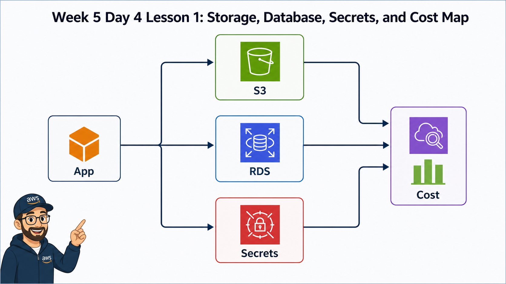

# Week 5 Day 4: AWS Storage, Database, Secrets, Cost 운영

## Overview
W5D4는 AWS에서 데이터와 비용이 남는 지점을 다룬다. W5D2-D3에서 EC2, ALB, container service를 실행했다면, 오늘은 애플리케이션이 의존하는 S3 object storage, RDS relational database, Secrets Manager, backup, public access, cost tag, cleanup을 운영 관점으로 연결한다.

오늘의 핵심은 데이터를 저장하는 resource는 삭제와 보안 판단이 더 조심스럽다는 점이다. compute resource는 다시 만들 수 있어도, object와 database는 잘못 공개되거나 잘못 삭제되면 복구와 책임 범위가 달라진다.

## Learning Goals
- S3 bucket, object, Block Public Access, bucket policy, versioning, lifecycle의 운영 의미를 설명한다.
- RDS instance, subnet group, Security Group, backup, snapshot, deletion protection을 연결해 설명한다.
- application credential을 코드나 배움일기에 남기지 않고 Secrets Manager/IAM 관점으로 다룬다.
- Cost Explorer, Budget, tag, leftover resource audit을 사용해 잔여 비용을 찾는다.
- storage/database resource를 삭제하기 전에 backup, snapshot, public access, retention 기준을 확인한다.

## Lesson Index
| 교시 | 주제 | 핵심 확인 |
|---|---|---|
| 1교시 | Day3 요약 + storage/database 운영 지도 | app, S3, RDS, secret, cost 연결 |
| 2교시 | S3 bucket/object/public access | Block Public Access, policy, object URL |
| 3교시 | S3 versioning/lifecycle/storage class | version, lifecycle, archive, expiration, cost |
| 4교시 | RDS 생성 전 운영 경계 | engine, instance class, subnet group, SG, public access |
| 5교시 | RDS backup/snapshot/deletion protection | automated backup, restore, final snapshot |
| 6교시 | Secrets Manager와 credential 운영 | secret, IAM permission, rotation, audit |
| 7교시 | Cost Explorer/tag/잔여 비용 점검 | cost allocation tag, Budget, cleanup audit |
| 8교시 | 구름 EXP 배움일기 | S3/RDS/Secrets/Cost evidence와 Day5 runbook 연결 |

## Practice Files
| 자료 | 용도 |
|---|---|
| `academic-foundations.md` | 공식 문서 기반 개념 근거와 읽을 키워드 |
| `lesson-01.md` ~ `lesson-08.md` | 교시별 강의 자료 |
| `assets/lesson-01-storage-database-map.png` | storage/database/security/cost 운영 지도 |
| `assets/lesson-02-s3-access-control.png` | S3 public access와 policy 흐름 |
| `assets/lesson-03-s3-versioning-lifecycle.png` | S3 versioning/lifecycle/cost 흐름 |
| `assets/lesson-04-rds-network-boundary.png` | RDS network/security boundary |
| `assets/lesson-05-rds-backup-deletion-protection.png` | RDS backup/snapshot/deletion protection |
| `assets/lesson-06-secrets-manager-flow.png` | Secrets Manager와 RDS credential 흐름 |
| `assets/lesson-07-cost-tags-cleanup.png` | Cost Explorer, tag, cleanup audit |
| `assets/lesson-08-storage-db-cleanup-journal.png` | 배움일기와 cleanup journal |

## Official References
| Topic | Reference |
|---|---|
| S3 Block Public Access | https://docs.aws.amazon.com/AmazonS3/latest/userguide/access-control-block-public-access.html |
| S3 bucket policies | https://docs.aws.amazon.com/AmazonS3/latest/userguide/bucket-policies.html |
| S3 Versioning | https://docs.aws.amazon.com/AmazonS3/latest/userguide/Versioning.html |
| S3 lifecycle configuration | https://docs.aws.amazon.com/AmazonS3/latest/userguide/object-lifecycle-mgmt.html |
| RDS DB instance overview | https://docs.aws.amazon.com/AmazonRDS/latest/UserGuide/Overview.DBInstance.html |
| RDS DB subnet groups | https://docs.aws.amazon.com/AmazonRDS/latest/UserGuide/USER_VPC.WorkingWithRDSInstanceinaVPC.html |
| RDS backups | https://docs.aws.amazon.com/AmazonRDS/latest/UserGuide/USER_WorkingWithAutomatedBackups.html |
| RDS deletion protection | https://docs.aws.amazon.com/AmazonRDS/latest/UserGuide/USER_DeleteInstance.html |
| AWS Secrets Manager | https://docs.aws.amazon.com/secretsmanager/latest/userguide/intro.html |
| Cost allocation tags | https://docs.aws.amazon.com/awsaccountbilling/latest/aboutv2/cost-alloc-tags.html |
| Cost Explorer | https://docs.aws.amazon.com/cost-management/latest/userguide/ce-what-is.html |

## Preparation Checklist
- W5D3 container resource cleanup 또는 유지 사유 기록
- 실습 Region: `ap-northeast-2`
- S3, RDS, Secrets Manager, Cost Explorer 접근 권한 확인
- RDS 실습은 비용이 발생할 수 있으므로 생성 대신 Console 시뮬레이션 경로를 허용
- 공통 tag 준비: `Course=paperclip`, `Week=5`, `Day=4`, `Owner=<student-id>`
- 수업 종료 전 S3 bucket/object, RDS instance/snapshot, secret, log retention, Budget 상태를 확인할 시간 확보

## Deliverables
- S3 public access 점검표
- S3 versioning/lifecycle/cost note
- RDS network/security/backup decision note
- Secrets Manager credential handling note
- Cost Explorer/tag/cleanup audit note
- Day5 통합 운영 runbook에 넣을 storage/database/security/cost 항목

## End Of Day Checklist
- public S3 bucket이 의도 없이 남아 있지 않은가
- RDS instance를 만들었다면 deletion protection, final snapshot, backup retention을 확인했는가
- secret 값이 screenshot, markdown, git repository에 노출되지 않았는가
- Cost Explorer/Budget/tag 기준으로 남은 비용 후보를 확인했는가
- Day5 통합 운영 실습에서 사용할 runbook 항목을 evidence로 남겼는가
