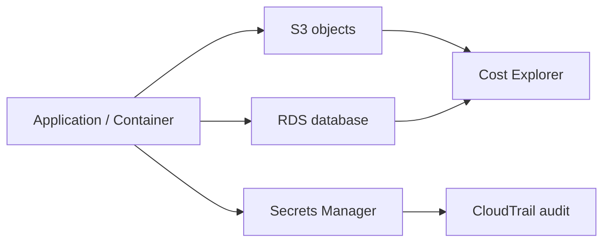

# 1교시: Day3 요약 + storage/database 운영 지도


이 visual에서는 App에서 S3, RDS, Secrets, Cost로 갈라지는 운영 경계를 본다. 선은 단순 연결이 아니라 접근 권한, 비용, 복구 책임이 나뉘는 지점이다.

## 수업 목표
- Day3 container service가 의존하는 데이터 resource를 운영 지도로 연결한다.
- S3, RDS, Secrets Manager, Cost Explorer가 각각 어떤 운영 질문에 답하는지 구분한다.
- 오늘의 성공 기준을 생성이 아니라 접근, 보존, 복구, 비용 evidence로 잡는다.

## 오늘 반드시 가져갈 것
| 필수 개념 | 왜 필수인가 | 놓치면 생기는 문제 | 확인 지점 |
|---|---|---|---|
| 데이터 resource 경계 | object와 database는 삭제와 공개의 영향이 compute보다 크다 | 실습 후에도 데이터와 비용이 남는다 | S3 bucket, RDS instance |
| 접근 통제 | S3 policy, SG, IAM이 서로 다른 계층에서 접근을 막는다 | app 장애와 보안 사고를 구분하지 못한다 | bucket policy, SG inbound, IAM permission |
| 복구 가능성 | backup과 version은 장애 후 되돌릴 수 있는 범위를 정한다 | 삭제 후 복구 기준이 없다 | S3 version, RDS backup |
| 비용 추적 | storage/database는 사용량과 시간으로 비용이 누적된다 | resource를 지웠다고 비용이 끝난 줄 안다 | Cost Explorer, tag |

## 핵심 개념
Day3까지는 image를 배포하고 service health와 logs를 확인했다. 실제 서비스는 여기서 끝나지 않는다. 사용자가 올린 파일은 S3에 남고, 주문이나 회원 정보는 RDS 같은 database에 남으며, database password는 secret으로 관리되어야 한다. 또한 이 모든 resource는 생성 순간부터 비용과 권한 흔적을 만든다. 오늘은 app을 더 화려하게 만드는 날이 아니라, 데이터가 어디에 남고 누가 접근하며 장애 때 어디까지 되돌릴 수 있는지 확인하는 날이다.

## 구조로 보기


Mermaid 흐름은 Console 화면을 외우기 위한 그림이 아니다. 어떤 resource가 어느 경계에서 접근, 비용, 복구, 감사 책임을 갖는지 확인하기 위한 지도다. 그림의 각 node는 evidence note에 남길 수 있는 실제 Console 화면이나 설정값으로 연결되어야 한다.

## 공식 문서 확인 지점
| 확인할 문서 키워드 | 읽을 때 볼 질문 |
|---|---|
| AWS User Guide | 이 기능이 해결하려는 운영 문제는 무엇인가 |
| Permissions 또는 Security | 누가 접근할 수 있고 어떤 기본 차단이 있는가 |
| Pricing 또는 Cost 관련 항목 | 켜져 있는 동안, 저장된 동안, 요청이 발생할 때 비용이 생기는가 |
| Delete, restore, retention | 삭제 후 무엇이 남고 무엇을 복구할 수 있는가 |

## 운영 판단 연습
| 판단 질문 | 확인 기준 |
|---|---|
| 파일 저장은 어디에 둘 것인가 | 정적/object 데이터는 S3, 관계형 transaction 데이터는 RDS 후보로 분리한다 |
| credential은 어디에 둘 것인가 | 코드와 markdown이 아니라 Secrets Manager/IAM 경계로 둔다 |
| 비용은 어떻게 찾을 것인가 | tag와 service filter를 기준으로 Cost Explorer에서 확인한다 |

## 흔한 실패와 첫 확인 위치
| 흔한 실패 | 첫 확인 위치 |
|---|---|
| S3, RDS, Secret을 모두 app 설정 정도로만 본다 | resource마다 접근 통제와 비용 기준을 따로 확인한다 |

## 화면 캡처 가이드
- Region, resource name, 상태값, tag, policy 상태처럼 재현 가능한 값이 보이게 캡처한다.
- account email, secret value, access key, token, password는 캡처하지 않는다.
- 실패 화면은 error message만 자르지 말고 어떤 service와 설정 화면에서 나온 결과인지 알 수 있게 남긴다.
- 삭제 또는 정리 evidence는 삭제 버튼 화면보다 삭제 후 검색 결과가 더 중요하다.

## Evidence 점검
- 화면에는 민감 정보 대신 resource 이름, Region, 상태값, rule, tag처럼 재현 가능한 값이 보여야 한다.
- 기록에는 "성공했다"보다 어떤 값이 어떤 상태였는지가 남아야 한다.
- 실패를 기록할 때는 증상, 확인한 화면, 수정한 값, 재확인 결과를 한 세트로 남긴다.
- 오늘 사용할 Region, S3/RDS/Secrets/Cost mapping, 남기면 비용이 생길 resource 후보 중 최소 두 가지는 배움일기에 남긴다.

## 실습/시뮬레이션 절차
1. AWS Console에서 S3, RDS, Secrets Manager, Cost Explorer 위치를 각각 연다.
2. 각 화면에서 Region이 영향을 주는 서비스와 global/billing 성격이 강한 서비스를 구분한다.
3. Day3 container app이 파일, DB, secret, 비용 중 무엇에 의존하는지 작은 표로 적는다.
4. 실제 resource를 만들기 전에 어떤 항목이 비용을 만들 수 있는지 표시한다.
5. 실습 종료 전 삭제할 항목과 Day5까지 남길 항목을 나누어 적는다.

## 복구와 정리 기준
| 항목 | 복구 관점 | 정리 관점 |
|---|---|---|
| S3 | versioning 또는 원본 파일로 복구 가능한가 | object, version, bucket이 남았는가 |
| RDS | backup/snapshot으로 되돌릴 수 있는가 | instance, snapshot, subnet group이 남았는가 |
| Secret | 값을 재발급하거나 rotation할 수 있는가 | secret scheduled deletion 상태를 확인했는가 |
| Cost | 어떤 service가 비용을 만들었는가 | tag와 service filter로 다시 찾을 수 있는가 |

## 공식 문서로 검증할 질문
- 공식 문서에서 이 resource의 기본 공개 상태는 어떻게 설명하는가?
- 삭제하면 즉시 사라지는가, retention 또는 snapshot이 남는가?
- 비용은 시간, 저장량, 요청 수, data transfer 중 어디서 발생하는가?

## Evidence Note
```markdown
# W5D4S1 storage database map
- Region:
- Resource name:
- 확인한 설정:
- 실패 또는 주의할 증상:
- 비용/보안 영향:
- cleanup 또는 유지 사유:
```

## 혼자 다시 따라오기
- 최소 재현 경로: S3, RDS, Secrets Manager, Cost Explorer를 저장/DB/credential/비용 관점으로 분류한다.
- 공식 문서 키워드: `S3 Block Public Access`, `RDS DB instance`, `Secrets Manager`, `Cost Explorer`
- 스스로 확인할 화면: S3 Buckets, RDS Databases, Secrets Manager Secrets, Cost Explorer
- 흔한 실패 3개: S3와 RDS를 모두 저장소라고만 부름, secret을 환경변수 문자열로만 봄, 비용 확인을 삭제 후로 미룸
- 다음 준비 상태: Day4의 각 resource가 어떤 장애와 비용 질문에 답하는지 설명할 수 있어야 한다.

## 한 줄 요약
```text
Storage와 database 운영은 app 밖에 남는 데이터, 권한, 복구, 비용의 경계를 읽는 일이다.
```
