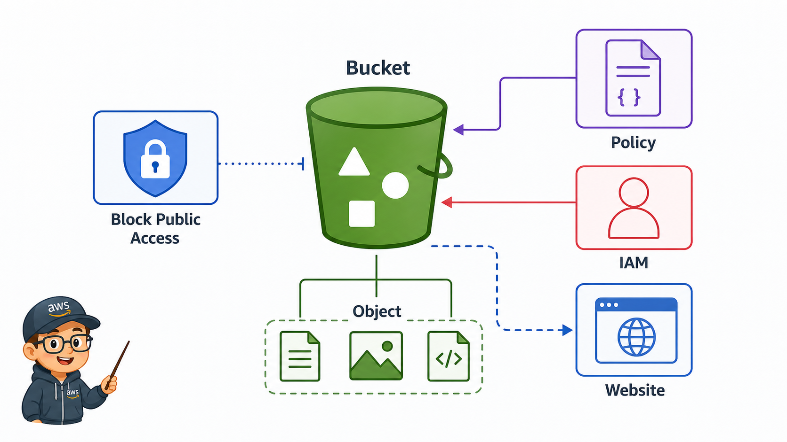
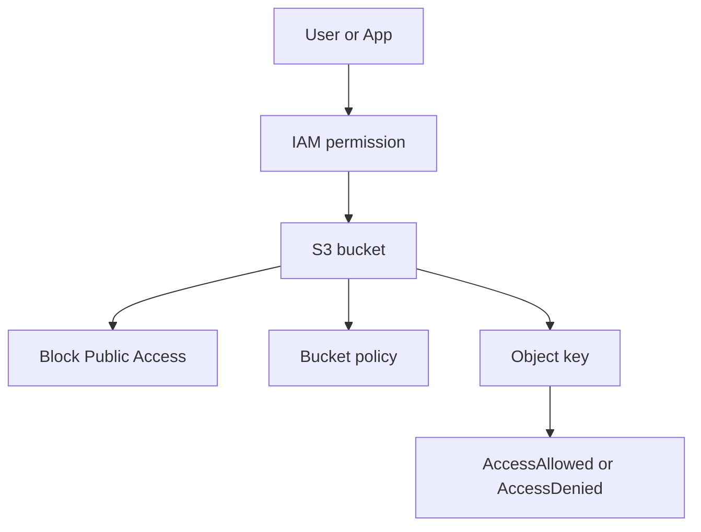

# 2교시: S3 bucket/object/public access



이 visual에서는 object URL, policy, Block Public Access가 서로 다른 위치에서 접근을 결정한다는 점을 본다. S3 공개 문제는 한 화면만 보고 판단하지 않는다.

## 수업 목표
- S3 bucket과 object의 차이를 설명한다.
- Block Public Access, bucket policy, IAM permission의 역할을 구분한다.
- object URL과 public access를 혼동하지 않는다.

## 오늘 반드시 가져갈 것
| 필수 개념 | 왜 필수인가 | 놓치면 생기는 문제 | 확인 지점 |
|---|---|---|---|
| Bucket과 object | bucket은 container, object는 실제 데이터 단위다 | 삭제와 권한 범위를 잘못 잡는다 | bucket list, object detail |
| Block Public Access | 의도치 않은 공개를 막는 안전장치다 | 실습 파일이나 개인정보가 공개될 수 있다 | Permissions tab |
| Bucket policy | resource 기반 접근 규칙이다 | IAM과 policy 경계를 혼동한다 | policy JSON |
| Object URL | URL 존재와 공개 접근은 다르다 | URL만 보고 public이라고 판단한다 | browser access, AccessDenied |

## 핵심 개념
S3는 파일 서버처럼 보이지만 운영 모델은 다르다. bucket 이름은 전역적으로 고유해야 하고, object는 key를 가진 데이터다. 접근은 IAM identity policy, bucket policy, ACL, Block Public Access 같은 여러 계층의 영향을 받는다. 수업에서는 public website hosting을 깊게 만들기보다, 왜 기본적으로 public access를 막아야 하는지와 공개가 필요할 때 어떤 evidence를 남겨야 하는지에 집중한다.

## AWS 문서 근거로 짚기
AWS 문서는 S3를 확장성, 가용성, 보안, 성능을 제공하는 object storage로 설명한다. 따라서 이 교시에서는 S3를 "서버의 폴더"가 아니라 `bucket`, `object`, `key`, `Region`, `policy`가 결합된 resource로 읽는다.

General purpose bucket 문서에서는 데이터를 S3에 업로드하려면 먼저 AWS Region 안에 bucket을 만들어야 하고, 모든 object는 bucket 안에 포함된다고 설명한다. object URL은 object를 주소로 표현하는 방법일 뿐이며, 실제 접근 가능 여부는 IAM, bucket policy, Block Public Access 같은 권한 경계가 함께 결정한다.

보안 best practice 문서는 최신 S3 사용에서 ACL보다 policy 기반 접근 제어를 우선하도록 안내한다. 특히 Object Ownership의 bucket owner enforced 설정에서는 ACL이 비활성화되고, 접근 제어는 IAM user policy, S3 bucket policy, VPC endpoint policy 같은 정책으로 관리된다. 수업에서는 ACL을 먼저 만지는 대신 Block Public Access, bucket policy, IAM permission 순서로 evidence를 남긴다.

## 구조로 보기


Mermaid 흐름은 Console 화면을 외우기 위한 그림이 아니다. 어떤 resource가 어느 경계에서 접근, 비용, 복구, 감사 책임을 갖는지 확인하기 위한 지도다. 그림의 각 node는 evidence note에 남길 수 있는 실제 Console 화면이나 설정값으로 연결되어야 한다.

## 공식 문서 확인 지점
| 확인할 문서 키워드 | 읽을 때 볼 질문 |
|---|---|
| AWS User Guide | 이 기능이 해결하려는 운영 문제는 무엇인가 |
| Permissions 또는 Security | 누가 접근할 수 있고 어떤 기본 차단이 있는가 |
| Pricing 또는 Cost 관련 항목 | 켜져 있는 동안, 저장된 동안, 요청이 발생할 때 비용이 생기는가 |
| Delete, restore, retention | 삭제 후 무엇이 남고 무엇을 복구할 수 있는가 |

## 운영 판단 연습
| 판단 질문 | 확인 기준 |
|---|---|
| bucket을 공개해야 하는가 | 정적 웹 사이트나 공개 자료처럼 명확한 목적이 있을 때만 검토한다 |
| object 단위 접근인가 bucket 단위 접근인가 | 필요한 key 범위만 공개하는 방향을 우선한다 |
| 실습 후 무엇을 되돌릴 것인가 | public policy, object, bucket, tag를 함께 확인한다 |

## 흔한 실패와 첫 확인 위치
| 흔한 실패 | 첫 확인 위치 |
|---|---|
| object URL이 있으니 누구나 볼 수 있다고 생각한다 | 브라우저 접근 결과와 Permissions tab의 Block Public Access 상태를 함께 본다 |

## 화면 캡처 가이드
- Region, resource name, 상태값, tag, policy 상태처럼 재현 가능한 값이 보이게 캡처한다.
- account email, secret value, access key, token, password는 캡처하지 않는다.
- 실패 화면은 error message만 자르지 말고 어떤 service와 설정 화면에서 나온 결과인지 알 수 있게 남긴다.
- 삭제 또는 정리 evidence는 삭제 버튼 화면보다 삭제 후 검색 결과가 더 중요하다.

## Evidence 점검
- 화면에는 민감 정보 대신 resource 이름, Region, 상태값, rule, tag처럼 재현 가능한 값이 보여야 한다.
- 기록에는 "성공했다"보다 어떤 값이 어떤 상태였는지가 남아야 한다.
- 실패를 기록할 때는 증상, 확인한 화면, 수정한 값, 재확인 결과를 한 세트로 남긴다.
- bucket name과 Region, Block Public Access 상태, AccessDenied 또는 정상 접근 결과 중 최소 두 가지는 배움일기에 남긴다.

## 실습/시뮬레이션 절차
1. S3 bucket 목록에서 오늘 사용할 bucket 이름과 Region을 확인한다.
2. object 하나를 기준으로 object URL, metadata, permissions 위치를 확인한다.
3. Permissions tab에서 Block Public Access가 account와 bucket 어느 수준에서 적용되는지 본다.
4. 공개가 필요한 시나리오와 공개가 필요 없는 시나리오를 나누어 bucket policy 영향을 적는다.
5. browser 접근 결과가 `AccessDenied`인지 정상 응답인지 기록하고, 그 이유를 policy와 함께 설명한다.

## 복구와 정리 기준
| 상황 | 먼저 볼 화면 | 복구 또는 정리 |
|---|---|---|
| object가 안 열린다 | object key, Block Public Access, policy | 공개 목적이 맞는지 먼저 확인한다 |
| bucket 삭제가 안 된다 | object list, version list | object와 version/delete marker를 정리한다 |
| public 경고가 보인다 | Permissions tab | 의도한 공개인지 evidence를 남긴다 |
| 권한 판단이 어렵다 | IAM policy simulator 또는 access result | policy 범위를 줄여 다시 확인한다 |

## 공식 문서로 검증할 질문
- S3는 왜 file storage가 아니라 object storage로 설명되는가?
- bucket은 어느 Region에 만들어지고 object URL은 어떤 정보를 드러내는가?
- Block Public Access가 bucket policy보다 어떤 방식으로 우선 동작하는가?
- bucket policy 예시는 어떤 principal과 action을 허용하는가?
- ACL과 policy를 동시에 사용할 때 운영 복잡도는 어떻게 늘어나는가?

## Evidence Note
```markdown
# W5D4S2 S3 access
- Region:
- Resource name:
- 확인한 설정:
- 실패 또는 주의할 증상:
- 비용/보안 영향:
- cleanup 또는 유지 사유:
```

## 혼자 다시 따라오기
- 최소 재현 경로: bucket 하나와 test object 하나를 기준으로 Permissions tab과 object URL 접근 결과를 비교한다.
- 공식 문서 키워드: `S3 Block Public Access`, `bucket policy`, `object ownership`, `AccessDenied`
- 스스로 확인할 화면: S3 Buckets, Object detail, Permissions tab, browser access result
- 흔한 실패 3개: Region을 틀림, public policy와 Block Public Access 충돌을 못 봄, object 삭제 후 bucket 삭제 순서를 놓침
- 다음 준비 상태: S3 접근 문제를 IAM, bucket policy, Block Public Access, object key로 나누어 설명할 수 있어야 한다.

## 한 줄 요약
```text
S3 public access는 URL 하나가 아니라 Block Public Access, policy, IAM, object key가 함께 결정한다.
```
