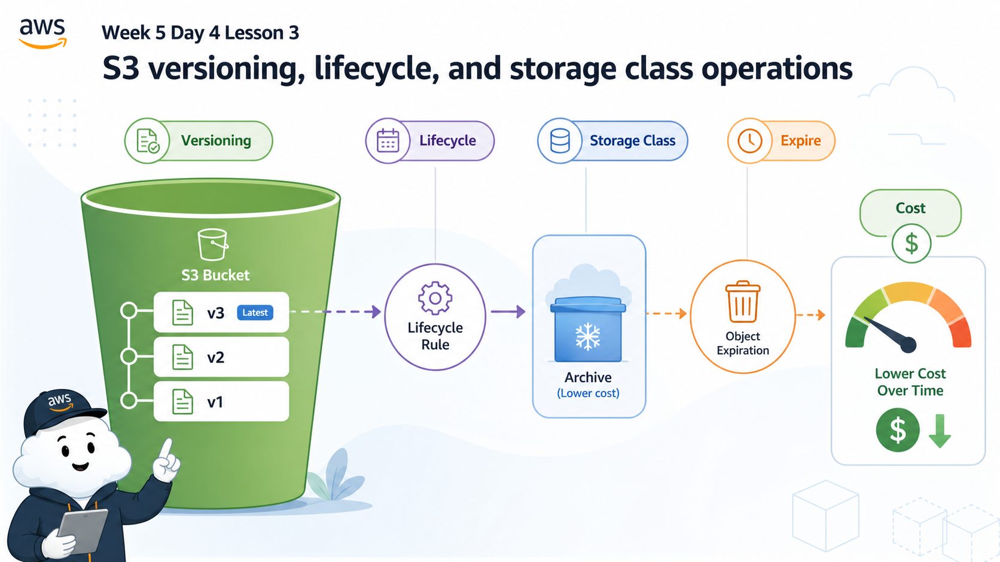
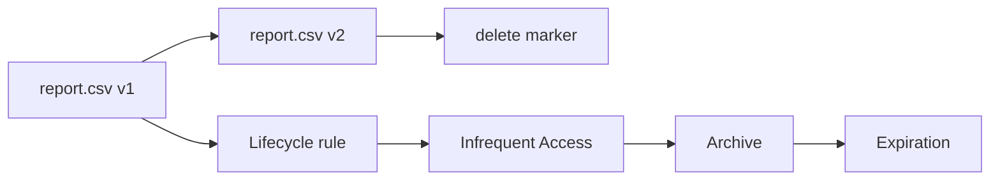

# 3교시: S3 versioning/lifecycle/storage class



이 visual은 같은 object key에도 여러 version과 lifecycle 상태가 생길 수 있음을 보여준다. 삭제와 비용 판단은 current object만 보면 부족하다.

## 수업 목표
- S3 Versioning이 삭제와 복구 의미를 어떻게 바꾸는지 설명한다.
- Lifecycle rule이 storage class 전환과 만료를 자동화하는 이유를 이해한다.
- 오래된 object와 version이 비용을 만들 수 있음을 확인한다.

## 오늘 반드시 가져갈 것
| 필수 개념 | 왜 필수인가 | 놓치면 생기는 문제 | 확인 지점 |
|---|---|---|---|
| Versioning | 같은 key의 여러 version을 보존한다 | 삭제했다고 생각한 데이터가 남거나 복구 기준을 모른다 | Versions toggle |
| Delete marker | versioning 상태의 삭제는 marker를 만들 수 있다 | 삭제 상태를 잘못 해석한다 | object versions |
| Lifecycle | 전환과 만료를 자동화한다 | 오래된 데이터가 계속 비용을 만든다 | Lifecycle rules |
| Storage class | 접근 빈도와 비용 특성이 다르다 | 자주 읽는 데이터를 archive로 보내 장애를 만든다 | object storage class |

## 핵심 개념
S3 비용은 bucket이 있다는 사실만으로 끝나지 않는다. object 크기, 요청 수, storage class, version 보존, lifecycle rule에 따라 달라진다. Versioning은 실수로 덮어쓴 파일을 복구할 수 있게 해주지만, 이전 version이 계속 남아 비용을 만들 수 있다. Lifecycle rule은 오래된 데이터를 더 저렴한 storage class로 전환하거나 만료시키는 자동화 장치지만, 업무상 다시 읽어야 하는 데이터를 너무 빨리 archive로 보내면 복구 시간과 비용이 생긴다.

## AWS 문서 근거로 짚기
AWS 문서는 object마다 storage class가 연결되며, 기본 storage class는 S3 Standard라고 설명한다. storage class는 "싸 보이는 것"을 고르는 항목이 아니라 사용 사례, 성능 요구, 접근 빈도, 가용성 요구를 기준으로 고르는 운영 결정이다.

강의에서는 storage class를 네 가지 질문으로 나누어 읽는다. 자주 읽고 지연 시간이 중요하면 S3 Standard 계열을 우선 검토한다. 접근 패턴을 아직 모르면 S3 Intelligent-Tiering을 비용 최적화 후보로 본다. 가끔 읽는 데이터는 Standard-IA 또는 One Zone-IA처럼 infrequent access 계열을 검토하되 가용성 조건을 함께 본다. 장기 보관과 아카이브 목적이면 S3 Glacier 계열을 검토하되 복구 시간과 요청 비용을 evidence에 남긴다.

AWS S3 개요 문서는 S3 Express One Zone처럼 낮은 지연 시간이 필요한 특수 storage class도 소개한다. 다만 이 수업에서는 먼저 Standard, Intelligent-Tiering, IA, Glacier 계열의 판단 기준을 익히고, Express One Zone은 latency-sensitive workload를 만났을 때 공식 문서로 다시 확인할 확장 주제로 둔다.

## 구조로 보기


Mermaid 흐름은 Console 화면을 외우기 위한 그림이 아니다. 어떤 resource가 어느 경계에서 접근, 비용, 복구, 감사 책임을 갖는지 확인하기 위한 지도다. 그림의 각 node는 evidence note에 남길 수 있는 실제 Console 화면이나 설정값으로 연결되어야 한다.

## 공식 문서 확인 지점
| 확인할 문서 키워드 | 읽을 때 볼 질문 |
|---|---|
| AWS User Guide | 이 기능이 해결하려는 운영 문제는 무엇인가 |
| Permissions 또는 Security | 누가 접근할 수 있고 어떤 기본 차단이 있는가 |
| Pricing 또는 Cost 관련 항목 | 켜져 있는 동안, 저장된 동안, 요청이 발생할 때 비용이 생기는가 |
| Delete, restore, retention | 삭제 후 무엇이 남고 무엇을 복구할 수 있는가 |

## 운영 판단 연습
| 판단 질문 | 확인 기준 |
|---|---|
| versioning을 켤 것인가 | 복구가 필요한 데이터이면 켜되, lifecycle과 비용 기준도 함께 정한다 |
| 언제 전환할 것인가 | 접근 빈도와 복구 시간 요구사항을 기준으로 storage class를 선택한다 |
| 언제 만료할 것인가 | 교육 실습 object는 짧은 만료 기준을 둘 수 있다 |

## 흔한 실패와 첫 확인 위치
| 흔한 실패 | 첫 확인 위치 |
|---|---|
| versioning을 켜면 비용 영향이 없다고 생각한다 | object versions와 lifecycle rule을 함께 확인한다 |

## 화면 캡처 가이드
- Region, resource name, 상태값, tag, policy 상태처럼 재현 가능한 값이 보이게 캡처한다.
- account email, secret value, access key, token, password는 캡처하지 않는다.
- 실패 화면은 error message만 자르지 말고 어떤 service와 설정 화면에서 나온 결과인지 알 수 있게 남긴다.
- 삭제 또는 정리 evidence는 삭제 버튼 화면보다 삭제 후 검색 결과가 더 중요하다.

## Evidence 점검
- 화면에는 민감 정보 대신 resource 이름, Region, 상태값, rule, tag처럼 재현 가능한 값이 보여야 한다.
- 기록에는 "성공했다"보다 어떤 값이 어떤 상태였는지가 남아야 한다.
- 실패를 기록할 때는 증상, 확인한 화면, 수정한 값, 재확인 결과를 한 세트로 남긴다.
- versioning 상태, lifecycle rule 조건, object version 또는 storage class 중 최소 두 가지는 배움일기에 남긴다.

## 실습/시뮬레이션 절차
1. S3 bucket의 Properties에서 Versioning 상태를 확인한다.
2. Management tab에서 Lifecycle rule 생성 화면을 열고 scope, transition, expiration 항목을 읽는다.
3. object version view에서 current version과 previous version이 어떻게 보이는지 확인한다.
4. storage class 전환이 비용을 줄일 수 있는 조건과 복구 지연을 만들 수 있는 조건을 구분한다.
5. 실습 bucket이라면 lifecycle expiration을 짧게 둘 수 있는지 비용 기준으로 판단한다.

## 복구와 정리 기준
| 설정 | 도움이 되는 상황 | 주의할 점 |
|---|---|---|
| Versioning enabled | 실수로 덮어쓴 object 복구 | 이전 version이 비용을 만든다 |
| Lifecycle transition | 오래된 object 비용 절감 | archive 복구 시간이 필요할 수 있다 |
| Expiration | 실습/임시 파일 자동 정리 | 필요한 데이터가 사라질 수 있다 |
| Delete marker | 삭제 상태 표현 | 실제 version은 남아 있을 수 있다 |

## 공식 문서로 검증할 질문
- object의 기본 storage class는 무엇이며 언제 바꾸는가?
- 접근 패턴을 모를 때 S3 Intelligent-Tiering을 검토할 수 있는가?
- Versioning을 suspend하면 기존 version은 어떻게 되는가?
- Lifecycle transition과 expiration은 어떤 단위로 적용되는가?
- archive storage class에서 다시 읽을 때 어떤 지연과 비용이 생길 수 있는가?

## Evidence Note
```markdown
# W5D4S3 S3 version lifecycle
- Region:
- Resource name:
- 확인한 설정:
- 실패 또는 주의할 증상:
- 비용/보안 영향:
- cleanup 또는 유지 사유:
```

## 혼자 다시 따라오기
- 최소 재현 경로: test object를 기준으로 versioning 상태와 lifecycle rule 화면을 읽고 비용 영향을 적는다.
- 공식 문서 키워드: `S3 Versioning`, `delete marker`, `lifecycle transition`, `expiration`, `storage class`
- 스스로 확인할 화면: Bucket Properties, Management tab, object versions view
- 흔한 실패 3개: versioning을 켜놓고 오래된 version을 방치함, archive 전환 후 즉시 읽을 수 있다고 생각함, lifecycle rule scope를 전체 bucket으로 잘못 설정함
- 다음 준비 상태: S3 비용과 복구 기준을 versioning/lifecycle/storage class로 설명할 수 있어야 한다.

## 한 줄 요약
```text
S3 versioning은 복구 가능성을 높이지만, lifecycle 없이 방치하면 오래된 version도 비용이 된다.
```
