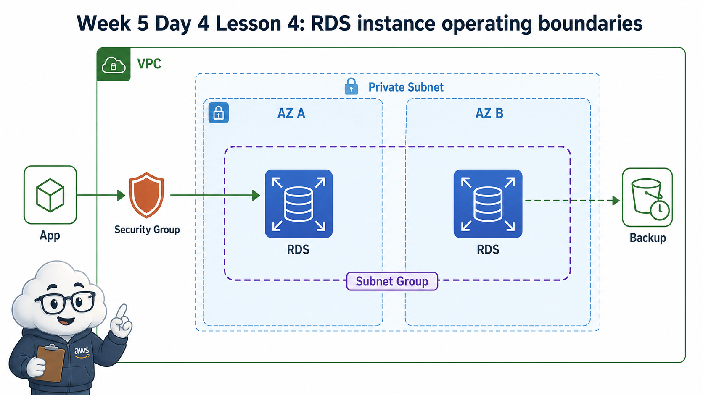
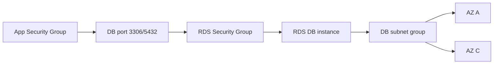

# 4교시: RDS 생성 전 운영 경계



이 visual에서는 RDS가 단독 서버가 아니라 VPC/subnet/SG 경계 안에 놓인다는 점을 본다. DB 접속 실패는 password보다 network boundary 문제일 수도 있다.

## 수업 목표
- RDS instance가 VPC, subnet group, Security Group 안에서 동작한다는 점을 이해한다.
- public access와 database port 공개의 위험을 구분한다.
- RDS 생성 전 비용과 삭제 기준을 먼저 확인한다.

## 오늘 반드시 가져갈 것
| 필수 개념 | 왜 필수인가 | 놓치면 생기는 문제 | 확인 지점 |
|---|---|---|---|
| DB instance | managed relational database의 실행 단위다 | EC2처럼 접속해 마음대로 고칠 수 있다고 생각한다 | RDS Databases |
| DB subnet group | RDS가 배치될 subnet 묶음이다 | 네트워크 경계를 설명하지 못한다 | Subnet group |
| Security Group | DB port 접근을 제한한다 | DB가 public internet에 노출된다 | inbound rule |
| Public access | endpoint 공개 여부와 SG 허용은 함께 봐야 한다 | public endpoint를 열어도 접속 제어가 없다고 오해한다 | Connectivity settings |

## 핵심 개념
RDS는 database engine을 직접 설치하지 않아도 되게 해주는 managed service다. 하지만 managed라는 말이 보안 책임이 사라진다는 뜻은 아니다. 어떤 VPC와 subnet group에 둘지, public access를 허용할지, 어떤 Security Group에서 DB port를 열지, backup과 deletion protection을 어떻게 둘지 결정해야 한다. 실습 계정에서는 실제 생성 대신 Console 생성 화면을 읽는 시뮬레이션 경로를 사용할 수 있다.

## 구조로 보기


Mermaid 흐름은 Console 화면을 외우기 위한 그림이 아니다. 어떤 resource가 어느 경계에서 접근, 비용, 복구, 감사 책임을 갖는지 확인하기 위한 지도다. 그림의 각 node는 evidence note에 남길 수 있는 실제 Console 화면이나 설정값으로 연결되어야 한다.

## 공식 문서 확인 지점
| 확인할 문서 키워드 | 읽을 때 볼 질문 |
|---|---|
| AWS User Guide | 이 기능이 해결하려는 운영 문제는 무엇인가 |
| Permissions 또는 Security | 누가 접근할 수 있고 어떤 기본 차단이 있는가 |
| Pricing 또는 Cost 관련 항목 | 켜져 있는 동안, 저장된 동안, 요청이 발생할 때 비용이 생기는가 |
| Delete, restore, retention | 삭제 후 무엇이 남고 무엇을 복구할 수 있는가 |

## 운영 판단 연습
| 판단 질문 | 확인 기준 |
|---|---|
| 실제 생성할 것인가 | 비용과 삭제 시간을 확보하지 못하면 생성 화면 분석으로 대체한다 |
| public access를 켤 것인가 | 교육 목적이 아니라면 private 접근을 기본으로 생각한다 |
| 누가 DB port에 접근할 것인가 | app SG 또는 특정 관리 경로만 허용한다 |

## 흔한 실패와 첫 확인 위치
| 흔한 실패 | 첫 확인 위치 |
|---|---|
| RDS endpoint가 있으니 어디서나 접속된다고 생각한다 | public access, subnet route, SG inbound, credential을 순서대로 본다 |

## 화면 캡처 가이드
- Region, resource name, 상태값, tag, policy 상태처럼 재현 가능한 값이 보이게 캡처한다.
- account email, secret value, access key, token, password는 캡처하지 않는다.
- 실패 화면은 error message만 자르지 말고 어떤 service와 설정 화면에서 나온 결과인지 알 수 있게 남긴다.
- 삭제 또는 정리 evidence는 삭제 버튼 화면보다 삭제 후 검색 결과가 더 중요하다.

## Evidence 점검
- 화면에는 민감 정보 대신 resource 이름, Region, 상태값, rule, tag처럼 재현 가능한 값이 보여야 한다.
- 기록에는 "성공했다"보다 어떤 값이 어떤 상태였는지가 남아야 한다.
- 실패를 기록할 때는 증상, 확인한 화면, 수정한 값, 재확인 결과를 한 세트로 남긴다.
- engine과 instance class, public access 설정, RDS SG inbound rule 중 최소 두 가지는 배움일기에 남긴다.

## 실습/시뮬레이션 절차
1. RDS Create database 화면에서 engine과 template 선택이 비용에 미치는 영향을 확인한다.
2. DB instance class, storage, Multi-AZ 옵션을 보고 실습에 필요한 최소 범위를 고른다.
3. Connectivity 영역에서 VPC, DB subnet group, public access, Security Group을 확인한다.
4. Security Group inbound rule에서 DB port가 누구에게 열리는지 기록한다.
5. 실제 생성하지 않는 경우에도 선택값과 선택하지 않은 이유를 evidence note에 남긴다.

## 복구와 정리 기준
| 항목 | 운영 기준 | 실습 기준 |
|---|---|---|
| Engine | app 요구사항과 운영 경험 | MySQL/PostgreSQL 중 하나로 시뮬레이션 |
| Instance class | 성능과 비용 균형 | 가장 작은 실습 가능 크기 |
| Public access | private 접근 우선 | 공개가 필요하면 사유 기록 |
| Security Group | app SG에서만 DB port 허용 | `0.0.0.0/0` DB port 금지 |

## 공식 문서로 검증할 질문
- RDS가 VPC 안에서 subnet group을 요구하는 이유는 무엇인가?
- publicly accessible 옵션은 Security Group과 어떤 관계가 있는가?
- free tier 또는 trial 조건은 현재 계정과 Region에 실제로 적용되는가?

## Evidence Note
```markdown
# W5D4S4 RDS boundary
- Region:
- Resource name:
- 확인한 설정:
- 실패 또는 주의할 증상:
- 비용/보안 영향:
- cleanup 또는 유지 사유:
```

## 혼자 다시 따라오기
- 최소 재현 경로: RDS 생성 마법사에서 engine, template, instance class, connectivity, public access, SG 화면을 읽고 선택 이유를 적는다.
- 공식 문서 키워드: `RDS DB instance`, `DB subnet group`, `publicly accessible`, `VPC security group`
- 스스로 확인할 화면: RDS Create database, Connectivity section, Security group inbound rules
- 흔한 실패 3개: free tier만 보고 instance class를 선택함, DB port를 public으로 엶, subnet group 의미를 놓침
- 다음 준비 상태: RDS 생성 전 network/security/cost 결정을 표로 설명할 수 있어야 한다.

## 한 줄 요약
```text
RDS는 database보다 먼저 VPC, subnet group, Security Group, public access 경계를 읽어야 한다.
```
