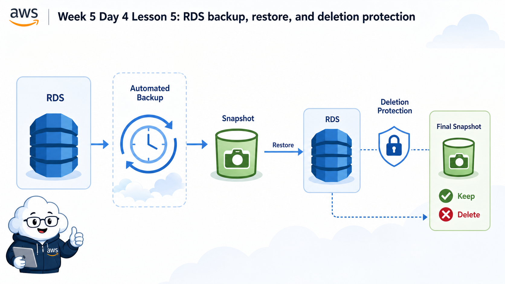
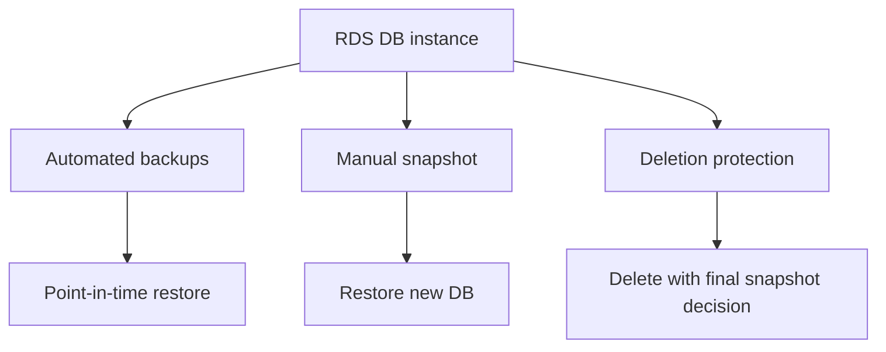

# 5교시: RDS backup/snapshot/deletion protection



이 visual은 backup, snapshot, restore, deletion protection이 삭제 전후의 복구 가능성을 어떻게 결정하는지 보여준다. 삭제 버튼보다 final snapshot 판단이 먼저다.

## 수업 목표
- RDS automated backup과 manual snapshot의 차이를 설명한다.
- restore가 기존 DB를 되살리는 것이 아니라 새 DB를 만들 수 있음을 이해한다.
- deletion protection과 final snapshot이 삭제 사고를 줄이는 방식을 확인한다.

## 오늘 반드시 가져갈 것
| 필수 개념 | 왜 필수인가 | 놓치면 생기는 문제 | 확인 지점 |
|---|---|---|---|
| Automated backup | retention 기간 안에서 복구 지점을 제공한다 | 장애 후 복구 가능 시점을 모른다 | Backup retention |
| Manual snapshot | 사용자가 남기는 특정 시점 백업이다 | 삭제 전 복구 지점을 남기지 않는다 | Snapshots |
| Restore | 복구는 새 instance 생성 흐름일 수 있다 | 원래 DB가 즉시 되돌아온다고 오해한다 | Restore action |
| Deletion protection | 실수 삭제를 막는 안전장치다 | 수업 종료 전 삭제가 막혀 당황한다 | Modify DB instance |

## 핵심 개념
Database 운영에서 backup은 체크박스가 아니라 복구 약속이다. 자동 백업이 켜져 있어도 retention 기간이 짧으면 원하는 시점으로 돌아가지 못할 수 있다. manual snapshot은 중요한 변경 전후의 명시적 복구 지점이 된다. 삭제할 때는 deletion protection, final snapshot, retained automated backup을 확인해야 한다. 비용을 줄이려고 무조건 snapshot을 지우면 복구 근거가 사라지고, 반대로 snapshot을 계속 남기면 storage 비용이 남는다.

## 구조로 보기


Mermaid 흐름은 Console 화면을 외우기 위한 그림이 아니다. 어떤 resource가 어느 경계에서 접근, 비용, 복구, 감사 책임을 갖는지 확인하기 위한 지도다. 그림의 각 node는 evidence note에 남길 수 있는 실제 Console 화면이나 설정값으로 연결되어야 한다.

## 공식 문서 확인 지점
| 확인할 문서 키워드 | 읽을 때 볼 질문 |
|---|---|
| AWS User Guide | 이 기능이 해결하려는 운영 문제는 무엇인가 |
| Permissions 또는 Security | 누가 접근할 수 있고 어떤 기본 차단이 있는가 |
| Pricing 또는 Cost 관련 항목 | 켜져 있는 동안, 저장된 동안, 요청이 발생할 때 비용이 생기는가 |
| Delete, restore, retention | 삭제 후 무엇이 남고 무엇을 복구할 수 있는가 |

## 운영 판단 연습
| 판단 질문 | 확인 기준 |
|---|---|
| backup retention은 며칠인가 | 수업 실습은 짧게, 운영 DB는 복구 요구사항에 맞게 둔다 |
| 삭제 전 snapshot을 남길 것인가 | 실습 DB는 비용과 복구 필요성을 비교해 결정한다 |
| deletion protection은 언제 끌 것인가 | 삭제 직전 의도 확인 후 변경하고 evidence를 남긴다 |

## 흔한 실패와 첫 확인 위치
| 흔한 실패 | 첫 확인 위치 |
|---|---|
| deletion protection 때문에 삭제가 안 되면 오류라고 생각한다 | DB 설정의 deletion protection 상태와 final snapshot 옵션을 확인한다 |

## 화면 캡처 가이드
- Region, resource name, 상태값, tag, policy 상태처럼 재현 가능한 값이 보이게 캡처한다.
- account email, secret value, access key, token, password는 캡처하지 않는다.
- 실패 화면은 error message만 자르지 말고 어떤 service와 설정 화면에서 나온 결과인지 알 수 있게 남긴다.
- 삭제 또는 정리 evidence는 삭제 버튼 화면보다 삭제 후 검색 결과가 더 중요하다.

## Evidence 점검
- 화면에는 민감 정보 대신 resource 이름, Region, 상태값, rule, tag처럼 재현 가능한 값이 보여야 한다.
- 기록에는 "성공했다"보다 어떤 값이 어떤 상태였는지가 남아야 한다.
- 실패를 기록할 때는 증상, 확인한 화면, 수정한 값, 재확인 결과를 한 세트로 남긴다.
- backup retention, snapshot 목록, deletion protection 상태 중 최소 두 가지는 배움일기에 남긴다.

## 실습/시뮬레이션 절차
1. RDS instance detail에서 Backup retention period와 backup window 위치를 확인한다.
2. Snapshots 화면에서 manual snapshot과 automated backup의 차이를 읽는다.
3. Restore 동작이 원본 DB를 덮어쓰는지 새 DB를 만드는지 공식 문서 기준으로 확인한다.
4. Delete database 화면에서 deletion protection, final snapshot, retained automated backup 옵션을 읽는다.
5. 삭제 전후에 남을 비용 후보를 snapshot, backup, storage 기준으로 적는다.

## 복구와 정리 기준
| 질문 | 확인할 값 | 판단 |
|---|---|---|
| 어느 시점으로 복구할 수 있는가 | backup retention, latest restorable time | RPO 설명 가능 여부 |
| 삭제 전 snapshot을 남길 것인가 | final snapshot option | 복구 필요성과 비용 비교 |
| 삭제가 막히는가 | deletion protection | 의도적 안전장치인지 확인 |
| 무엇이 남는가 | snapshots, retained backups | 비용 후보로 기록 |

## 공식 문서로 검증할 질문
- automated backup과 manual snapshot은 lifecycle과 비용이 어떻게 다른가?
- point-in-time restore는 어떤 조건에서 가능한가?
- deletion protection이 켜진 DB를 삭제하려면 어떤 변경이 먼저 필요한가?

## Evidence Note
```markdown
# W5D4S5 RDS backup delete
- Region:
- Resource name:
- 확인한 설정:
- 실패 또는 주의할 증상:
- 비용/보안 영향:
- cleanup 또는 유지 사유:
```

## 혼자 다시 따라오기
- 최소 재현 경로: RDS backup 설정과 snapshot 화면을 읽고 삭제 전 확인할 항목을 checklist로 만든다.
- 공식 문서 키워드: `RDS automated backups`, `manual snapshot`, `restore DB instance`, `deletion protection`, `final snapshot`
- 스스로 확인할 화면: RDS Maintenance & backups, Snapshots, Delete database dialog
- 흔한 실패 3개: backup retention을 모름, final snapshot 비용을 고려하지 않음, deletion protection을 오류로 봄
- 다음 준비 상태: RDS 삭제 전 backup/snapshot/deletion protection 판단을 설명할 수 있어야 한다.

## 한 줄 요약
```text
RDS 삭제는 resource 제거가 아니라 마지막 복구 지점과 남을 비용을 결정하는 절차다.
```
