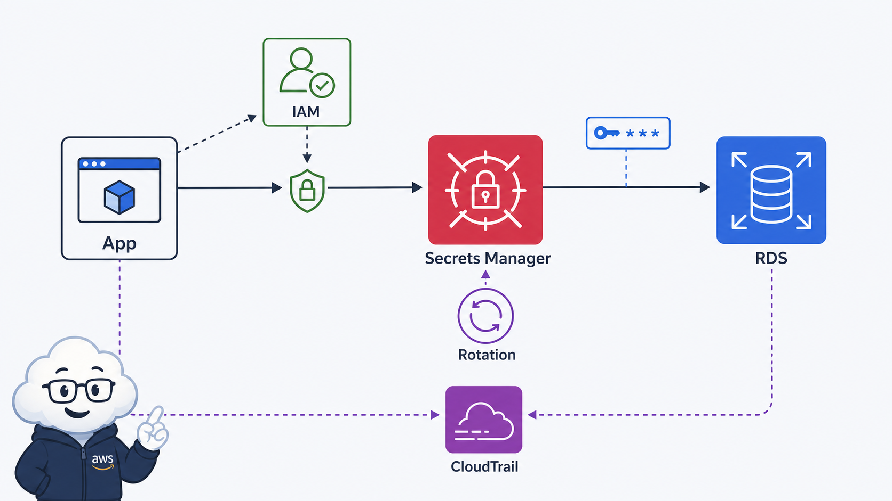
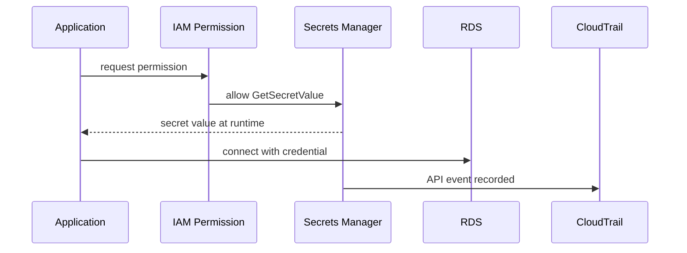

# 6교시: Secrets Manager와 credential 운영



이 visual에서는 secret 값이 문서에 복사되는 것이 아니라 runtime에 권한을 가진 주체가 읽는 흐름을 본다. evidence에는 secret 값 자체가 아니라 secret 이름, 권한, audit 위치를 남긴다.

## 수업 목표
- credential을 코드, screenshot, git repository에 남기지 않는 이유를 설명한다.
- Secrets Manager, IAM permission, CloudTrail audit의 역할을 구분한다.
- rotation 개념과 실습 범위에서의 안전한 secret evidence를 정리한다.

## 오늘 반드시 가져갈 것
| 필수 개념 | 왜 필수인가 | 놓치면 생기는 문제 | 확인 지점 |
|---|---|---|---|
| Secret value | password/API key 같은 민감 값이다 | 배움일기나 Git에 노출된다 | Secret details, value hidden |
| IAM permission | 누가 secret을 읽을 수 있는지 정한다 | 모든 user가 credential을 볼 수 있다 | resource policy/IAM policy |
| Rotation | credential 교체를 자동화할 수 있다 | 오래된 password가 계속 사용된다 | Rotation setting |
| Audit | secret 접근도 추적 대상이다 | 누가 읽었는지 설명하지 못한다 | CloudTrail event |

## 핵심 개념
application이 RDS에 접속하려면 credential이 필요하다. 가장 위험한 방식은 password를 코드, README, screenshot, 메신저에 남기는 것이다. Secrets Manager는 secret 값을 저장하고 IAM으로 접근을 제어하며, rotation과 audit 흐름으로 운영할 수 있게 해준다. 오늘은 실제 rotation 구현보다 secret을 어떻게 만들고, 누가 읽고, 어떤 evidence를 남겨야 안전한지에 집중한다.

## 구조로 보기


Mermaid 흐름은 Console 화면을 외우기 위한 그림이 아니다. 어떤 resource가 어느 경계에서 접근, 비용, 복구, 감사 책임을 갖는지 확인하기 위한 지도다. 그림의 각 node는 evidence note에 남길 수 있는 실제 Console 화면이나 설정값으로 연결되어야 한다.

## 공식 문서 확인 지점
| 확인할 문서 키워드 | 읽을 때 볼 질문 |
|---|---|
| AWS User Guide | 이 기능이 해결하려는 운영 문제는 무엇인가 |
| Permissions 또는 Security | 누가 접근할 수 있고 어떤 기본 차단이 있는가 |
| Pricing 또는 Cost 관련 항목 | 켜져 있는 동안, 저장된 동안, 요청이 발생할 때 비용이 생기는가 |
| Delete, restore, retention | 삭제 후 무엇이 남고 무엇을 복구할 수 있는가 |

## 운영 판단 연습
| 판단 질문 | 확인 기준 |
|---|---|
| secret을 어디에 둘 것인가 | 코드나 markdown이 아니라 Secrets Manager 같은 secret store를 사용한다 |
| 누가 읽을 수 있는가 | IAM policy와 role 기준으로 최소 권한을 둔다 |
| 값을 어떻게 바꿀 것인가 | rotation 가능성과 수동 변경 절차를 기록한다 |

## 흔한 실패와 첫 확인 위치
| 흔한 실패 | 첫 확인 위치 |
|---|---|
| secret 값을 캡처해서 evidence로 남긴다 | secret value는 숨기고 secret name, ARN 일부, 권한 화면만 남긴다 |

## 화면 캡처 가이드
- Region, resource name, 상태값, tag, policy 상태처럼 재현 가능한 값이 보이게 캡처한다.
- account email, secret value, access key, token, password는 캡처하지 않는다.
- 실패 화면은 error message만 자르지 말고 어떤 service와 설정 화면에서 나온 결과인지 알 수 있게 남긴다.
- 삭제 또는 정리 evidence는 삭제 버튼 화면보다 삭제 후 검색 결과가 더 중요하다.

## Evidence 점검
- 화면에는 민감 정보 대신 resource 이름, Region, 상태값, rule, tag처럼 재현 가능한 값이 보여야 한다.
- 기록에는 "성공했다"보다 어떤 값이 어떤 상태였는지가 남아야 한다.
- 실패를 기록할 때는 증상, 확인한 화면, 수정한 값, 재확인 결과를 한 세트로 남긴다.
- secret name, IAM permission 방향, CloudTrail event 위치 중 최소 두 가지는 배움일기에 남긴다.

## 실습/시뮬레이션 절차
1. Secrets Manager에서 새 secret 생성 화면을 열고 secret type을 확인한다.
2. RDS credential을 저장하는 시나리오에서 username/password가 화면에 어떻게 숨겨지는지 본다.
3. secret 이름, description, tag, rotation 설정 위치를 확인한다.
4. IAM policy에서 `secretsmanager:GetSecretValue` 권한이 필요한 지점을 읽는다.
5. CloudTrail Event history에서 secret 관련 API event를 찾을 수 있는지 확인한다.

## 복구와 정리 기준
| 상황 | 첫 확인 위치 | 대응 |
|---|---|---|
| app이 DB password를 못 읽는다 | IAM permission, secret ARN | role/policy scope 확인 |
| secret 값이 노출됐다 | git/log/screenshot | 값 교체와 노출 위치 제거 |
| rotation이 실패했다 | rotation configuration, Lambda/event | 수동 변경 절차 확인 |
| secret 삭제가 필요하다 | scheduled deletion | 복구 기간과 비용 확인 |

## 공식 문서로 검증할 질문
- Secrets Manager는 secret 값을 어떤 API로 읽는가?
- rotation을 사용하려면 어떤 추가 resource 또는 권한이 필요한가?
- secret 삭제는 즉시 삭제인가, recovery window가 있는가?

## Evidence Note
```markdown
# W5D4S6 Secrets Manager
- Region:
- Resource name:
- 확인한 설정:
- 실패 또는 주의할 증상:
- 비용/보안 영향:
- cleanup 또는 유지 사유:
```

## 혼자 다시 따라오기
- 최소 재현 경로: Secrets Manager에서 secret 생성 화면과 value 숨김 상태, IAM permission, CloudTrail event 위치를 확인한다.
- 공식 문서 키워드: `Secrets Manager`, `GetSecretValue`, `rotation`, `CloudTrail`, `least privilege`
- 스스로 확인할 화면: Secrets Manager Secret details, IAM policy, CloudTrail Event history
- 흔한 실패 3개: secret value를 노트에 남김, 모든 user에게 read 권한을 줌, rotation을 backup으로 오해함
- 다음 준비 상태: credential을 안전하게 저장하고 evidence에서 민감 값을 제거할 수 있어야 한다.

## 한 줄 요약
```text
Secret 운영의 핵심은 값을 숨기는 것뿐 아니라 누가 읽고 언제 바뀌며 어떻게 감사되는지 설명하는 것이다.
```
