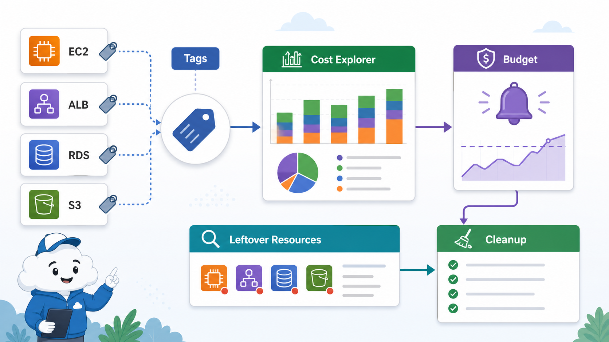
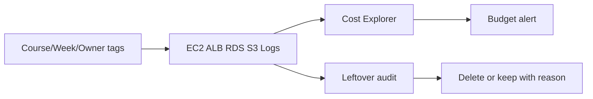

# 7교시: Cost Explorer/tag/잔여 비용 점검



이 visual은 tag가 resource와 비용 분석을 연결하는 기준이라는 점을 보여준다. Budget 알림은 안전벨트지만, cleanup은 직접 확인해야 한다.

## 수업 목표
- Cost Explorer와 Budget이 각각 어떤 질문에 답하는지 구분한다.
- tag 기반 비용 추적이 왜 필요한지 설명한다.
- EC2/ALB/ECR/RDS/S3/CloudWatch에서 남을 수 있는 비용 후보를 점검한다.

## 오늘 반드시 가져갈 것
| 필수 개념 | 왜 필수인가 | 놓치면 생기는 문제 | 확인 지점 |
|---|---|---|---|
| Cost Explorer | 서비스/기간/tag 기준 비용 분석 도구다 | 어떤 resource가 비용을 만들었는지 추적하지 못한다 | Cost Explorer filters |
| Budget | 비용 임계값 알림 기준이다 | 비용을 자동으로 막아준다고 오해한다 | Budget alerts |
| Cost allocation tag | 비용을 소유자/목적별로 묶는 기준이다 | 팀별/실습별 비용 분리가 안 된다 | Tag activation |
| Leftover resource | 눈에 안 보이는 잔여 resource가 비용을 만든다 | 삭제 후에도 비용이 남는다 | resource search |

## 핵심 개념
AWS 비용 관리는 마지막에 한 번 보는 영수증이 아니다. resource를 만들 때 tag를 붙이고, 삭제할 때 service별 잔여 비용 후보를 확인해야 한다. Cost Explorer는 과거 비용을 분석하는 도구이고 Budget은 임계값 알림이다. 둘 다 resource 삭제를 대신하지 않는다. 특히 ALB, NAT Gateway, RDS, snapshot, EBS volume, Elastic IP, CloudWatch log retention, S3 object/version은 실습 뒤 남기 쉽다.

## 구조로 보기


Mermaid 흐름은 Console 화면을 외우기 위한 그림이 아니다. 어떤 resource가 어느 경계에서 접근, 비용, 복구, 감사 책임을 갖는지 확인하기 위한 지도다. 그림의 각 node는 evidence note에 남길 수 있는 실제 Console 화면이나 설정값으로 연결되어야 한다.

## 공식 문서 확인 지점
| 확인할 문서 키워드 | 읽을 때 볼 질문 |
|---|---|
| AWS User Guide | 이 기능이 해결하려는 운영 문제는 무엇인가 |
| Permissions 또는 Security | 누가 접근할 수 있고 어떤 기본 차단이 있는가 |
| Pricing 또는 Cost 관련 항목 | 켜져 있는 동안, 저장된 동안, 요청이 발생할 때 비용이 생기는가 |
| Delete, restore, retention | 삭제 후 무엇이 남고 무엇을 복구할 수 있는가 |

## 운영 판단 연습
| 판단 질문 | 확인 기준 |
|---|---|
| tag는 언제 붙일 것인가 | 생성 시점에 Course/Week/Owner/Purpose를 붙인다 |
| 비용은 언제 확인할 것인가 | 수업 종료 전과 다음 날 Cost Explorer에서 모두 확인한다 |
| 남길 resource는 어떻게 기록할 것인가 | 유지 사유, 예상 비용, 삭제 예정 시각을 함께 적는다 |

## 흔한 실패와 첫 확인 위치
| 흔한 실패 | 첫 확인 위치 |
|---|---|
| Budget을 만들었으니 비용이 자동 차단된다고 생각한다 | Budget은 알림이고 resource 삭제/중지는 별도 작업임을 확인한다 |

## 화면 캡처 가이드
- Region, resource name, 상태값, tag, policy 상태처럼 재현 가능한 값이 보이게 캡처한다.
- account email, secret value, access key, token, password는 캡처하지 않는다.
- 실패 화면은 error message만 자르지 말고 어떤 service와 설정 화면에서 나온 결과인지 알 수 있게 남긴다.
- 삭제 또는 정리 evidence는 삭제 버튼 화면보다 삭제 후 검색 결과가 더 중요하다.

## Evidence 점검
- 화면에는 민감 정보 대신 resource 이름, Region, 상태값, rule, tag처럼 재현 가능한 값이 보여야 한다.
- 기록에는 "성공했다"보다 어떤 값이 어떤 상태였는지가 남아야 한다.
- 실패를 기록할 때는 증상, 확인한 화면, 수정한 값, 재확인 결과를 한 세트로 남긴다.
- Cost Explorer service filter, tag 또는 resource name, cleanup 후 검색 결과 중 최소 두 가지는 배움일기에 남긴다.

## 실습/시뮬레이션 절차
1. Billing and Cost Management에서 Cost Explorer를 열고 기간을 오늘/이번 주 기준으로 바꾼다.
2. service filter로 EC2, Elastic Load Balancing, RDS, S3, CloudWatch를 각각 확인한다.
3. tag가 비용 필터에 쓰이려면 cost allocation tag 활성화가 필요하다는 점을 확인한다.
4. Budget 화면에서 threshold와 notification 대상이 무엇인지 확인한다.
5. Resource Groups Tag Editor 또는 각 service 화면에서 tag 누락 resource를 찾는다.

## 복구와 정리 기준
| 비용 후보 | 확인 화면 | 정리 기준 |
|---|---|---|
| ALB/Target Group | EC2 Load Balancers | Day2 실습 후 삭제 또는 유지 사유 |
| RDS/Snapshot | RDS Databases/Snapshots | backup 필요성과 비용 비교 |
| S3 object/version | S3 bucket versions | lifecycle 또는 삭제 |
| CloudWatch Logs | Log groups retention | retention 설정 확인 |

## 공식 문서로 검증할 질문
- Cost Explorer 데이터는 실시간인가, 지연될 수 있는가?
- cost allocation tag는 붙이기만 하면 바로 비용 필터에 나타나는가?
- Budget은 비용 발생을 막는가, 아니면 알림을 보내는가?

## Evidence Note
```markdown
# W5D4S7 cost audit
- Region:
- Resource name:
- 확인한 설정:
- 실패 또는 주의할 증상:
- 비용/보안 영향:
- cleanup 또는 유지 사유:
```

## 혼자 다시 따라오기
- 최소 재현 경로: Cost Explorer에서 기간과 service filter를 바꾸고, 오늘 만든 resource tag 기준으로 비용 추적 가능성을 점검한다.
- 공식 문서 키워드: `Cost Explorer`, `AWS Budgets`, `cost allocation tags`, `resource tagging`, `log retention`
- 스스로 확인할 화면: Cost Explorer, Billing Budgets, Resource Groups Tag Editor, 각 service list
- 흔한 실패 3개: tag를 나중에 붙이려고 미룸, Budget을 차단 장치로 오해함, snapshot/log/object를 남김
- 다음 준비 상태: 서비스별 잔여 비용 후보를 checklist로 설명할 수 있어야 한다.

## 한 줄 요약
```text
AWS 비용 관리는 tag로 추적하고 Cost Explorer로 확인하며 cleanup으로 끝내는 운영 루프다.
```
