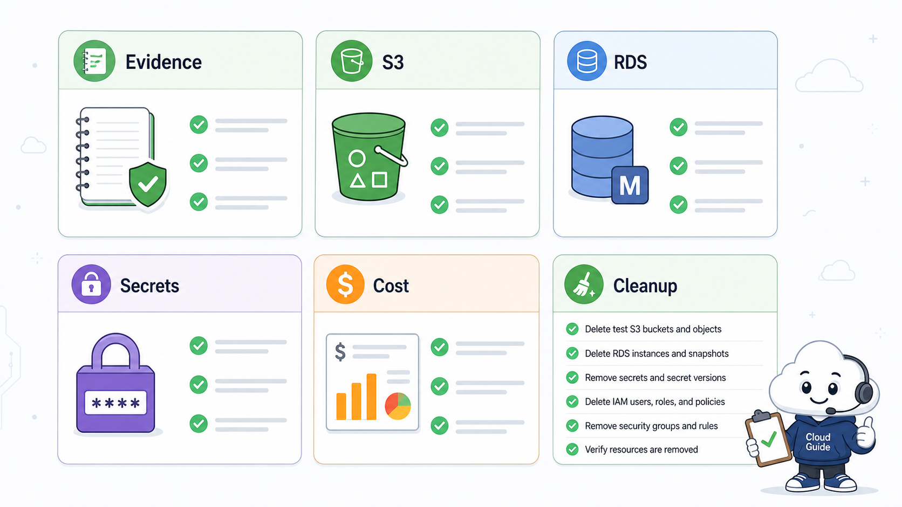
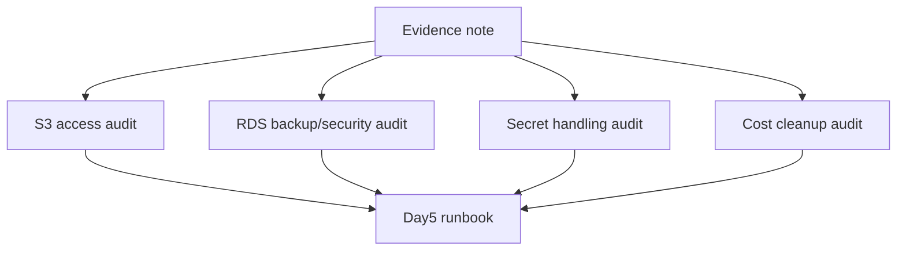

# 8교시: 구름 EXP 배움일기



이 visual은 오늘의 기록이 Day5 runbook으로 이어지는 흐름을 보여준다. 단순 감상이 아니라 운영 절차로 재사용 가능한 항목을 남긴다.

## 수업 목표
- S3/RDS/Secrets/Cost evidence를 하나의 운영 journal로 정리한다.
- Day5 통합 운영 실습에 넣을 runbook 항목을 만든다.
- 남길 resource와 삭제할 resource의 이유를 구분한다.

## 오늘 반드시 가져갈 것
| 필수 개념 | 왜 필수인가 | 놓치면 생기는 문제 | 확인 지점 |
|---|---|---|---|
| Evidence journal | 결정, 상태, 실패, 복구를 재현 가능한 기록으로 남긴다 | 다음 날 같은 문제를 설명하지 못한다 | 배움일기 markdown |
| Cleanup audit | resource 삭제 후 남은 항목을 다시 검색한다 | 비용이 남는다 | service list, Cost Explorer |
| Runbook 연결 | Day5 통합 실습에서 반복 사용할 절차를 만든다 | 매번 Console 클릭 기억에 의존한다 | checklist |
| 민감 정보 제거 | secret, account email, key를 문서에 남기지 않는다 | credential 노출 사고가 난다 | screenshot review |

## 핵심 개념
오늘 배움일기는 예쁜 회고가 아니라 Day5 통합 운영 runbook의 초안이다. S3 public access를 어떻게 판단했는지, RDS를 만들었다면 backup과 deletion protection을 어떻게 봤는지, secret 값은 어떻게 숨겼는지, 비용 후보는 어디서 확인했는지를 남긴다. 기록의 품질은 길이가 아니라 다음 사람이 같은 판단을 재현할 수 있는지로 평가한다.

## 구조로 보기


Mermaid 흐름은 Console 화면을 외우기 위한 그림이 아니다. 어떤 resource가 어느 경계에서 접근, 비용, 복구, 감사 책임을 갖는지 확인하기 위한 지도다. 그림의 각 node는 evidence note에 남길 수 있는 실제 Console 화면이나 설정값으로 연결되어야 한다.

## 공식 문서 확인 지점
| 확인할 문서 키워드 | 읽을 때 볼 질문 |
|---|---|
| AWS User Guide | 이 기능이 해결하려는 운영 문제는 무엇인가 |
| Permissions 또는 Security | 누가 접근할 수 있고 어떤 기본 차단이 있는가 |
| Pricing 또는 Cost 관련 항목 | 켜져 있는 동안, 저장된 동안, 요청이 발생할 때 비용이 생기는가 |
| Delete, restore, retention | 삭제 후 무엇이 남고 무엇을 복구할 수 있는가 |

## 운영 판단 연습
| 판단 질문 | 확인 기준 |
|---|---|
| 무엇을 남길 것인가 | resource 이름, Region, 상태값, 판단 이유를 남긴다 |
| 무엇을 가릴 것인가 | secret value, account email, access key, token은 제거한다 |
| 무엇을 Day5로 가져갈 것인가 | storage/database/security/cost checklist를 runbook 항목으로 만든다 |

## 흔한 실패와 첫 확인 위치
| 흔한 실패 | 첫 확인 위치 |
|---|---|
| 삭제했다는 말만 남기고 검색 결과를 남기지 않는다 | 삭제 후 service list와 Cost Explorer 확인 지점을 기록한다 |

## 화면 캡처 가이드
- Region, resource name, 상태값, tag, policy 상태처럼 재현 가능한 값이 보이게 캡처한다.
- account email, secret value, access key, token, password는 캡처하지 않는다.
- 실패 화면은 error message만 자르지 말고 어떤 service와 설정 화면에서 나온 결과인지 알 수 있게 남긴다.
- 삭제 또는 정리 evidence는 삭제 버튼 화면보다 삭제 후 검색 결과가 더 중요하다.

## Evidence 점검
- 화면에는 민감 정보 대신 resource 이름, Region, 상태값, rule, tag처럼 재현 가능한 값이 보여야 한다.
- 기록에는 "성공했다"보다 어떤 값이 어떤 상태였는지가 남아야 한다.
- 실패를 기록할 때는 증상, 확인한 화면, 수정한 값, 재확인 결과를 한 세트로 남긴다.
- S3/RDS/Secrets audit table, cleanup checklist, Day5 runbook 후보 중 최소 두 가지는 배움일기에 남긴다.

## 실습/시뮬레이션 절차
1. 오늘 다룬 S3, RDS, Secrets, Cost 항목을 하나의 markdown journal로 합친다.
2. 각 항목마다 resource name, Region, 보안 판단, 비용 판단, cleanup 상태를 남긴다.
3. screenshot을 다시 보며 secret value, account email, access key, token이 보이지 않는지 확인한다.
4. Day5 runbook에 넣을 반복 절차를 `확인 -> 판단 -> 조치 -> 재확인` 형식으로 정리한다.
5. 남겨둔 resource가 있다면 유지 사유와 삭제 예정 시각을 명시한다.

## 복구와 정리 기준
| journal 항목 | 포함할 내용 | 제외할 내용 |
|---|---|---|
| S3 audit | public access, policy, object 상태 | 불필요한 개인정보 object |
| RDS audit | subnet/SG/backup/delete 기준 | password 원문 |
| Secret audit | secret name, 권한, audit 위치 | secret value |
| Cost audit | service filter, tag, cleanup 결과 | 막연한 비용 감상 |

## 공식 문서로 검증할 질문
- 내가 남긴 판단이 공식 문서의 용어와 같은가?
- 삭제/복구/비용 기준을 추측이 아니라 문서와 Console 상태로 설명할 수 있는가?
- Day5에서 같은 절차를 다른 resource에도 반복 적용할 수 있는가?

## Evidence Note
```markdown
# W5D4S8 journal cleanup
- Region:
- Resource name:
- 확인한 설정:
- 실패 또는 주의할 증상:
- 비용/보안 영향:
- cleanup 또는 유지 사유:
```

## 혼자 다시 따라오기
- 최소 재현 경로: 오늘 만든 evidence를 하나의 markdown journal로 합치고, Day5 runbook 항목 5개를 뽑는다.
- 공식 문서 키워드: `S3 access audit`, `RDS deletion protection`, `Secrets Manager audit`, `Cost Explorer`, `cleanup checklist`
- 스스로 확인할 화면: S3/RDS/Secrets/Cost Explorer 각 화면, Git markdown diff
- 흔한 실패 3개: secret 값을 캡처함, 삭제 전후 상태가 없음, 비용 확인을 생략함
- 다음 준비 상태: Day5 통합 실습에서 사용할 storage/database/security/cost runbook 초안을 가지고 있어야 한다.

## 한 줄 요약
```text
좋은 배움일기는 감상이 아니라 다음 장애와 비용 점검에 다시 쓰는 운영 runbook의 씨앗이다.
```
