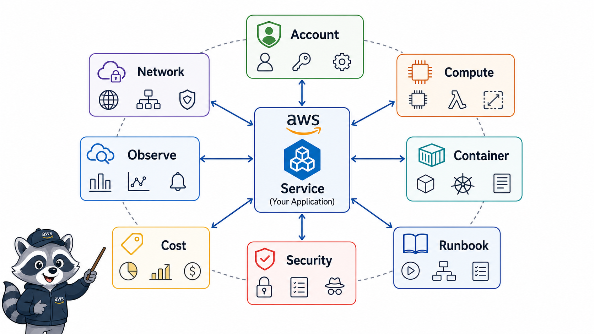
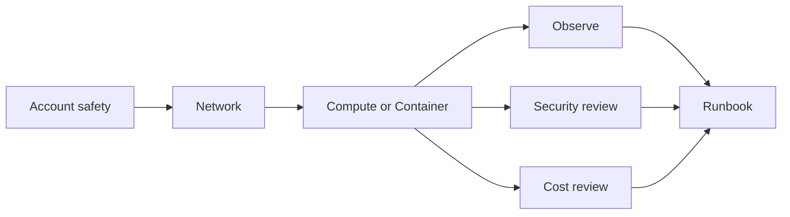

# 1교시: Week 5 통합 운영 지도



이 visual은 Week 5의 AWS resource를 운영 경계와 runbook으로 다시 묶는 흐름을 보여준다. D5의 중심은 특정 서비스가 아니라 evidence와 decision의 연결이다.

## 수업 목표
- Week 5에서 배운 resource를 운영 경계별로 재분류한다.
- 새 resource 생성보다 evidence와 decision의 연결을 우선한다.
- Day5 산출물의 기준을 runbook과 portfolio packet으로 정한다.

## 오늘 반드시 가져갈 것
| 필수 개념 | 왜 필수인가 | 놓치면 생기는 문제 | 확인 지점 |
|---|---|---|---|
| 운영 경계 | account/network/compute/observability/cost가 서로 다른 책임을 가진다 | resource 목록만 있고 운영 판단이 없다 | Week 5 map |
| Evidence chain | 상태, 로그, 이벤트, 비용 근거가 연결되어야 한다 | 장애나 비용 질문에 답하지 못한다 | CloudWatch, CloudTrail, Cost Explorer |
| Runbook | 반복 가능한 운영 절차다 | 다음 사람이 같은 조치를 재현하지 못한다 | runbook markdown |
| Portfolio packet | 학습 결과를 현업형 산출물로 묶는다 | 캡처 묶음으로 끝난다 | README, evidence, checklist |

## 핵심 개념
Week 5는 AWS 서비스를 많이 본 주간이 아니라 운영 질문을 실제 Console evidence에 연결한 주간이다. 오늘은 EC2, ALB, ECR/ECS/App Runner, S3/RDS, CloudWatch, CloudTrail, Cost Explorer를 각각 따로 보지 않는다. 하나의 서비스가 계정 경계, 네트워크 경계, 실행 경계, 관찰 경계, 비용 경계 안에서 어떻게 운영되는지 다시 묶는다.

## 구조로 보기


이 구조는 Console 화면을 암기하기 위한 그림이 아니다. 운영 질문이 들어왔을 때 어떤 evidence를 먼저 확인하고, 어떤 판단을 문서에 남길지 정하는 기준이다.

## 공식 문서 확인 지점
| 확인할 문서 키워드 | 읽을 때 볼 질문 |
|---|---|
| Well-Architected | 이 판단이 운영 우수성, 보안, 비용 중 어디에 해당하는가 |
| CloudWatch 또는 CloudTrail | 상태와 변경 이력을 어떤 evidence로 확인하는가 |
| IAM 또는 Security | 누가 접근할 수 있고 무엇이 공개되어 있는가 |
| Billing 또는 Cost | 비용 원인과 owner를 설명할 수 있는가 |

## 운영 판단 연습
| 판단 질문 | 확인 기준 |
|---|---|
| 어떤 resource가 핵심인가 | 실습에서 실제 traffic 또는 비용을 만든 resource를 우선한다 |
| 어떤 evidence가 필요한가 | 상태, 로그, 이벤트, 비용, 보안 설정을 최소 세 가지 이상 연결한다 |
| 무엇을 최종 산출물로 남길 것인가 | map, checklist, runbook, portfolio README를 남긴다 |

## 흔한 실패와 첫 확인 위치
| 흔한 실패 | 첫 확인 위치 |
|---|---|
| resource 이름만 나열하고 운영 경계를 설명하지 못한다 | account/network/runtime/observe/cost 경계로 다시 분류한다 |

## 실습/시뮬레이션 절차
1. Week 5 evidence에서 이 교시 주제와 연결되는 화면을 2개 이상 고른다.
2. 각 화면에 대해 resource name, Region, 상태값, owner/tag, 비용 또는 보안 영향을 적는다.
3. 공식 문서 키워드와 Console 화면의 용어가 일치하는지 확인한다.
4. 판단이 필요한 항목은 `확인한 값 -> 판단 -> 다음 행동` 형식으로 기록한다.
5. 민감 정보가 보이는 screenshot은 폐기하거나 가린 뒤 다시 저장한다.

## 복구와 정리 기준
| 상황 | 먼저 볼 evidence | 다음 행동 |
|---|---|---|
| 상태가 불명확하다 | service detail, health, logs | 정상 기준과 비교한다 |
| 최근 변경이 의심된다 | CloudTrail, deployment history | 변경 시각과 증상 시각을 비교한다 |
| 비용이 남는다 | Cost Explorer, resource inventory | 삭제/중지/유지 판단을 남긴다 |
| 공개 또는 권한이 의심된다 | IAM, SG, public endpoint, secret | 접근 범위를 줄이고 재확인한다 |

## 화면 캡처 가이드
- Region, resource name, 상태값, tag, policy, metric name처럼 재현 가능한 값을 남긴다.
- account email, secret value, access key, token, password는 캡처하지 않는다.
- 실패 화면은 error message만 자르지 말고 어떤 service와 설정에서 발생했는지 보이게 한다.
- cleanup evidence는 삭제 버튼보다 삭제 후 검색 결과와 비용 후보 확인이 중요하다.

## Evidence 점검
- 화면에는 민감 정보 대신 resource 이름, Region, 상태값, rule, tag처럼 재현 가능한 값이 보여야 한다.
- 기록에는 "성공했다"보다 어떤 값이 어떤 상태였는지가 남아야 한다.
- 실패를 기록할 때는 증상, 확인한 화면, 수정한 값, 재확인 결과를 한 세트로 남긴다.
- Week 5 resource map, 핵심 evidence 목록, runbook에 넣을 운영 질문 중 최소 두 가지는 최종 패킷에 남긴다.

## Evidence Note
```markdown
# W5D5S1 integrated map
- Region/account boundary:
- Resource or evidence source:
- 확인한 값:
- 판단:
- 다음 행동:
- cleanup/handoff 상태:
```

## 혼자 다시 따라오기
- 최소 재현 경로: W5D1-D4 evidence를 모아 account, network, runtime, observe, cost, security로 다시 분류한다.
- 공식 문서 키워드: `Well-Architected operational excellence`, `runbook`, `observability`, `cost visibility`
- 스스로 확인할 화면: AWS Console service list, CloudWatch, CloudTrail, Cost Explorer
- 흔한 실패 3개: 서비스 이름 암기, evidence 없는 캡처, 비용/보안 질문 누락
- 다음 준비 상태: Week 5 운영 지도를 한 장으로 설명할 수 있어야 한다.

## 한 줄 요약
```text
Week 5의 최종 목표는 AWS 서비스를 나열하는 것이 아니라 운영 경계를 evidence와 runbook으로 연결하는 것이다.
```
