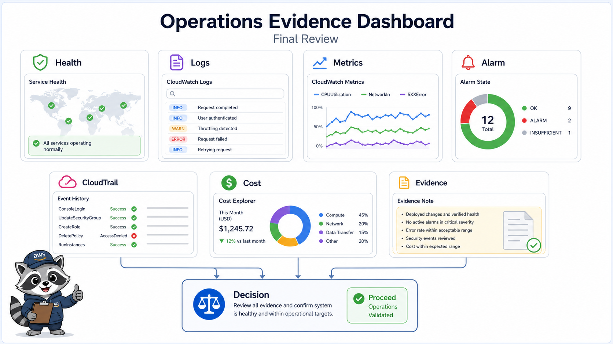
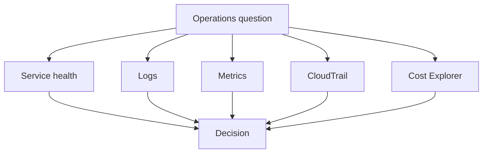

# 2교시: 운영 evidence dashboard



이 visual은 상태, 로그, 지표, 변경 이력, 비용 화면이 하나의 운영 판단으로 모이는 구조를 보여준다.

## 수업 목표
- CloudWatch Logs/Metrics/Alarm, CloudTrail, Cost Explorer를 evidence dashboard로 묶는다.
- 정상/장애/비용/변경 질문에 맞는 확인 화면을 선택한다.
- dashboard가 예쁜 그래프가 아니라 운영 결정을 돕는 도구임을 이해한다.

## 오늘 반드시 가져갈 것
| 필수 개념 | 왜 필수인가 | 놓치면 생기는 문제 | 확인 지점 |
|---|---|---|---|
| Logs | 무슨 일이 있었는지 event/text로 확인한다 | error 원인을 숫자 그래프에서만 찾는다 | CloudWatch Log group |
| Metrics | 상태 변화를 수치로 본다 | 장애 규모와 추세를 놓친다 | CloudWatch Metrics |
| CloudTrail | 누가 어떤 API 변경을 했는지 본다 | 최근 변경 원인을 못 찾는다 | Event history |
| Cost Explorer | 비용 발생 원인을 service/tag 기준으로 본다 | 잔여 비용을 추측한다 | service filter |

## 핵심 개념
운영 dashboard는 모든 화면을 한 번에 보여주는 장식이 아니다. 문제 질문에 맞는 evidence를 빠르게 찾는 지도다. 응답이 느리면 metric과 log를 보고, 갑자기 설정이 바뀌었으면 CloudTrail을 보며, 비용이 늘었으면 Cost Explorer와 tag를 본다. 같은 장애라도 질문이 다르면 첫 화면이 달라진다.

## 구조로 보기


이 구조는 Console 화면을 암기하기 위한 그림이 아니다. 운영 질문이 들어왔을 때 어떤 evidence를 먼저 확인하고, 어떤 판단을 문서에 남길지 정하는 기준이다.

## 공식 문서 확인 지점
| 확인할 문서 키워드 | 읽을 때 볼 질문 |
|---|---|
| Well-Architected | 이 판단이 운영 우수성, 보안, 비용 중 어디에 해당하는가 |
| CloudWatch 또는 CloudTrail | 상태와 변경 이력을 어떤 evidence로 확인하는가 |
| IAM 또는 Security | 누가 접근할 수 있고 무엇이 공개되어 있는가 |
| Billing 또는 Cost | 비용 원인과 owner를 설명할 수 있는가 |

## 운영 판단 연습
| 판단 질문 | 확인 기준 |
|---|---|
| 사용자 장애인가 설정 변경인가 | health/log/metric과 CloudTrail을 나누어 본다 |
| 비용 질문인가 성능 질문인가 | Cost Explorer와 CloudWatch Metrics를 구분한다 |
| 알림이 필요한가 | 반복적이고 행동 가능한 metric에만 alarm 후보를 둔다 |

## 흔한 실패와 첫 확인 위치
| 흔한 실패 | 첫 확인 위치 |
|---|---|
| CloudWatch에 그래프가 있으면 dashboard가 완성됐다고 생각한다 | 각 panel이 어떤 운영 질문에 답하는지 적는다 |

## 실습/시뮬레이션 절차
1. Week 5 evidence에서 이 교시 주제와 연결되는 화면을 2개 이상 고른다.
2. 각 화면에 대해 resource name, Region, 상태값, owner/tag, 비용 또는 보안 영향을 적는다.
3. 공식 문서 키워드와 Console 화면의 용어가 일치하는지 확인한다.
4. 판단이 필요한 항목은 `확인한 값 -> 판단 -> 다음 행동` 형식으로 기록한다.
5. 민감 정보가 보이는 screenshot은 폐기하거나 가린 뒤 다시 저장한다.

## 복구와 정리 기준
| 상황 | 먼저 볼 evidence | 다음 행동 |
|---|---|---|
| 상태가 불명확하다 | service detail, health, logs | 정상 기준과 비교한다 |
| 최근 변경이 의심된다 | CloudTrail, deployment history | 변경 시각과 증상 시각을 비교한다 |
| 비용이 남는다 | Cost Explorer, resource inventory | 삭제/중지/유지 판단을 남긴다 |
| 공개 또는 권한이 의심된다 | IAM, SG, public endpoint, secret | 접근 범위를 줄이고 재확인한다 |

## 화면 캡처 가이드
- Region, resource name, 상태값, tag, policy, metric name처럼 재현 가능한 값을 남긴다.
- account email, secret value, access key, token, password는 캡처하지 않는다.
- 실패 화면은 error message만 자르지 말고 어떤 service와 설정에서 발생했는지 보이게 한다.
- cleanup evidence는 삭제 버튼보다 삭제 후 검색 결과와 비용 후보 확인이 중요하다.

## Evidence 점검
- 화면에는 민감 정보 대신 resource 이름, Region, 상태값, rule, tag처럼 재현 가능한 값이 보여야 한다.
- 기록에는 "성공했다"보다 어떤 값이 어떤 상태였는지가 남아야 한다.
- 실패를 기록할 때는 증상, 확인한 화면, 수정한 값, 재확인 결과를 한 세트로 남긴다.
- log group 또는 metric graph, CloudTrail event, Cost Explorer filter 중 최소 두 가지는 최종 패킷에 남긴다.

## Evidence Note
```markdown
# W5D5S2 evidence dashboard
- Region/account boundary:
- Resource or evidence source:
- 확인한 값:
- 판단:
- 다음 행동:
- cleanup/handoff 상태:
```

## 혼자 다시 따라오기
- 최소 재현 경로: 하나의 증상을 정하고 health, logs, metrics, CloudTrail, Cost 중 어떤 순서로 볼지 표로 만든다.
- 공식 문서 키워드: `CloudWatch dashboards`, `CloudWatch alarms`, `CloudTrail Event history`, `Cost Explorer`
- 스스로 확인할 화면: CloudWatch dashboard, Log groups, Metrics, CloudTrail Event history, Cost Explorer
- 흔한 실패 3개: Region mismatch, metric 지연을 장애로 오해, CloudTrail을 app log로 착각
- 다음 준비 상태: 운영 질문에 맞는 evidence 화면을 선택할 수 있어야 한다.

## 한 줄 요약
```text
좋은 dashboard는 화면 수가 아니라 운영 질문에 답하는 evidence 연결로 평가한다.
```
