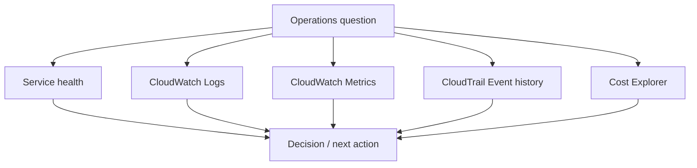

# 2교시: AWS Operations Evidence Dashboard


이 시간은 예쁜 그래프를 만드는 시간이 아니다. AWS Console에서 health, logs, metrics, CloudTrail, cost 화면을 열고 운영 질문별로 어떤 evidence를 봐야 하는지 dashboard 표로 연결한다.

## 수업 목표
- CloudWatch Logs, CloudWatch Metrics/Alarms, CloudTrail Event history, Cost Explorer를 운영 질문에 연결한다.
- 정상/장애/변경/비용 질문마다 첫 확인 화면을 다르게 고른다.
- Week 5 최종 패킷에 넣을 evidence index를 만든다.

## 오늘 만들 산출물
| 산출물 | 형태 | 반드시 들어갈 값 |
|---|---|---|
| Operations evidence dashboard | markdown 표 또는 스프레드시트 | 질문, AWS 화면, 확인 값, 판단, 다음 행동 |
| Evidence index | 표 | log/metric/event/cost evidence와 연결된 resource |
| Screenshot shortlist | 목록 | 최종 패킷에 넣을 캡처와 제외할 캡처 |

실습 템플릿은 `labs/operations-evidence-dashboard/README.md`를 사용한다.

## 오늘 반드시 가져갈 것
| 필수 개념 | 왜 필수인가 | 놓치면 생기는 문제 | AWS에서 확인할 화면 |
|---|---|---|---|
| Service health | 지금 resource가 정상인지 본다 | 로그부터 뒤져서 시간을 잃는다 | ALB target health, ECS/App Runner service, EC2 status |
| Logs | 무슨 일이 있었는지 event/text로 확인한다 | 숫자 그래프만 보고 원인을 단정한다 | CloudWatch Log groups |
| Metrics | 상태 변화와 규모를 수치로 본다 | 장애 추세와 범위를 놓친다 | CloudWatch Metrics, ALB/ECS/EC2 metrics |
| CloudTrail | 누가 어떤 AWS API 변경을 했는지 본다 | 최근 변경 원인을 못 찾는다 | CloudTrail Event history |
| Cost | 비용 발생 후보를 service 기준으로 본다 | cleanup 대상을 추측한다 | Cost Explorer, Billing dashboard |

## 핵심 개념
운영 dashboard는 모든 화면을 한 번에 붙이는 장식이 아니다. 질문에 맞는 evidence를 빠르게 찾는 지도다. 응답이 느리면 health, metric, log를 보고, 갑자기 설정이 바뀌었으면 CloudTrail을 보며, 비용이 늘었으면 Cost Explorer와 resource inventory를 본다.

## Evidence Dashboard 구조


## 질문별 첫 확인 화면
| 운영 질문 | 첫 화면 | 두 번째 화면 | 판단 |
|---|---|---|---|
| endpoint가 안 열린다 | ALB target health 또는 EC2 status | SG inbound, CloudWatch Logs | network/runtime 분리 |
| 응답이 느리다 | CloudWatch Metrics | Logs, target health | resource pressure/error 확인 |
| 방금 누가 설정을 바꿨나 | CloudTrail Event history | service detail 화면 | 변경 시각과 증상 시각 비교 |
| 비용이 남는 것 같다 | Cost Explorer | EC2/EBS/ELB/RDS/S3 inventory | 삭제/중지/유지 결정 |
| S3 object가 안 열린다 | S3 object URL result | S3 Permissions, CloudTrail | policy/BPA/key 문제 분리 |
| 배포 후 실패했다 | ECS/App Runner events 또는 target health | CloudWatch Logs, CloudTrail | image/env/permission/change 확인 |

## 구현 경로 A: CloudWatch evidence
| AWS Console 위치 | 확인할 값 | dashboard에 남길 문장 |
|---|---|---|
| CloudWatch -> Log groups | log group name, latest event time, error line | 어떤 resource의 어떤 event를 봤는가 |
| CloudWatch -> Metrics | namespace, metric name, period | 어떤 수치가 정상/비정상 판단에 쓰였는가 |
| CloudWatch -> Alarms | alarm name, state, threshold | 알림이 행동 가능한 조건인가 |
| ALB Target groups -> Health | target status, reason | health check가 성공/실패했는가 |

## 구현 경로 B: CloudTrail evidence
CloudTrail은 application log가 아니라 AWS API 변경 이력이다.

| 보고 싶은 일 | Event name 예시 |
|---|---|
| SG rule 변경 | `AuthorizeSecurityGroupIngress`, `RevokeSecurityGroupIngress` |
| IAM 권한 변경 | `AttachUserPolicy`, `DetachUserPolicy`, `CreateAccessKey` |
| S3 policy 변경 | `PutBucketPolicy`, `PutPublicAccessBlock` |
| resource 생성/삭제 | `RunInstances`, `CreateLoadBalancer`, `DeleteLoadBalancer` |
| Console 로그인 | `ConsoleLogin` |

기록은 `eventTime`, `eventName`, `user`, `resource`, `판단`만 남긴다.

## 구현 경로 C: Cost evidence
Cost Explorer는 지연될 수 있으므로 화면 값과 service inventory를 함께 사용한다.

| 화면 | 확인할 값 |
|---|---|
| Cost Explorer | 기간, group by Service, 보이는 비용 service |
| Budgets | threshold, alert 상태 |
| service inventory | EC2/EBS/ELB/RDS/S3/CloudWatch 잔여 resource |

## 실습 절차
1. `labs/operations-evidence-dashboard/README.md`의 dashboard 표를 복사한다.
2. Week 5에서 만든 대표 resource 하나를 고른다. 예: EC2+ALB, ECS/App Runner, S3.
3. health 화면을 먼저 확인하고 정상 기준을 적는다.
4. CloudWatch Logs 또는 Metrics에서 해당 resource와 연결되는 evidence를 찾는다.
5. CloudTrail Event history에서 오늘 변경 이벤트 1개를 찾는다.
6. Cost Explorer 또는 service inventory에서 비용 후보를 찾는다.
7. 각 evidence에 `이 값으로 어떤 판단을 했는지`를 한 줄로 적는다.
8. 최종 패킷에 넣을 screenshot과 버릴 screenshot을 구분한다.

## 흔한 실패와 첫 확인 위치
| 흔한 실패 | 첫 확인 위치 |
|---|---|
| dashboard를 그래프 모음으로 만든다 | 질문 -> evidence -> 판단 구조로 다시 쓴다 |
| CloudTrail을 app error log로 찾는다 | CloudTrail eventName과 eventSource |
| metric 지연을 장애로 오해한다 | metric period와 latest datapoint time |
| Cost Explorer 0원을 cleanup 완료로 착각한다 | service별 resource inventory |

## Evidence 점검
- health, log 또는 metric, CloudTrail, cost evidence가 각각 하나 이상 있다.
- 각 evidence마다 resource name, Region, 확인 값, 판단이 있다.
- screenshot에는 secret/account email/access key가 보이지 않는다.
- 다음 S3~S8에서 재사용할 evidence가 표시되어 있다.

## Evidence Note
```markdown
# W5D5S2 operations evidence dashboard
- Account/Region:
- 대표 resource:
- Health evidence:
- Log/metric evidence:
- CloudTrail evidence:
- Cost evidence:
- 이 dashboard가 답하는 운영 질문:
- 다음 행동:
```

## 한 줄 요약
```text
운영 evidence dashboard는 화면 모음이 아니라 질문별로 health, logs, metrics, CloudTrail, cost를 연결한 판단 지도다.
```
