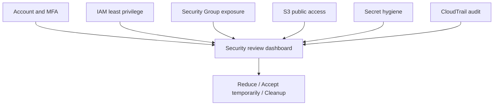

# 3교시: AWS Security Review Dashboard


이 시간은 "보안 중요함"을 말하는 시간이 아니다. AWS Console에서 실제로 확인할 수 있는 보안 증거를 모아 하나의 운영 대시보드로 만든다. 학생은 IAM, Security Group, S3, CloudTrail 화면을 직접 열고 `확인한 값 -> 위험 판단 -> 다음 조치`를 표로 남긴다.

## 수업 목표
- AWS 계정, 권한, 네트워크 공개, S3 공개, secret, 감사 로그를 하나의 security review dashboard로 정리한다.
- 각 항목을 추상 체크가 아니라 Console 화면에서 확인 가능한 값으로 기록한다.
- 보안 위험을 발견했을 때 바로 줄일 수 있는 조치와 수업 종료 전 cleanup 기준을 남긴다.

## 오늘 만들 산출물
| 산출물 | 형태 | 반드시 들어갈 값 |
|---|---|---|
| Security review dashboard | markdown 표 또는 스프레드시트 | 항목, Console 위치, 확인 값, 위험도, 다음 조치 |
| Public exposure inventory | 표 | SG inbound, ALB/EC2 public endpoint, S3 public access |
| Audit evidence note | 짧은 기록 | CloudTrail event name, event time, user, resource |
| Secret hygiene note | 체크리스트 | access key, token, password, screenshot 노출 여부 |

실습 템플릿은 `labs/security-review-dashboard/README.md`를 사용한다.

## 오늘 반드시 가져갈 것
| 필수 개념 | 왜 필수인가 | 놓치면 생기는 문제 | AWS에서 확인할 화면 |
|---|---|---|---|
| MFA | 계정 탈취 위험을 줄이는 첫 안전장치다 | root/account 보호가 약해진다 | IAM dashboard, Security credentials |
| Least privilege | 필요한 권한만 허용한다 | 실습 identity가 과도한 권한을 가진다 | IAM user/role, attached policy |
| Network exposure | 인터넷에서 들어오는 경로를 제한한다 | SSH/DB/Admin port가 전체 공개된다 | EC2 Security Groups, Load Balancers |
| S3 public access | 파일 공개 여부를 명시적으로 판단한다 | 실습 파일이나 개인정보가 공개된다 | S3 bucket Permissions |
| Secret hygiene | key/token/password를 자료에 남기지 않는다 | 유출된 credential로 비용/삭제 사고가 난다 | IAM access keys, screenshots, git diff |
| Audit | 최근 변경 주체와 시각을 확인한다 | 누가 무엇을 바꿨는지 추적하지 못한다 | CloudTrail Event history |

## 핵심 개념
Security review는 보안 원칙을 외우는 일이 아니라 운영자가 확인 가능한 증거를 모으는 절차다. `안전함`이라고 쓰면 부족하다. `ap-northeast-2의 w5-web-sg inbound에 TCP 22 from 0.0.0.0/0이 있었고, 수업 종료 전 삭제했다`처럼 resource, Region, rule, 조치가 보여야 한다.

이번 시간의 기본 경로는 추가 유료 보안 서비스를 켜지 않는다. 이미 Week 5에서 사용한 AWS Console 화면만으로 구현한다. Security Hub, GuardDuty, AWS Config는 계정/비용 정책이 확인된 경우에만 확장 옵션으로 다룬다.

## Security Review Dashboard 구조


이 구조의 각 노드는 실제 Console 화면 하나와 연결되어야 한다. 그림만 보고 넘어가면 실습이 아니다.

## 구현 경로 A: Console로 대시보드 만들기
아래 순서대로 화면을 열고 `labs/security-review-dashboard/README.md`의 표를 채운다.

| 순서 | AWS Console 위치 | 확인할 값 | 위험 신호 | 즉시 조치 |
|---|---|---|---|---|
| 1 | IAM -> Dashboard 또는 Security credentials | root MFA, IAM user MFA | MFA not enabled | MFA 설정 또는 실습 중단 사유 기록 |
| 2 | IAM -> Users/Roles -> Permissions | attached policy, AdministratorAccess 여부 | 수업용 identity가 관리자 권한을 계속 보유 | 필요한 실습 범위만 남기는 계획 기록 |
| 3 | EC2 -> Security Groups -> Inbound rules | port, protocol, source | TCP 22/3389/3306/5432 from `0.0.0.0/0` 또는 `::/0` | 내 IP 제한 또는 rule 삭제 |
| 4 | EC2 -> Load Balancers 또는 Instances | public DNS/IP, listener | 의도하지 않은 public endpoint | 삭제, stop, SG 제한 중 하나 선택 |
| 5 | S3 -> Bucket -> Permissions | Block Public Access, bucket policy | public 경고, broad principal `*` | 공개 목적 확인, 아니면 block/policy 제거 |
| 6 | IAM -> Users -> Security credentials | access key 존재, last used | 장기 key가 있고 목적이 불명확 | 비활성화/삭제 계획 기록 |
| 7 | CloudTrail -> Event history | event name, user name, event time | 누가 SG/IAM/S3를 바꿨는지 모름 | 변경 시각과 resource를 note에 연결 |

## 구현 경로 B: CloudTrail Event history로 감사 증거 만들기
CloudTrail Event history는 기본적으로 최근 이벤트 조회에 사용할 수 있다. 오늘은 app log가 아니라 AWS API 변경 이력을 보는 연습을 한다.

| 보고 싶은 변경 | CloudTrail filter 예시 | 확인할 질문 |
|---|---|---|
| Security Group rule 변경 | `AuthorizeSecurityGroupIngress`, `RevokeSecurityGroupIngress` | 누가 어떤 port/source를 열거나 닫았는가 |
| IAM policy 변경 | `AttachUserPolicy`, `DetachUserPolicy`, `CreateAccessKey` | 권한이나 key가 언제 바뀌었는가 |
| S3 공개 설정 변경 | `PutBucketPolicy`, `PutPublicAccessBlock` | bucket 공개 관련 설정이 바뀌었는가 |
| Console 로그인 | `ConsoleLogin` | 어떤 identity가 언제 로그인했는가 |

기록할 때는 전체 JSON을 붙이지 않는다. `eventTime`, `eventName`, `userIdentity.type`, `userIdentity.userName` 또는 role 이름, 관련 resource 이름만 남긴다.

## 구현 경로 C: 선택 확장
계정 정책과 비용 허용이 확인된 경우에만 확장한다.

| 확장 서비스 | 수업에서 얻는 것 | 주의 |
|---|---|---|
| IAM Access Analyzer | 외부 접근 가능 policy 발견 | analyzer 생성 범위와 결과 해석 필요 |
| AWS Config | resource 설정 변경 추적과 규칙 평가 | recorder/resource recording 설정과 비용 확인 필요 |
| Security Hub | 여러 보안 finding 통합 | 표준 활성화와 finding 비용/범위 확인 필요 |
| GuardDuty | threat detection finding 확인 | 계정별 활성화와 비용 확인 필요 |

기본 수업 통과 조건은 확장 서비스 활성화가 아니라 Console 기반 dashboard 완성이다.

## 실습 절차
1. `labs/security-review-dashboard/README.md`를 열고 dashboard 표를 복사한다.
2. 상단에 account alias 또는 account id 마지막 4자리, Region, 실습 identity를 적는다.
3. IAM에서 MFA와 permission evidence를 채운다.
4. EC2 Security Groups에서 public inbound rule을 모두 찾는다.
5. S3 bucket Permissions에서 Block Public Access와 bucket policy 상태를 확인한다.
6. IAM access key, screenshot, markdown, git diff에 secret 값이 남았는지 점검한다.
7. CloudTrail Event history에서 오늘 변경한 IAM/SG/S3 이벤트 1개 이상을 찾아 기록한다.
8. 각 항목에 `OK`, `Fix now`, `Accept until cleanup`, `Need owner decision` 중 하나를 붙인다.
9. `Fix now`는 수업 시간 안에 조치하고 같은 화면으로 재확인한다.

## 보안 판단 기준
| 상태 | 의미 | 예시 |
|---|---|---|
| OK | 수업 기준에서 위험이 낮고 근거가 있다 | root MFA enabled, S3 Block Public Access on |
| Fix now | 지금 줄일 수 있는 명확한 위험이다 | SSH 22 from `0.0.0.0/0`, secret 포함 screenshot |
| Accept until cleanup | 실습 때문에 잠시 허용하지만 종료 시각이 있다 | HTTP 80 public for ALB test |
| Need owner decision | 학생 혼자 바꾸면 안 되는 계정/팀 정책이다 | 공용 IAM policy, shared bucket policy |

## 흔한 실패와 첫 확인 위치
| 흔한 실패 | 첫 확인 위치 |
|---|---|
| "보안 확인함" 한 줄로 끝낸다 | dashboard 표에 Console 위치와 확인 값을 강제로 적는다 |
| public endpoint만 보고 SG source를 안 본다 | EC2 Security Groups inbound rules |
| S3 object URL이 있으면 public이라고 착각한다 | S3 Permissions와 브라우저 접근 결과를 함께 확인한다 |
| CloudTrail을 app error log로 착각한다 | Event history의 event source와 event name |
| secret을 가리지 않은 캡처를 포트폴리오에 넣는다 | screenshot, markdown, git diff 최종 점검 |

## 화면 캡처 가이드
- 남겨도 되는 값: resource name, Region, SG rule, MFA enabled 상태, Block Public Access 상태, CloudTrail event name.
- 가려야 하는 값: account email, access key, secret value, token, password, MFA code, 결제 정보.
- 위험 rule은 before/after를 모두 남긴다. 단, IP나 계정 식별자가 민감하면 일부를 가린다.
- 삭제/수정 조치는 버튼 클릭 화면보다 조치 후 재조회 화면이 더 좋은 evidence다.

## Evidence 점검
- dashboard에 IAM, SG, S3, CloudTrail 항목이 모두 있다.
- public exposure 항목은 port, source, resource name이 함께 적혀 있다.
- `Fix now` 항목은 조치 후 재확인 값이 있다.
- secret이 보이는 screenshot이나 markdown이 최종 패킷에 남지 않았다.
- CloudTrail event 1개 이상이 보안 판단과 연결되어 있다.

## Evidence Note
```markdown
# W5D5S3 security review dashboard
- Account/Region:
- 실습 identity:
- 가장 위험했던 항목:
- 즉시 수정한 항목:
- 실습 때문에 임시 허용한 항목과 cleanup 시각:
- CloudTrail event evidence:
- secret 노출 최종 점검:
```

## 혼자 다시 따라오기
- 최소 재현 경로: IAM MFA, IAM permission, SG inbound, S3 Permissions, CloudTrail Event history를 하나의 dashboard 표로 채운다.
- 공식 문서 키워드: `IAM best practices`, `least privilege`, `security group rules`, `S3 Block Public Access`, `CloudTrail Event history`.
- 스스로 확인할 화면: IAM Dashboard, IAM Users/Roles, EC2 Security Groups, S3 Permissions, CloudTrail Event history.
- 흔한 실패 3개: root로 실습, SG 0.0.0.0/0 방치, secret 값 캡처.
- 다음 준비 상태: 보안 질문에 대해 "어느 화면에서 어떤 값을 봤고 무엇을 조치했는지" 설명할 수 있어야 한다.

## 한 줄 요약
```text
AWS 보안 리뷰는 원칙 암기가 아니라 IAM, SG, S3, CloudTrail evidence를 dashboard로 묶고 위험을 줄이는 실습이다.
```
