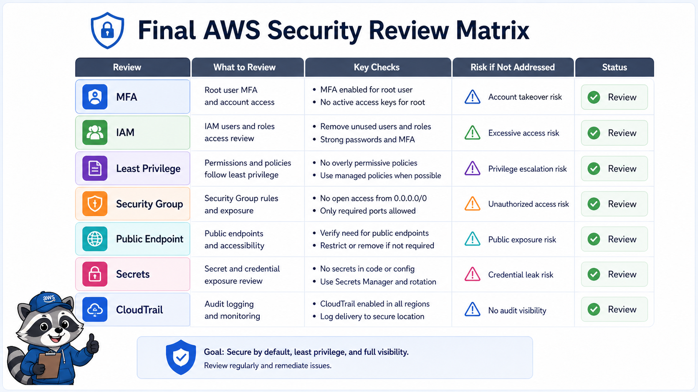
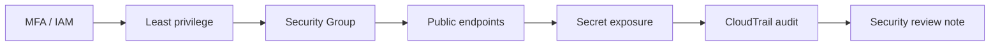

# 3교시: Security review



이 visual은 계정, 권한, 네트워크 노출, secret, audit을 보안 리뷰 표로 묶는 방식을 보여준다.

## 수업 목표
- MFA, IAM, Security Group, public endpoint, secret, CloudTrail을 최종 점검한다.
- 보안 리뷰를 추상적 문장이 아니라 확인 가능한 항목으로 작성한다.
- 최소 권한과 공개 범위를 evidence로 설명한다.

## 오늘 반드시 가져갈 것
| 필수 개념 | 왜 필수인가 | 놓치면 생기는 문제 | 확인 지점 |
|---|---|---|---|
| MFA | 계정 탈취 위험을 줄이는 첫 안전장치다 | root/account 보호가 약해진다 | IAM/account security |
| Least privilege | 필요한 권한만 허용한다 | 실습 user가 과도한 권한을 가진다 | IAM policy |
| Exposure review | public endpoint와 SG source를 확인한다 | 의도치 않은 인터넷 노출이 남는다 | SG, ALB, S3 public |
| Audit | 변경 이력을 확인한다 | 누가 바꿨는지 추적하지 못한다 | CloudTrail |

## 핵심 개념
Security review는 "보안이 중요하다"는 선언이 아니다. 누가 접근할 수 있고, 어디가 공개되어 있으며, 어떤 민감 정보가 노출되었고, 어떤 변경이 감사 로그에 남는지 확인하는 절차다. Week 5에서는 root MFA, IAM 권한, Security Group, ALB/서비스 URL, S3 public access, secret 값, CloudTrail event를 최소 점검 범위로 둔다.

## 구조로 보기


이 구조는 Console 화면을 암기하기 위한 그림이 아니다. 운영 질문이 들어왔을 때 어떤 evidence를 먼저 확인하고, 어떤 판단을 문서에 남길지 정하는 기준이다.

## 공식 문서 확인 지점
| 확인할 문서 키워드 | 읽을 때 볼 질문 |
|---|---|
| Well-Architected | 이 판단이 운영 우수성, 보안, 비용 중 어디에 해당하는가 |
| CloudWatch 또는 CloudTrail | 상태와 변경 이력을 어떤 evidence로 확인하는가 |
| IAM 또는 Security | 누가 접근할 수 있고 무엇이 공개되어 있는가 |
| Billing 또는 Cost | 비용 원인과 owner를 설명할 수 있는가 |

## 운영 판단 연습
| 판단 질문 | 확인 기준 |
|---|---|
| 누가 접근 가능한가 | IAM user/role/policy와 MFA 상태를 확인한다 |
| 어디가 공개되어 있는가 | public endpoint, SG source, bucket public access를 확인한다 |
| 민감 정보가 남았는가 | screenshot, markdown, git diff에서 secret 값을 제거한다 |

## 흔한 실패와 첫 확인 위치
| 흔한 실패 | 첫 확인 위치 |
|---|---|
| 보안 확인을 감으로 완료한다 | 각 항목마다 Console 위치와 확인 값을 남긴다 |

## 실습/시뮬레이션 절차
1. Week 5 evidence에서 이 교시 주제와 연결되는 화면을 2개 이상 고른다.
2. 각 화면에 대해 resource name, Region, 상태값, owner/tag, 비용 또는 보안 영향을 적는다.
3. 공식 문서 키워드와 Console 화면의 용어가 일치하는지 확인한다.
4. 판단이 필요한 항목은 `확인한 값 -> 판단 -> 다음 행동` 형식으로 기록한다.
5. 민감 정보가 보이는 screenshot은 폐기하거나 가린 뒤 다시 저장한다.

## 복구와 정리 기준
| 상황 | 먼저 볼 evidence | 다음 행동 |
|---|---|---|
| 상태가 불명확하다 | service detail, health, logs | 정상 기준과 비교한다 |
| 최근 변경이 의심된다 | CloudTrail, deployment history | 변경 시각과 증상 시각을 비교한다 |
| 비용이 남는다 | Cost Explorer, resource inventory | 삭제/중지/유지 판단을 남긴다 |
| 공개 또는 권한이 의심된다 | IAM, SG, public endpoint, secret | 접근 범위를 줄이고 재확인한다 |

## 화면 캡처 가이드
- Region, resource name, 상태값, tag, policy, metric name처럼 재현 가능한 값을 남긴다.
- account email, secret value, access key, token, password는 캡처하지 않는다.
- 실패 화면은 error message만 자르지 말고 어떤 service와 설정에서 발생했는지 보이게 한다.
- cleanup evidence는 삭제 버튼보다 삭제 후 검색 결과와 비용 후보 확인이 중요하다.

## Evidence 점검
- 화면에는 민감 정보 대신 resource 이름, Region, 상태값, rule, tag처럼 재현 가능한 값이 보여야 한다.
- 기록에는 "성공했다"보다 어떤 값이 어떤 상태였는지가 남아야 한다.
- 실패를 기록할 때는 증상, 확인한 화면, 수정한 값, 재확인 결과를 한 세트로 남긴다.
- MFA/IAM 확인, public exposure 목록, CloudTrail event 또는 secret 노출 없음 증거 중 최소 두 가지는 최종 패킷에 남긴다.

## Evidence Note
```markdown
# W5D5S3 security review
- Region/account boundary:
- Resource or evidence source:
- 확인한 값:
- 판단:
- 다음 행동:
- cleanup/handoff 상태:
```

## 혼자 다시 따라오기
- 최소 재현 경로: MFA, IAM policy, SG inbound, public endpoint, secret exposure, CloudTrail event를 한 표로 점검한다.
- 공식 문서 키워드: `IAM best practices`, `least privilege`, `security group`, `CloudTrail`, `detective controls`
- 스스로 확인할 화면: IAM, EC2 Security Groups, Load Balancers, S3 Permissions, Secrets Manager, CloudTrail
- 흔한 실패 3개: root로 실습, SG 0.0.0.0/0 방치, secret 값 캡처
- 다음 준비 상태: 보안 리뷰 항목마다 확인 화면과 판단 결과가 있어야 한다.

## 한 줄 요약
```text
보안 리뷰는 원칙 문장이 아니라 접근 주체, 공개 범위, 민감 정보, 감사 증거를 확인하는 표다.
```
