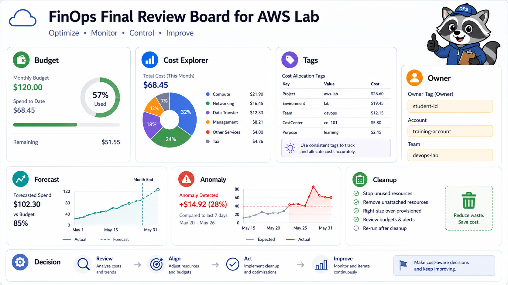
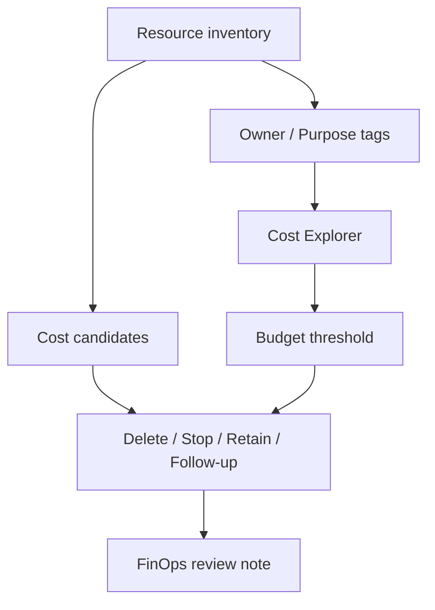

# 4교시: AWS FinOps Review Dashboard



이 시간은 비용 그래프를 구경하는 시간이 아니다. AWS Billing, Cost Explorer, Budgets, Tag Editor, 각 service list를 열어 비용이 어디서 생길 수 있는지 찾고 `삭제 / 중지 / 유지` 결정을 남긴다.

## 수업 목표
- Budget, Cost Explorer, tag, forecast, resource inventory를 하나의 FinOps dashboard로 묶는다.
- 비용 원인을 service, owner, purpose, cleanup action 기준으로 설명한다.
- 수업 종료 전에 비용이 남을 수 있는 resource를 찾아 삭제 또는 유지 사유를 기록한다.

## 오늘 만들 산출물
| 산출물 | 형태 | 반드시 들어갈 값 |
|---|---|---|
| FinOps review dashboard | markdown 표 또는 스프레드시트 | service, resource, owner/tag, 비용 후보, action |
| Cost Explorer evidence | screenshot 또는 note | 기간, group by, service filter |
| Budget evidence | screenshot 또는 note | budget 이름, threshold, 알림 상태 |
| Cleanup decision table | 표 | Delete, Stop, Retain, Follow-up |

실습 템플릿은 `labs/finops-review/README.md`를 사용한다.

## 오늘 반드시 가져갈 것
| 필수 개념 | 왜 필수인가 | 놓치면 생기는 문제 | AWS에서 확인할 화면 |
|---|---|---|---|
| Budget | 비용 임계값 알림 기준이다 | 비용을 막아준다고 오해한다 | Billing -> Budgets |
| Cost Explorer | 서비스/기간/tag별 비용 분석이다 | 잔여 비용 원인을 추측한다 | Cost Explorer |
| Tag | owner/purpose 기준 추적을 가능하게 한다 | 누가 만든 비용인지 모른다 | Resource Groups Tag Editor, resource tag tab |
| Cost candidate | 삭제 후에도 남는 비용 후보를 찾는다 | EBS, snapshot, ALB, NAT, log, RDS 비용이 남는다 | 각 service list |
| Cleanup decision | 삭제/중지/유지 판단을 비용 근거와 연결한다 | 불필요한 resource가 방치된다 | inventory table |

## 핵심 개념
FinOps review는 "아껴 쓰자"가 아니라 비용의 원인과 책임을 설명하는 절차다. Budget은 알림이고, Cost Explorer는 분석이며, tag는 비용을 사람과 목적에 연결하는 기준이다. 마지막 산출물은 비용 그래프가 아니라 어떤 resource를 왜 지웠고 무엇을 왜 남겼는지 보여주는 decision table이다.

## FinOps Dashboard 구조


## 구현 경로 A: Billing/Cost Console로 비용 증거 만들기
| 순서 | AWS Console 위치 | 확인할 값 | 판단 |
|---|---|---|---|
| 1 | Billing and Cost Management -> Budgets | budget name, threshold, alert email | 알림만 있고 자동 차단은 아님 |
| 2 | Cost Explorer | 기간: 이번 달, Group by: Service | 어떤 service 비용이 보이는지 확인 |
| 3 | Cost Explorer filter | Region 또는 tag filter 가능 여부 | tag가 없으면 owner별 분석이 어려움 |
| 4 | Billing dashboard | month-to-date, forecast | 실습 직후 데이터 지연 가능성 기록 |

Cost Explorer는 데이터 반영이 지연될 수 있다. 비용이 0으로 보인다고 resource 비용 후보가 없다는 뜻은 아니다.

## 구현 경로 B: Service별 비용 후보 inventory
| Service | 확인할 resource | 비용/잔여 후보 | 기본 조치 |
|---|---|---|---|
| EC2 | running/stopped instance | EBS volume은 stopped 후에도 비용 가능 | terminate 또는 EBS 확인 |
| EBS | volumes, snapshots | unattached volume, snapshot | delete 또는 유지 사유 기록 |
| ELB/ALB | load balancer, target group | traffic 없어도 시간 비용 가능 | delete |
| ECS/App Runner | service, task, image | service running, image storage | stop/delete |
| ECR | repositories/images | image storage | 필요 없으면 delete |
| S3 | bucket/object/version | storage, request, version | empty/delete 또는 유지 사유 |
| RDS | DB instance, snapshot | instance/storage/snapshot | delete, final snapshot 여부 기록 |
| CloudWatch | log groups, alarms, dashboards | log retention/storage | retention 설정 또는 delete |
| Secrets Manager | secrets | secret monthly charge 가능 | delete schedule 또는 유지 사유 |

## 실습 절차
1. `labs/finops-review/README.md`의 dashboard 표를 복사한다.
2. Budget 화면에서 budget 이름, threshold, 알림 상태를 기록한다.
3. Cost Explorer에서 이번 달 service별 비용 화면을 확인한다.
4. Cost Explorer 데이터가 아직 없으면 "데이터 지연"이라고 적고 service inventory로 비용 후보를 찾는다.
5. EC2, ELB, ECS/App Runner, ECR, S3, RDS, CloudWatch, Secrets Manager를 순서대로 확인한다.
6. 각 resource에 owner/purpose tag가 있는지 본다.
7. resource마다 `Delete`, `Stop`, `Retain`, `Follow-up` 중 하나를 결정한다.
8. `Retain`은 owner, 목적, 예상 종료 시각을 반드시 적는다.

## 흔한 실패와 첫 확인 위치
| 흔한 실패 | 첫 확인 위치 |
|---|---|
| Budget이 비용을 자동 차단한다고 믿는다 | Budgets 설명과 resource cleanup table |
| EC2만 지우고 ALB/EBS/Snapshot을 놓친다 | EC2, ELB, EBS 화면을 따로 확인 |
| Cost Explorer가 0이라서 비용 후보가 없다고 판단한다 | 데이터 지연과 service inventory |
| tag 없이 owner를 추측한다 | Resource Groups Tag Editor |

## Evidence 점검
- Budget threshold 또는 접근 불가 사유가 있다.
- Cost Explorer의 기간과 group 기준이 적혀 있다.
- 비용 후보 inventory가 service별로 있다.
- 삭제/중지/유지 결정과 재확인 방법이 있다.
- 남긴 resource에는 owner, purpose, cleanup 예정 시각이 있다.

## Evidence Note
```markdown
# W5D5S4 FinOps review dashboard
- Account/Region:
- Budget evidence:
- Cost Explorer 기간/group 기준:
- 가장 큰 비용 후보:
- Delete/Stop 대상:
- Retain 대상과 사유:
- 다음 비용 재확인 시각:
```

## 한 줄 요약
```text
FinOps review는 비용 그래프가 아니라 비용 후보를 찾아 action과 owner를 붙이는 운영 실습이다.
```
