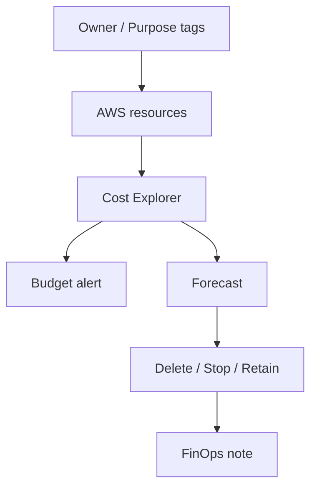

# 4교시: FinOps review


이 visual은 Budget, Cost Explorer, tag, forecast, cleanup decision이 비용 판단으로 연결되는 흐름을 보여준다.

## 수업 목표
- Budget, Cost Explorer, tag, forecast, cleanup decision을 연결한다.
- 비용 발생 원인을 service와 owner 기준으로 설명한다.
- 삭제할 resource와 유지할 resource의 비용 근거를 남긴다.

## 오늘 반드시 가져갈 것
| 필수 개념 | 왜 필수인가 | 놓치면 생기는 문제 | 확인 지점 |
|---|---|---|---|
| Budget | 비용 임계값 알림 기준이다 | 비용을 막아준다고 오해한다 | Budgets dashboard |
| Cost Explorer | 서비스/기간/tag별 비용 분석이다 | 잔여 비용 원인을 못 찾는다 | filter, graph |
| Tag | owner/purpose 기준 추적을 가능하게 한다 | 팀/학생별 비용 분리가 안 된다 | resource tags |
| Cleanup decision | 삭제/유지 판단을 비용 근거와 연결한다 | 불필요한 resource가 남는다 | inventory |

## 핵심 개념
FinOps review는 비용을 아끼자는 구호가 아니라 비용의 원인을 설명할 수 있게 만드는 절차다. 실습에서는 작은 비용도 owner, purpose, service 기준으로 추적해야 한다. Budget은 알림이고 Cost Explorer는 분석 도구이며, tag는 비용을 의미 있는 단위로 묶는 기준이다. 마지막 판단은 삭제, 중지, 보존 중 하나로 남아야 한다.

## 구조로 보기


이 구조는 Console 화면을 암기하기 위한 그림이 아니다. 운영 질문이 들어왔을 때 어떤 evidence를 먼저 확인하고, 어떤 판단을 문서에 남길지 정하는 기준이다.

## 공식 문서 확인 지점
| 확인할 문서 키워드 | 읽을 때 볼 질문 |
|---|---|
| Well-Architected | 이 판단이 운영 우수성, 보안, 비용 중 어디에 해당하는가 |
| CloudWatch 또는 CloudTrail | 상태와 변경 이력을 어떤 evidence로 확인하는가 |
| IAM 또는 Security | 누가 접근할 수 있고 무엇이 공개되어 있는가 |
| Billing 또는 Cost | 비용 원인과 owner를 설명할 수 있는가 |

## 운영 판단 연습
| 판단 질문 | 확인 기준 |
|---|---|
| 비용이 어디서 발생했는가 | Cost Explorer service filter와 resource inventory를 비교한다 |
| 누가 소유하는가 | Owner/Purpose tag가 있는지 확인한다 |
| 무엇을 정리할 것인가 | 삭제/중지/유지 사유와 다음 확인 시각을 남긴다 |

## 흔한 실패와 첫 확인 위치
| 흔한 실패 | 첫 확인 위치 |
|---|---|
| Budget이 있으니 비용이 자동 차단된다고 생각한다 | Budget은 알림이고 resource 조치는 별도임을 확인한다 |

## 실습/시뮬레이션 절차
1. Week 5 evidence에서 이 교시 주제와 연결되는 화면을 2개 이상 고른다.
2. 각 화면에 대해 resource name, Region, 상태값, owner/tag, 비용 또는 보안 영향을 적는다.
3. 공식 문서 키워드와 Console 화면의 용어가 일치하는지 확인한다.
4. 판단이 필요한 항목은 `확인한 값 -> 판단 -> 다음 행동` 형식으로 기록한다.
5. 민감 정보가 보이는 screenshot은 폐기하거나 가린 뒤 다시 저장한다.

## 복구와 정리 기준
| 상황 | 먼저 볼 evidence | 다음 행동 |
|---|---|---|
| 상태가 불명확하다 | service detail, health, logs | 정상 기준과 비교한다 |
| 최근 변경이 의심된다 | CloudTrail, deployment history | 변경 시각과 증상 시각을 비교한다 |
| 비용이 남는다 | Cost Explorer, resource inventory | 삭제/중지/유지 판단을 남긴다 |
| 공개 또는 권한이 의심된다 | IAM, SG, public endpoint, secret | 접근 범위를 줄이고 재확인한다 |

## 화면 캡처 가이드
- Region, resource name, 상태값, tag, policy, metric name처럼 재현 가능한 값을 남긴다.
- account email, secret value, access key, token, password는 캡처하지 않는다.
- 실패 화면은 error message만 자르지 말고 어떤 service와 설정에서 발생했는지 보이게 한다.
- cleanup evidence는 삭제 버튼보다 삭제 후 검색 결과와 비용 후보 확인이 중요하다.

## Evidence 점검
- 화면에는 민감 정보 대신 resource 이름, Region, 상태값, rule, tag처럼 재현 가능한 값이 보여야 한다.
- 기록에는 "성공했다"보다 어떤 값이 어떤 상태였는지가 남아야 한다.
- 실패를 기록할 때는 증상, 확인한 화면, 수정한 값, 재확인 결과를 한 세트로 남긴다.
- Budget threshold, Cost Explorer filter, 삭제/유지 decision table 중 최소 두 가지는 최종 패킷에 남긴다.

## Evidence Note
```markdown
# W5D5S4 FinOps review
- Region/account boundary:
- Resource or evidence source:
- 확인한 값:
- 판단:
- 다음 행동:
- cleanup/handoff 상태:
```

## 혼자 다시 따라오기
- 최소 재현 경로: Cost Explorer에서 service별 비용을 보고, Week 5 resource inventory와 tag 기준으로 cleanup decision을 만든다.
- 공식 문서 키워드: `AWS Budgets`, `Cost Explorer`, `cost allocation tags`, `forecast`, `resource cleanup`
- 스스로 확인할 화면: Billing Budgets, Cost Explorer, Resource Groups Tag Editor, 각 service list
- 흔한 실패 3개: Cost Explorer 지연을 모름, tag 누락, snapshot/log/ALB 비용 후보 누락
- 다음 준비 상태: 비용 질문에 대해 service, owner, action 기준으로 답할 수 있어야 한다.

## 한 줄 요약
```text
FinOps review는 비용 그래프를 보는 일이 아니라 비용 원인과 다음 조치를 연결하는 일이다.
```
