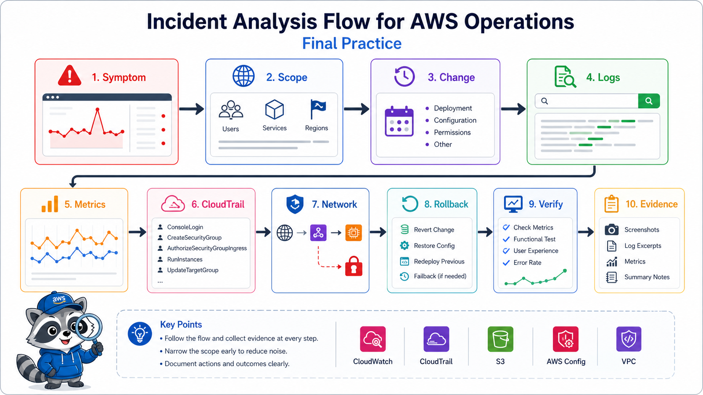
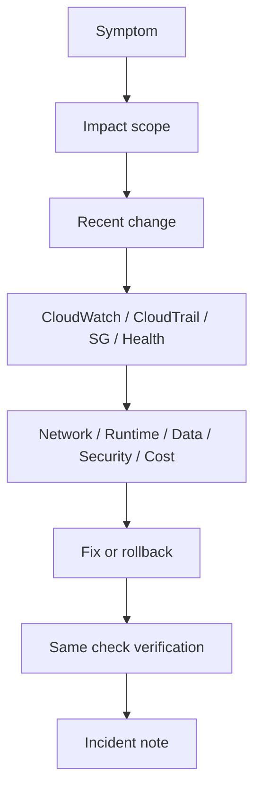

# 5교시: AWS Incident Drill



이 시간은 실제 AWS resource를 기준으로 작은 장애를 일부러 만들고, 증상에서 evidence, 조치, 재확인까지 incident note를 완성한다. 계정 상황에 따라 실제 장애 주입이 어렵다면 제공된 시나리오 중 하나를 선택해 Console evidence로 시뮬레이션한다.

## 수업 목표
- 증상, 영향 범위, 최근 변경, evidence, 조치, 검증을 분리한다.
- CloudWatch, CloudTrail, Security Group, target health, S3 access result를 증상에 맞게 고른다.
- 조치 후 같은 명령이나 같은 화면으로 복구를 증명한다.

## 오늘 만들 산출물
| 산출물 | 형태 | 반드시 들어갈 값 |
|---|---|---|
| Incident note | markdown | symptom, scope, recent change, evidence, action, verification |
| Before/after evidence | screenshot 또는 command result | 실패와 복구를 같은 기준으로 비교 |
| Timeline | 짧은 표 | 발견, 변경 확인, 조치, 복구 시각 |

실습 템플릿은 `labs/incident-drill/README.md`를 사용한다.

## 장애 시나리오 선택
| 시나리오 | 실제 AWS에서 하는 일 | 확인할 evidence | 복구 |
|---|---|---|---|
| A. SG HTTP 차단 | EC2/ALB HTTP inbound rule을 임시 제거 | curl timeout, SG inbound, CloudTrail | HTTP rule 복구 |
| B. ALB target unhealthy | target group health를 확인하고 원인 후보 분류 | target health, service event, CloudWatch logs | task/instance/SG 복구 |
| C. S3 AccessDenied | object URL 접근 결과와 Permissions 비교 | browser AccessDenied, Block Public Access | 공개 목적이면 policy 수정, 아니면 유지 |
| D. 비용 급증 후보 | ALB/RDS/EBS 등 잔여 resource 발견 | Cost Explorer, service list | delete/stop/retain 결정 |

공용 계정이거나 resource를 바꾸면 안 되는 상황이면 A를 실제로 주입하지 말고 B~D를 시뮬레이션으로 진행한다.

## 핵심 개념
장애 분석은 원인 맞히기가 아니다. 먼저 사용자가 보는 증상을 적고, 영향 범위를 좁히고, 최근 변경과 evidence를 연결한다. 그 다음 network, runtime, data, security, cost 중 어느 경계인지 판단한다. 복구했다고 말하려면 실패를 확인했던 같은 기준으로 다시 확인해야 한다.

## Incident Drill 구조


## 구현 경로 A: Security Group HTTP 장애 주입
1. EC2 -> Security Groups에서 실습용 web SG를 연다.
2. 현재 HTTP rule을 기록한다. 예: `TCP 80 from 0.0.0.0/0`.
3. browser 또는 `curl -m 5 -i http://<endpoint>/`로 정상 응답을 기록한다.
4. HTTP inbound rule을 임시 제거한다.
5. 같은 `curl` 명령으로 timeout 또는 실패를 기록한다.
6. CloudTrail Event history에서 `RevokeSecurityGroupIngress` 이벤트를 찾는다.
7. HTTP rule을 복구한다.
8. 같은 `curl` 명령으로 정상 응답을 재확인한다.

## 구현 경로 B: 시뮬레이션 incident note
실제 변경이 어렵다면 아래 중 하나를 선택한다.

| 증상 | 첫 확인 화면 | 두 번째 확인 화면 | 판단 예시 |
|---|---|---|---|
| ALB 5xx | Target Groups -> Health | CloudWatch Logs/Metrics | target app 또는 health check 문제 |
| S3 AccessDenied | S3 object URL | Bucket Permissions | policy/BPA/object key 문제 |
| app 배포 후 오류 | ECS/App Runner events | CloudWatch Logs, CloudTrail | image/env/permission 변경 문제 |
| 예상 비용 증가 | Cost Explorer | EC2/ELB/RDS/EBS inventory | cleanup 누락 문제 |

## Evidence 점검
- symptom이 사용자 관점으로 적혀 있다. 예: `curl timeout`, `HTTP 503`, `AccessDenied`.
- scope가 service, Region, endpoint 기준으로 적혀 있다.
- recent change가 CloudTrail 또는 service event와 연결되어 있다.
- action 전후가 같은 명령 또는 같은 화면으로 비교된다.
- rollback 또는 cleanup 결정이 있다.

## Evidence Note
```markdown
# W5D5S5 incident drill
- Scenario:
- Symptom:
- Scope:
- Recent change:
- Evidence:
- Suspected boundary:
- Action:
- Verification:
- Follow-up/cleanup:
```

## 한 줄 요약
```text
Incident drill은 일부러 작게 고장내고 같은 기준으로 복구를 증명하는 운영 연습이다.
```
