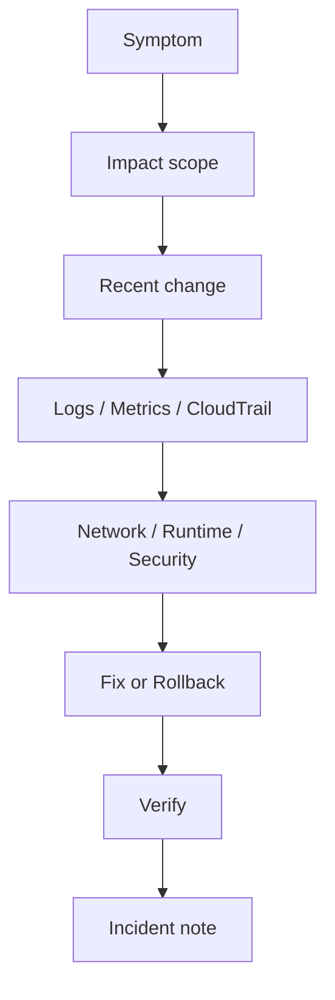

# 5교시: 장애 분석 drill


이 visual은 증상에서 evidence, 조치, 재확인으로 이어지는 장애 분석 순서를 보여준다.

## 수업 목표
- 증상, 영향 범위, 최근 변경, evidence, 조치, 검증을 분리한다.
- 로그와 metric, CloudTrail, network/security 확인을 순서화한다.
- rollback과 cleanup까지 incident note에 남긴다.

## 오늘 반드시 가져갈 것
| 필수 개념 | 왜 필수인가 | 놓치면 생기는 문제 | 확인 지점 |
|---|---|---|---|
| Symptom | 사용자가 보는 문제를 구체화한다 | 원인 추정부터 시작한다 | HTTP status, timeout, error |
| Scope | 영향 범위를 정한다 | 전체 장애와 개인 환경 문제를 혼동한다 | service/Region/user range |
| Recent change | 변경과 장애 시점을 비교한다 | 원인 후보를 놓친다 | CloudTrail, deployment history |
| Verification | 조치 후 같은 기준으로 재확인한다 | 고쳤는지 증명하지 못한다 | same command/result |

## 핵심 개념
장애 분석은 추측 게임이 아니다. 먼저 사용자가 보는 증상을 적고, 영향 범위를 좁히며, 최근 변경과 evidence를 연결한다. 그 다음 network/security/runtime/data/cost 중 어느 경계에서 문제가 생겼는지 확인한다. 조치를 했다면 같은 명령이나 같은 화면으로 재확인해야 한다.

## 구조로 보기


이 구조는 Console 화면을 암기하기 위한 그림이 아니다. 운영 질문이 들어왔을 때 어떤 evidence를 먼저 확인하고, 어떤 판단을 문서에 남길지 정하는 기준이다.

## 공식 문서 확인 지점
| 확인할 문서 키워드 | 읽을 때 볼 질문 |
|---|---|
| Well-Architected | 이 판단이 운영 우수성, 보안, 비용 중 어디에 해당하는가 |
| CloudWatch 또는 CloudTrail | 상태와 변경 이력을 어떤 evidence로 확인하는가 |
| IAM 또는 Security | 누가 접근할 수 있고 무엇이 공개되어 있는가 |
| Billing 또는 Cost | 비용 원인과 owner를 설명할 수 있는가 |

## 운영 판단 연습
| 판단 질문 | 확인 기준 |
|---|---|
| 첫 질문은 무엇인가 | 사용자 증상과 영향 범위를 먼저 고정한다 |
| 어디서 evidence를 볼 것인가 | logs, metrics, CloudTrail, health, SG를 증상에 맞게 고른다 |
| 조치 후 무엇을 비교할 것인가 | 실패를 확인했던 같은 명령/화면으로 재확인한다 |

## 흔한 실패와 첫 확인 위치
| 흔한 실패 | 첫 확인 위치 |
|---|---|
| 장애 원인을 바로 단정한다 | 증상, 범위, 최근 변경, evidence를 순서대로 채운다 |

## 실습/시뮬레이션 절차
1. Week 5 evidence에서 이 교시 주제와 연결되는 화면을 2개 이상 고른다.
2. 각 화면에 대해 resource name, Region, 상태값, owner/tag, 비용 또는 보안 영향을 적는다.
3. 공식 문서 키워드와 Console 화면의 용어가 일치하는지 확인한다.
4. 판단이 필요한 항목은 `확인한 값 -> 판단 -> 다음 행동` 형식으로 기록한다.
5. 민감 정보가 보이는 screenshot은 폐기하거나 가린 뒤 다시 저장한다.

## 복구와 정리 기준
| 상황 | 먼저 볼 evidence | 다음 행동 |
|---|---|---|
| 상태가 불명확하다 | service detail, health, logs | 정상 기준과 비교한다 |
| 최근 변경이 의심된다 | CloudTrail, deployment history | 변경 시각과 증상 시각을 비교한다 |
| 비용이 남는다 | Cost Explorer, resource inventory | 삭제/중지/유지 판단을 남긴다 |
| 공개 또는 권한이 의심된다 | IAM, SG, public endpoint, secret | 접근 범위를 줄이고 재확인한다 |

## 화면 캡처 가이드
- Region, resource name, 상태값, tag, policy, metric name처럼 재현 가능한 값을 남긴다.
- account email, secret value, access key, token, password는 캡처하지 않는다.
- 실패 화면은 error message만 자르지 말고 어떤 service와 설정에서 발생했는지 보이게 한다.
- cleanup evidence는 삭제 버튼보다 삭제 후 검색 결과와 비용 후보 확인이 중요하다.

## Evidence 점검
- 화면에는 민감 정보 대신 resource 이름, Region, 상태값, rule, tag처럼 재현 가능한 값이 보여야 한다.
- 기록에는 "성공했다"보다 어떤 값이 어떤 상태였는지가 남아야 한다.
- 실패를 기록할 때는 증상, 확인한 화면, 수정한 값, 재확인 결과를 한 세트로 남긴다.
- symptom/scope 기록, recent change evidence, verify result 중 최소 두 가지는 최종 패킷에 남긴다.

## Evidence Note
```markdown
# W5D5S5 incident drill
- Region/account boundary:
- Resource or evidence source:
- 확인한 값:
- 판단:
- 다음 행동:
- cleanup/handoff 상태:
```

## 혼자 다시 따라오기
- 최소 재현 경로: ALB 5xx, container unhealthy, S3 AccessDenied, 비용 급증 중 하나를 선택해 incident note를 작성한다.
- 공식 문서 키워드: `CloudWatch Logs`, `CloudWatch metrics`, `CloudTrail`, `rollback`, `post-incident review`
- 스스로 확인할 화면: ALB target health, service events, logs, metrics, CloudTrail, Cost Explorer
- 흔한 실패 3개: 원인 단정, 재확인 누락, rollback 기준 없음
- 다음 준비 상태: 장애 분석을 symptom -> evidence -> action -> verification 흐름으로 설명할 수 있어야 한다.

## 한 줄 요약
```text
장애 분석은 빠른 추측보다 증상과 evidence를 분리해 같은 기준으로 재확인하는 절차다.
```
