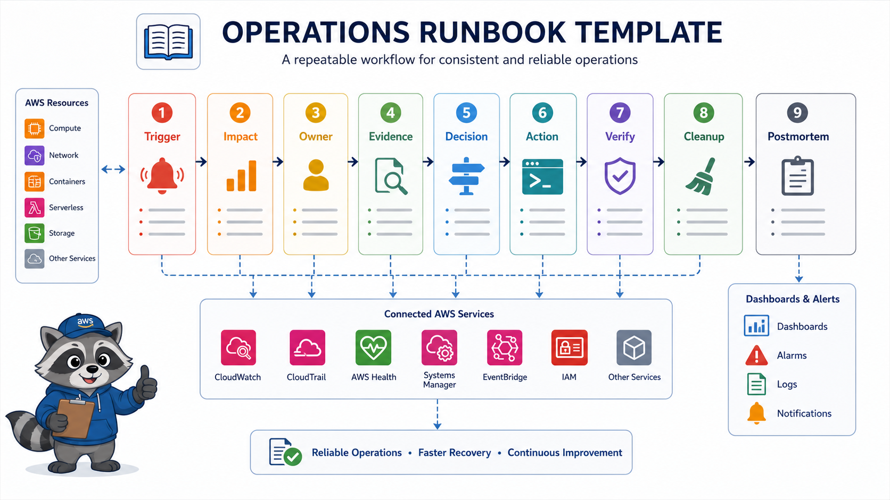
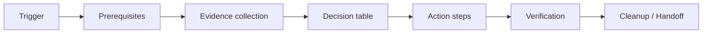

# 6교시: AWS Operations Runbook



이 시간은 Week 5에서 확인한 Console 절차를 다른 사람이 반복할 수 있는 runbook으로 바꾼다. runbook은 긴 감상문이 아니라 trigger, owner, evidence, action, verification, cleanup이 있는 실행 문서다.

## 수업 목표
- 장애 대응, 보안 점검, 비용 cleanup 중 하나를 골라 실제 실행 가능한 runbook을 작성한다.
- 필요한 권한, Console 위치, 정상 기준, 실패 기준을 명시한다.
- 다음 사람이 문서만 보고 같은 점검을 반복할 수 있게 만든다.

## 오늘 만들 산출물
| 산출물 | 형태 | 반드시 들어갈 값 |
|---|---|---|
| Operations runbook | markdown | trigger, prerequisites, evidence, action, verification, cleanup |
| Decision table | 표 | 증상/조건별 다음 행동 |
| Verification checklist | 체크리스트 | 성공 기준과 재확인 화면 |

실습 템플릿은 `labs/operations-runbook/README.md`를 사용한다.

## Runbook 주제 선택
| 주제 | 적합한 상황 | 반드시 포함할 AWS 화면 |
|---|---|---|
| Web endpoint 장애 대응 | EC2/ALB/ECS/App Runner 실습을 했다 | endpoint, target health, logs, SG, CloudTrail |
| Security exposure cleanup | SG/S3/IAM 점검을 했다 | IAM, EC2 SG, S3 Permissions, CloudTrail |
| Cost cleanup | Week 5 resource를 정리해야 한다 | Cost Explorer, EC2/ELB/EBS/S3/RDS/CloudWatch |
| S3 AccessDenied 대응 | S3 접근 실습을 했다 | object URL, Permissions, policy, Block Public Access |

## 핵심 개념
좋은 runbook은 "CloudWatch 확인" 같은 제목으로 끝나지 않는다. 어디로 들어가서 어떤 값을 보고, 그 값이 무엇이면 어떤 조치를 하며, 조치 후 무엇을 다시 확인하는지 적는다. 개인 기억을 제거하고 실행 가능한 절차로 만드는 것이 목적이다.

## Runbook 구조


## 필수 섹션
| 섹션 | 작성할 내용 |
|---|---|
| Trigger | 언제 이 runbook을 실행하는가 |
| Preconditions | 필요한 권한, Region, resource name, 안전 주의 |
| Normal baseline | 정상일 때 기대되는 값 |
| Evidence collection | AWS Console 위치와 확인 값 |
| Decision table | 값에 따른 다음 행동 |
| Action steps | 실제 조치 순서 |
| Verification | 성공을 증명하는 같은 명령/화면 |
| Cleanup/Handoff | 남는 resource, 비용, 보안 예외 |

## 실습 절차
1. `labs/operations-runbook/README.md`에서 템플릿을 복사한다.
2. runbook 주제를 하나 고른다.
3. Week 5에서 만든 실제 resource 이름과 Region을 넣는다.
4. 정상 기준을 먼저 적는다. 예: `target healthy`, `HTTP 200`, `S3 Block Public Access on`.
5. evidence collection 절차를 Console path 기준으로 쓴다.
6. decision table에 최소 3개 분기를 만든다.
7. action step마다 verification을 붙인다.
8. cleanup/handoff에 남는 비용 또는 보안 예외를 적는다.

## Evidence 점검
- trigger와 owner가 있다.
- AWS Console path가 실제로 따라갈 수 있게 적혀 있다.
- 정상 기준과 실패 기준이 구분된다.
- action 후 verification이 있다.
- cleanup 또는 handoff가 빠지지 않았다.

## Evidence Note
```markdown
# W5D5S6 runbook
- Runbook title:
- Trigger:
- Owner:
- Required permissions:
- Evidence sources:
- Main action:
- Verification:
- Cleanup/handoff:
```

## 한 줄 요약
```text
Runbook은 AWS Console 기억을 다음 사람이 실행 가능한 절차로 바꾸는 문서다.
```
